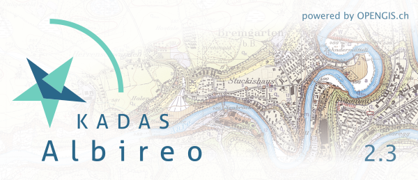

# KADAS Albireo

KADAS Albireo is a mapping application based on [QGIS](http://qgis.org/) and targeted at non-specialized users, providing enhanced functionalities in areas such as drawing, measuring, terrain analysis, etc.

## Main features:

 * Streamlined user interface
 * Redlining functionality for adding geometries, pins, georeferenced pictures and other symbols
 * Measurement tools, incl. geodetic measurements.
 * Terrain analysis: slope, hillshade, viewshed, line of sight
 * Numeric inputs for all drawing operations
 * Integrated GPS geolocation support and GPX waypoint and route editor
 * Multiple map views
 * 3D globe view
 * Advanced map grids, including UTM/MGRS and guide grids
 * Tightly integrated search functionality
 * Integrated geodata catalog
 * Online-/Offline detection with online-/offline project templates
 * User friendly printing
 * KML and GPKG data export and import
 * Support for the MSS-MilX Military-Symbols library from [gs-soft](https://www.gs-soft.com/)

## Manuals

* [User manual](https://kadas-albireo.github.io/)
* [Technical manual](https://github.com/kadas-albireo/kadas-manuals/tree/master/technical/src)

## Downloads

* From the [releases](https://github.com/kadas-albireo/kadas-albireo2/releases) page.

## Quick start for Windows x64

* Download and extract the latest `kadas-portable-win64.zip` portable build from the [releases](https://github.com/kadas-albireo/kadas-albireo2/releases) page.
* Run `..\kadas\bin\kadas.exe`.
* Read the [technical manual](https://github.com/kadas-albireo/kadas-manuals/tree/master/technical/src) to learn how to configure the application.
* *Note*: To be able to use the terrain analysis functions, a heightmap needs to be defined in the project. The portable build contains a sample project which references a 1km resolution SRTM model. You can use any other model by adding the corresponding layer to the project, and marking it as heightmap from its context menu in the layer tree.

## Screenshots

### Redlining tools

Redlining sketches:

Georeferenced pictures:

### Multiple views

### Mesurement tools

Lines, circles, angles, areas:

Geodectic distance measurement:

Geodectic radius with real-time display:

### Terrain analysis

Line of Sight calculations:

Slopes:

More tools like hillshade and viewshed analysis are available as well.

### Search

### GPS tools (GPX)

### Military symbols

### 3D visualization and interaction

### Printing

## Feedback and support:

This software is commercially supported by OPENGIS.ch, Switzerland. 
To get more information, please contact info@opengis.ch
