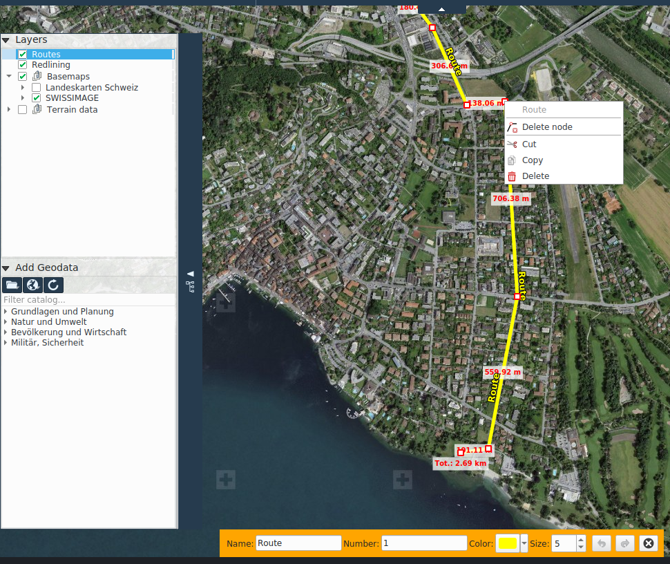

<!-- Recovered from: docs_old/html/de/de/gps/index.html -->
<!-- Language: de | Section: gps -->

# Navigation

Im Navigation-Tab befinden sich Funktionalitäten zur Interaktion mit einem angeschlossenen GPS Gerät sowie Werkzeuge zum Zeichnen, importieren und exportieren von GPX (GPS Exchange Format) Wegpunkte und Routen.

## Geolokalisierung Aktivieren

Um unter Windows ein GPS mit KADAS verwenden zu können, muss auf dem System die Applikation GpsGate Splitter installiert sein, siehe [GPSGate Konfiguration](../gpsgate/gpsgate/)

Der Status der GPS-Verbindung wird in der Statuszeile im unteren Programmbereich angezeigt. Dieser GPS Statusbutton kann aktiviert bzw. deaktiviert werden, um die Verbidung zu erstellen oder trennen. Die Füllfarbe des Statusbuttons ändert sich gemäss dem aktuellen Verbindungszustand:

- **Schwarz**: GPS nicht aktiviert
- **Blau**: Verbindung wird initialisiert
- **Weiss**: Verbindung initialisiert, aber keine Daten werden empfangen
- **Rot**: Verbindung initialisiert, aber keine Positionsinformationen verfügbar
- **Gelb**: Verbindung initialisiert, nur 2D Fix
- **Grün**: Verbindung initialisiert, 3D Fix

Sobald KADAS vom GPS Positionsdaten empfängt, wird auf der Karte ein entsprechender Positionsmarker gezeichnet.

## Mit Position bewegen

Diese Funktion aktiviert das automatische verscheiben des sichtbaren Kartenausschnittes, zentriert auf der aktuellen GPS-Position.

## Wegpunkte und Routen zeichnen

Mit diesen Funktionen können Wegpunkte und Routen gezeichnet werden, welche später als GPX gespeichert werden können, z.B. für das Hochladen auf ein GPS gerät.

**Wegpunkte** sind einfache Punkte auf der Karte, und können zusätzlich mit einem Namen versehen werden.

**Routen** sind Linienzüge und können mit Namen und Nummer versehen werden.

Wegpunkte und Routen werden in einer eigenen Ebene GPS Routen im Layerbaum abgelegt, analog zur Redlining Ebene.

## GPX Export und Import

Diese Funktionen erlauben das Exportieren von gezeichneten Wegpunkte und Routen in eine GPX Datei sowie das Importieren einer existierenden GPX Datei in die **GPS Routen** Ebene.
