<!-- Recovered from: share/docs/html/de/de/working_with_raster/raster_properties/index.html -->
<!-- Language: de | Section: working_with_raster/raster_properties -->

# Dialogfenster Rasterlayereigenschaften

Um die Eigenschaften eines Rasterlayers zu sehen oder einzustellen doppelklicken Sie auf den Layernamen in der Legende oder rechtsklicken Sie auf den Layernamen und wählen Sie _Eigenschaften_ aus dem Kontextmenü. Dies öffnet den _Layereigenschaften_ Dialog.

Es gibt mehrere Menüs in diesem Dialog:

- _Allgemein_
- _Stil_
- _Transparenz_
- _Pyramiden_
- _Histogramm_
- _Metadaten_

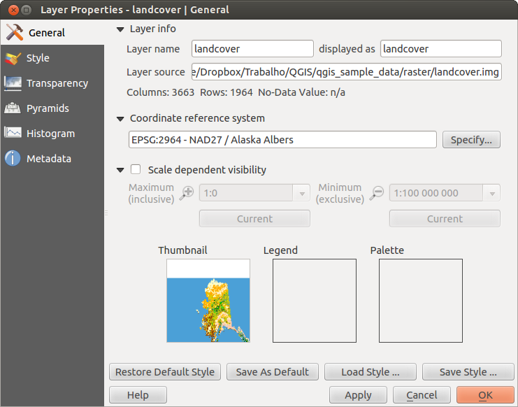

## Menü Allgemein

### Layerinformation

Das Menü _Allgemein_ stellt grundlegende Informationen über den ausgewählten Rasterlayer dar, einschließlich der Layerquelle, dem Anzeigenamen (der verändert werden kann) und der Anzahl von Spalten, Zeilen und LeerWerten des Rasterlayers.

### Koordinatenbezugssystem

Hier können Sie das Koordinatenbezugssystem (KBS) als PROJ.4 Text ablesen. Wenn diese Einstellung nicht richtig ist können Sie Sie verändern indem Sie den Knopf **[Angeben]** klicken.

### Maßstabsabhängige Sichtbarkeit

Zusätzlich kann eine skalenabhängige Sichtbarkeit eingestellt werden. Dazu muss das Kontrollkästchen aktiviert sein und ein entsprechender Maßstab, indem Ihre Daten im Kartenfenster dargestellt werden, eingetragen werden.

Unten können Sie einen Thumbnail, sein Legendensymbol und die Palette sehen.

## Menü Stil

### Kanaldarstellung

KADAS bietet vier verschiedene _Darstellungsart_. Die ausgewählte Darstellungsart hängt vom Datentyp ab.

1. Multikanalfarbe - wenn die Datei ein Multiband mit mehreren Kanälen ist (z.B. bei einem Satellitenbild mit mehreren Bändern)
2. Palette - wenn ein Einkanalbild eine indizierte Palette besitzt (z.B. benutzt bei digitalen Topographischen Karten)
3. Einkanalgraustufen - das Bild oder ein Kanal davon wird grau dargestellt; KADAS benutzt diese Darstellung wenn die Datei weder Multibänder, noch eine indizierte Palette noch eine kontinuirliche Palette (z.B. in einer Schummerungskarte benutzt) besitzt.
4. Einkanalpseudofarbe - diese Darstellung ist bei Dateien mit kontinuirlicher Palette oder Farbkarte (z.B. wie sie in Höhenkarten verwendet wird) möglich

**Multikanalfarbe**

Mit der Darstellung Multikanalfarbe werden drei ausgewählte Kanäle des Bildes dargestellt, wobei jedes Band due rote, grüne oder blaue Komponente zum Erstellen eines Farbbildes darstellt.

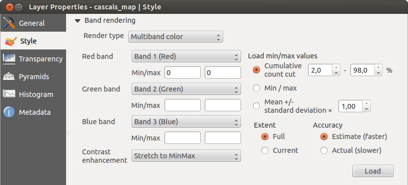

Diese Auswahl bietet Ihnen ein breites Spektrum von Optionen zum Verändern des Erscheinungsbildes des Rasterlayers an. Zuerst müssen Sie den Datenbereich Ihres Bildes abrufen. Dieser kann durch das Wählen von _Ausdehnung_ und das Klicken von **[Laden]** ermittelt werden. KADAS kann die _Min_ und _Max_ Werte der Kanäle  _Schätzen (schneller)_ oder die  _Genau (langsamer)_ _Genauigkeit_ verwenden.

Jetzt können Sie die Farben mit Hilfe des _Min/Max Werte_ Bereichs skalieren. Viele Bilder haben ein paar sehr tiefe und hohe Daten. Diese Ausreißer können anhand der  _Kommulativer Anzahlschnitt_ Einstellung beseitigt werden. Der voreingestellte Datenbereich ist auf 2% bis 98% der Datenwerte eingestellt und kann manuell angepasst werden. Mit dieser Einstellung kann das graue Aussehen des Bildes verschwinden. Mit der Skalierungsoption  _Min/max_ erstellt KADAS eine Farbtabelle von allen im Originalbild enthaltenen Daten (z.B. erstellt KADAS eine Farbtabelle mit 256 Werten, vorausgesetzt Sie haben 8bit-Kanäle). Sie können Ihre Farbtabelle auch mit der  _Mittlere +/- Standardabweichung x_ 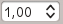 berechnen. Dann werden nur Werte innerhalb der Standardabweichung oder innerhalb mehrerer Standardabweichungen verwendet. Dies ist nützlich wenn ein oder zwei Zellen mit anormalen hohen Werten, die einen negativen Effekt auf die Darstellung des Rasterbildes haben, in einem Grid auftauchen.

Alle Berechnungen können auch für die  _Aktuell_ Ausdehnung durchgeführt werden.

**Einen einzelnen Kanal eines Mehrkanal-Rasterlayers anzeigen**

Wenn Sie sich nur einen einzelnen Kanal eines Multikanalfarbe Bildes (z.B. Rot) ansehen wollen kommen Sie vielleicht auf die Idee den Grün- und Blaukanal auf ‘’Nicht gesetzt” einzustellen. Dies ist nicht der korrekte Weg. Um den Rotkanal darzustellen stellen Sie den Bildtyp auf ‘Einkanalgraustufen’ ein und wählen Sie dann Rot als Kanal, der für Grau benutzt werden soll, aus

**Palette**

Dies ist die voreingestellt Darstellungsart für Singleband-Dateien die bereits eine Farbtabelle besitzen, wobei jedem Pixel eine bestimmte Farbe zugewiesen wird. In diesem Fall wird die Palette automatisch dargestellt. Wenn Sie die Farben, die einem bestimmten Wert zugewiesen werden, ändern wollen, Doppelklicken Sie auf die Farbe und der _Farbauswahl_ Dialog erscheint. Seit KADAS 2.2. ist es möglich dem Farbwert eine Beschriftung zuzuweisen. Die Beschriftung erscheint dann in der Legende des Rasterlayers.

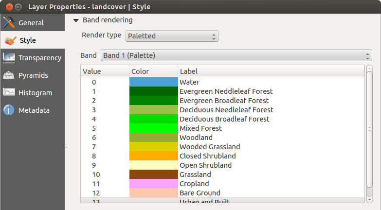

**Kontrastverbesserung**

Wenn GRASS Rasterlayer hinzugefügt werden wird die Option **Kontrastverbesserung** immer automatisch auf **Strecken auf MinMax** eingestellt, ungeachtet der Einstellungen in den KADAS Optionen.

**Einkanalgraustufen**

Mit dieser Darstellungsart können Sie ein Einkanalbild mit einem _Farbverlauf_ darstellen: ‘Schwarz nach Weiß’ oder ‘Weiß nach Schwarz’. Sie können einen _Min_ und einen _Max_ Wert festlegen indem Sie erst _Ausdehnung_ auswählen und dann **[Laden]** drücken. KADAS kann die _Min_ und _Max_ Werte der Kanäle  _Schätzen (schneller)_ oder die  _Genau (langsamer)_ _Genauigkeit_ verwenden.

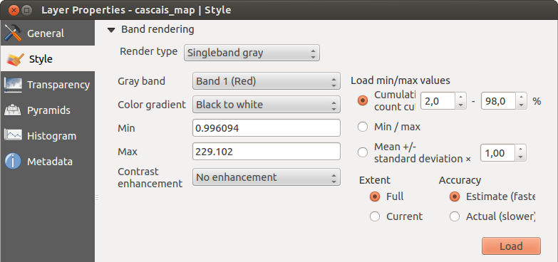

Im _Extremwerte laden_ Abschnitt ist das Skalieren der Farbtabelle möglich. Ausreißer können anhand der  _Kommulativer Anzahlschnitt_ Einstellung beseitigt werden. Der voreingestellte Datenbereich ist von 2% bis 98% der Datenwerte eingestellt und kann manuell angepasst werden. Mit dieser Einstellung kann der graue Charakter des Bildes verschwinden. Weitere Einstellungen können mit  _Extrema_ und  _Mittlere +/- Standardabweichung x_  gemacht werden. Während die erste eine Farbtabelle mit allen Daten, die im Originalbild enthalten sind, erstellt, erstellt die zweite eine Farbtabelle die nur Werte innerhalb der Standardabweichung oder mehrerer Standardabweichungen berücksichtigt. Dies ist nützlich wenn Sie eine oder zwei Zellen mit anormal hohen Werten in einem Grid haben die einen negativen Einfluss auf die Darstellung des Rasterlayers haben.

**Einkanalpseudofarbe**

Dies ist eine Darstellungsoption für Einkanaldateien die eine kontinuirliche Palette enthalten. Sie können hier auch individuelle Karten für die einzelnen Kanäle erstellen.

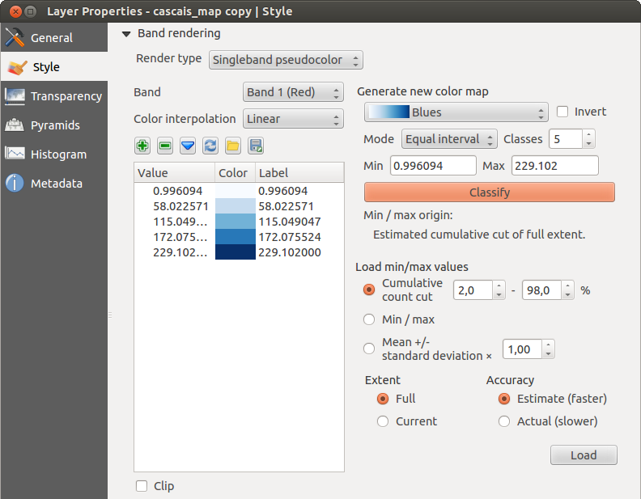

Es sind drei Typen von Farbinterpolation möglich:

1. Diskret
2. Linear
3. Genau

Im linken Block fügt der Knopf  _Werte manuell hinzufügen_ einen Wert zu der individuellen Farbtabelle hinzu. Der Knopf  _Gewählte Zeile löschen_ löscht einen Wert aus der individuellen Farbtabelle und der  _Farbabbildungselemente_ Knopf sortiert die Farbtabelle gemäß den Pixelwerten in der Wertespalte. Ein Doppelklick auf die Wertespalte macht das Eingeben eines spezifischen Wertes möglich. Das Doppelklicken auf die Farbspalte öffnet den Dialog _Change color_ in dem Sie eine Farbe die auf den Wert angewendet werden soll auswählen können. Des weiteren können Sie auch Beschriftungen für jede Farbe hinzufügen, allerdings wird dieser Wert nicht angezeigt wenn Sie das Objekte abfragen Werkzeug benutzen. Sie können auch auf den Knopf mActionDraw| _Farbabbildung aus Kanal laden_ klicken welcher versucht die Tabelle aus dem Kanal zu laden (falls dieser eine hat). Und Sie können die Knöpfe  _Farbabbildung aus Datei laden_ oder 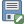 _Farbabbildung in Datei speichern_ verwenden um eine bestehende Farbtabelle zu laden oder eine definierte Farbtabelle für andere Sitzungen zu speichern.

Im rechten Block wird Ihnen durch _Neue Farbabbildung generieren_ das Erstellen von neuen kategorisierten Farbkarten ermöglicht. Für den _Modus_ 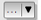 ‘Gleiches Intervall’ müssen Sie nur die Anzahl der _Klassen_  auswählen und den Knopf _Klassifizieren_ drücken. Sie können die Farben der Farbkarte invertieren indem Sie auf das  _Invertieren_ Kontrollkästchen klicken. Im Fall des _Modus_  ‘Fortlaufend’ erstellt KADAS automatisch Klassen abhängig von _Min_ und _Max_. Das Definieren von Extremwerten kann mit Hilfe des _Extremwerte laden_ Abschnitts durchgeführt werden. Viele Bilder haben einige wenige sehr tiefe und hohe Daten. Diese Ausreißer können anhand der  _Kommulativer Anzahlschnitt_ Einstellung beseitigt werden. Der voreingestellte Datenbereich ist von 2% bis 98% der Datenwerte eingestellt und kann manuell angepasst werden. Anhand dieser Einstellung kann der graue Charakter des Bildes verschwinden. Mit der Skalierungsoption  _Extrema_ erstellt KADAS eine Farbtabelle mit allen im Originalbild enthaltenen Daten (z.B. erstellt KADAS eine Farbtabelle mit 256 Werten, vorausgesetzt Sie haben 8bit Kanäle). Sie können Ihre Farbtabelle auch anhand der  _Mittlere +/- Standardabweichung x_  berechnen. Dann werden nur Werte innerhalb der Standardabweichung oder mehrerer Standardabweichungen für die Farbtabelle berücksichtigt.

### Farbdarstellung

Für jede _Kanaldarstellung_ ist eine _Farbdarstellung_ möglich.

Sie können auch spezielle Darstellungseffekte für Ihre Rasterdatei(en) erreichen indem Sie Mischmodi verwenden.

Weitere Einstellungen können durch das Verändern der _Helligkeit_, der _Sättigung_ und des _Kontrast_ gemacht werden. Sie können auch eine _Graustufen_ Option verwenden bei der Sie zwischen ‘Nach Helligkeit’, ‘Nach Leuchtkraft’ und ‘Nach Durchschnitt’ wählen können. Für einen Farbwert in der Farbtabelle können Sie die ‘Stärke’ verändern.

### Abtastung

Die _Abtastung_ Option kommt zur Erscheinung wenn Sie in ein Bild herein- oder herauszoomen. Abtastungsmodi können die Erscheinung der Karte optimieren. Sie berechnen eine neue Grauwertmatrix anhand einer geometrischen Transformation.

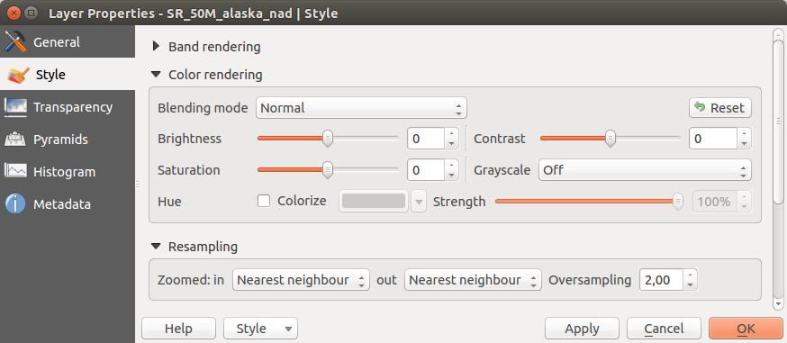

Wenn Sie die ‘Nächster Nachbar’ Methode anwenden kann die Karte eine pixelige Struktur bein Hineinzoomen haben. Dieses Erscheinungsbild kann verbessert werden indem man die ‘Bilinear’ oder ‘Kubisch’ Methode verwendet, die scharfe Objekte verwischt. Der Effekt ist ein weicheres Bild. Diese Methode kann z.B. auf digitale Topographische Karten angewendet werden.

## Menü Transparenz

KADAS besitzt die Fähigkeit jeden Rasterlayer auf einem unterschiedlichen Transparenzlevel darzustellen. Verwenden Sie den Transparenzschieberegler 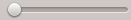 um einzugeben bis zu welchem Ausmaß die darunterliegenden Layer (falls es welche gibt) sichtbar durch den aktuellen Rasterlayer sein sollen. Dies ist sehr nützlich wenn Sie mehr als einen Rasterlayer überlagern wollen (z.B. wenn eine Schummerungskarte von einer klassifizierten Rasterkarte überlagert werden soll). So wird die Karte dreidimensionaler aussehen.

Zusätzlich können Sie einen Rasterwert eingeben der als **Leerwert** im _Zusätzlicher Leerwert_ Menü behandelt wird.

Die Transparenz kann noch flexibler über die _Transparente Pixelliste_ angepasst werden. Die Transparenz jedes Pixels kann hier eingestellt werden.

Als Beispiel wollen wir die Wasserflächen aus dem Rasterlayer `landcover.tif` auf eine Transparenz von 20% setzen. Folgende Schritte sind dazu notwendig:

1. Laden Sie die Rasterdatei `landcover.tif`.
2. Öffnen Sie den Dialog _Layereigenschaften_ indem Sie auf den Namen in der Legende doppelklicken, oder im Rechte-Maustaste Menü _Eigenschaften_ auswählen.
3. Wählen Sie das Menü _Transparenz_.
4. Wählen Sie ‘Keines’ aus dem _Transparenzkanal_ Menü.
5. Klicken Sie den  _Werte manuell hinzufügen_ Knopf. Eine neue Zeile erscheint in der Pixelliste.
6. Geben Sie den Rasterwert in die ‘Von’ und ‘Nach’ Spalte ein (wir benutzen hier 0) und passen Sie die Transparenz auf 20% an.
7. Drücken Sie den Knopf **[Anwenden]** und schauen Sie sich das Ergebnis an.

Sie können Schritte 5 und 6 wiederholen um mehr Werte mit benutzerdefinierter Transparenz einzustellen.

Wie Sie sehen können ist es recht einfach die benutzerdefinierte Transparenz einzustellen, aber es kann ganz schön viel Arbeit sein. Deswegen können Sie den Knopf 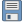 _In Datei exportieren_ benutzen um Ihre Transparenzliste in eine Datei zu speichern. Der Knopf  _Aus Datei importieren_ lädt Ihre Transparenzeinstellungen und wendet sie auf den aktuellen Rasterlayer an.

## Menü Metadaten

Das _Metadaten_ Menü stellt eine Fülle von Informationen über den Rasterlayer dar, einschließlich Statistiken über jeden Kanal im aktuellen Rasterlayer. In diesem Menü können Einträge für _Beschreibung_, _Beschreibung_, _Metadaten-URL_ und _Eigenschaften_ gemacht werden. In _Eigenschaften_ werden Statistiken nach dem Prinzip ‘was brauche ich’ erstellt, so dass es gut sein kann dass für einen Rasterlayer noch keine Statistik erstellt oder gesammelt wurde.

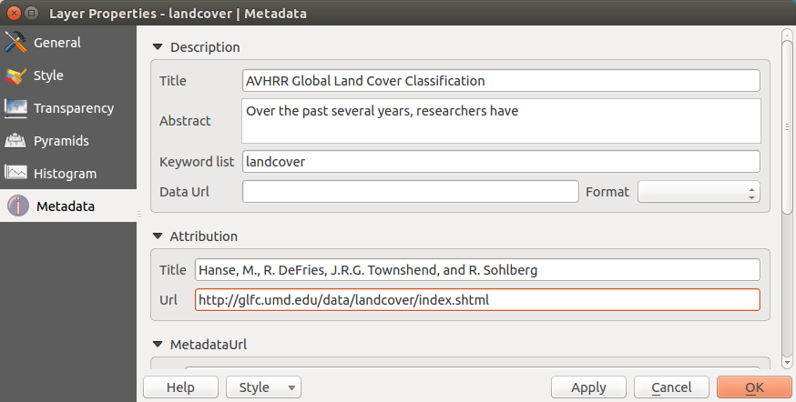
