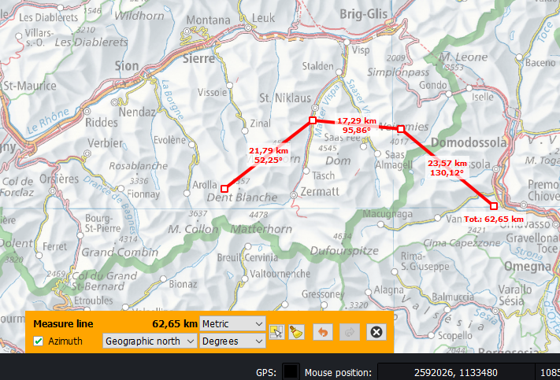
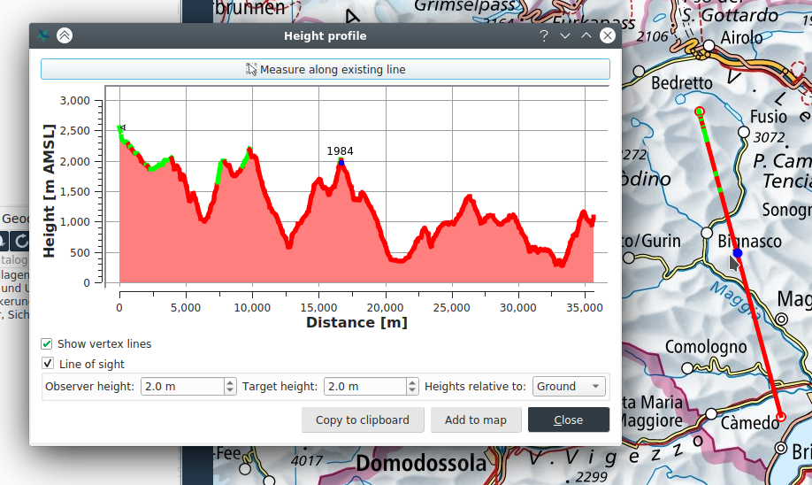
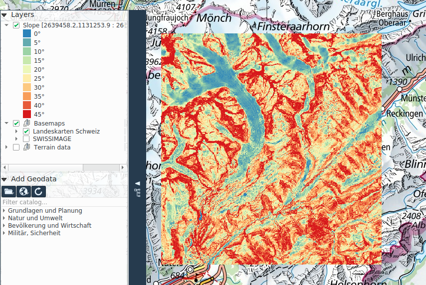

<!-- Recovered from: docs_old/html/en/en/analysis/index.html -->
<!-- Language: en | Section: analysis -->

# Analysis

The **Analysis** tab contains tools for measuring distances, areas, circles, and angles, as well as various terrain analysis functions.

To use the terrain analysis functions, a height model must be defined in the current project. A raster layer can be selected as height model in its context menu in the map layer tree.

## Measuring lengths, areas and azimuth angles

Four measurement functions are available:

- Line (distance)
- Area
- Circle area
- Azimuth angles

All measurement functions work on the WGS84 ellipsoid.

Upon activating a measurement function, the desired measurement geometry can be drawn in the map canvas. Relevant measurements are displayed directly next to the geometry.

Multiple geometries can be drawn for distance and area measurements, in which case the total is displayed in measurement bar in the lower area of the application window. Here the user can also select the measurement unit, and a picker button allows to measure existing geometries.

## Height profile and line of sight

The **Profile sight** function allows the user to perform a height profile as well as a line of sight analysis of the terrain. To utilize this function, a heightmap must be defined in the project. A raster layer can be selected as height model in its context menu in the map layer tree.

To create a height profile, the user can draw a line geometry on the map along which the profile should be measured. The result is displayed in a separate dialog. Alternatively, the user can use the picker button to measure along an existing line geometry.

If the line geometry consists of one segment only, then a line of sight analysis can be computed along this line by checking the corresponding checkbox in the height profile dialog. Visible or invisible areas are then drawn accordingly green or red. If you move the mouse along the measurement line, the corresponding position in the height profile is displayed with a blue dot. The visibility analysis takes into account the curvature of the earth. Configuration parameters for the analysis include the observer height, the target height as well as if these heights are expressed with respect to the ground or the sea level.

From the height profile dialog, the user can also choose to copy the height profile graphic to the clipboard, or to add it to the map as an annotation.

## Slope and hillshade

The **Slope** function computes a slope profile of the terrain as a color coded raster layer.

The **Hillshade** function computes the shading of the terrain, which is added as a semi-opaque raster layer to the map.

To utilize these functions, a heightmap must be defined in the project.

In both cases the analysis is performed within a rectangular region of the map as specified by the user. For hillshade, the user is also asked to specify the horizontal and vertical angles of the light source.

The results of the slope and hillshade analyzes are added to the map as raster layers, and appear accordingly in the map layer tree. When saving the project, these datasets are stored as project attachments in the _.qgz_ project file.

## Viewshed

The **Viewshed** tool calculates the visible or invisible terrain area in a circular sector, starting from the center of the circle - the observer's location. The visibility analysis takes into account the curvature of the earth.

To utilize these functions, a heightmap must be defined in the project.

The viewhsed analysis is computed within a circular sector or a full circle as specified by the user. The first click sets the observer position, the second one the radius and the third click the the aperture angle. These parameters can also be entered numerically if numeric input is enabled in the settings tab. After drawing the analysis area geometry, the user is required to specify the computation parameters, which include the observer height, the target height, whether these heights are relative to the ground or the sea level, and whether the visible or invisible area should be shown in the result.

The analysis output is added as a raster layer to the map. When the project is saved, the raster is saved as a project attachment in the _.qgz_ project file.

## Min/Max

The **Min/Max** tool allows computing the lowest and highest terrain point within a selected area (rectangle/polygon/circle). The respective points will be marked with up- and down-facing triangle icons on the map. Clicking on the triangle icons allows copying the coordinates, adding a pin and initiating a further analysis function (i.e. viewshed) from that point.

## Ephemeris

The **Ephemeris** tool calculates sun and moon ephemeris (position, rise and set times, moon phase) at a selected terrain position and moment in time. The checkbox allows configuring whether the relief is considered for the computation.
