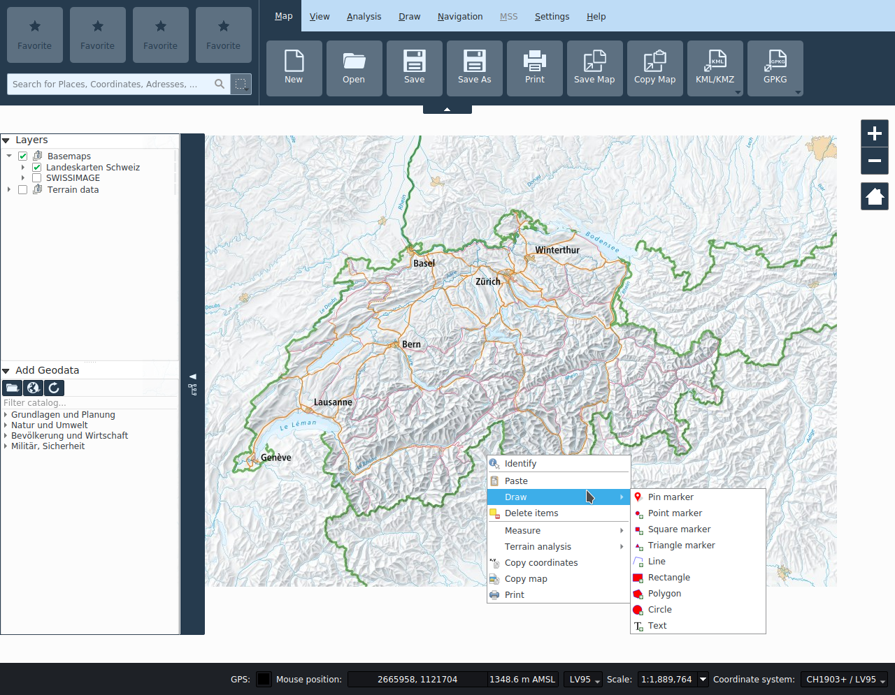
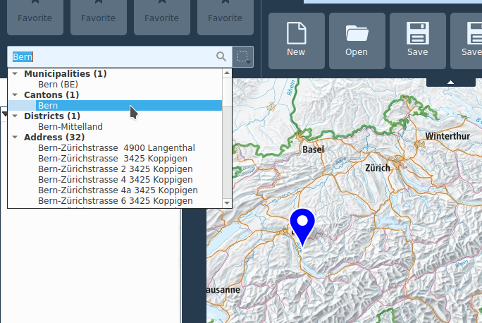

<!-- Recovered from: docs_old/html/en/en/kadas_gui/index.html -->
<!-- Language: en | Section: kadas_gui -->

# KADAS Interface

The KADAS GUI is divided into five areas:

- Functionality menu
- Favorites and search
- Map View
- Layers and geodata catalog
- Status bar

## Functionality menu

Functionalities are grouped by topic in tabs, which can be activated from the menu bar. The tabs contain buttons for the various functionalities. The functionalities of each tab are documented in the respective chapters:

- [Map](../map/)
- [View](../view/)
- [Analysis](../analysis/)
- [Draw](../draw/)
- [Navigation](../gps/)
- [MSS](../mss/)
- [Settings](../settings/)

## Favorites and search

### Favorites

Favorite functionalities can be dragged from the respective tab to one of the four placeholders. They can be removed again via context menu on the favorite button. The favorites are stored in the personal user settings.

### Search

The search field provides a unified interface for various search services:

- Coordinates (LV03, LV95, DD, DM, DMS, UTM, MGRS)
- Locations and addresses throughout Switzerland
- Locations worldwide
- Attributes in local layers
- Attributes in remote layers (web services)
- Attributes in pins

As soon as at least three characters are typed, the search starts and results are displayed.

The results are listed in correspondingly designated categories. The result list can be searched with mouse or keyboard arrows. When selecting a result with the arrows, a blue pin is placed in the appropriate location. When activating a result with the mouse, the map extent is centered on the corresponding location.

To the right of the search field, it is possible to define a filter geometry for local and remote data set search. This filter is _NOT_ applied to coordinate, location or pin searches.

## Map View

This central area of KADAS displays the loaded layers and allows performing various operations on the map.

Panning in the map is done with the left or middle mouse button, zooming with the scroll wheel or with the zoom buttons in the upper right corner of the map window. The right mouse button opens the context menu. Pan and rotation gestures are recognized on touch-enabled devices. In addition, you can zoom to a specific extent by holding down the SHIFT key and dragging a rectangle.

Regardless of the active map tool, the middle mouse button and the scroll wheel are always used for map navigation. The function of the left and right mouse buttons depend on the active tool.

The contents of the map is controlled by the map legend, described in the next section.

In the View tab, additional map views can be added. These additional views are passive, meaning no other interaction besides panning and zooming is possible.

## Layers and geodata catalog

The functions to manage the map layers are contained in the collapsible area anchored at the left border of the application window. The upper part contains the table of contents of the map, the lower part contains the geodata catalog.

### Layers

The map legend area lists all the **layers** in the project. The checkbox in each legend entry can be used to show or hide the layer.

A layer can be selected and dragged up or down in the legend to change the Z-ordering. Z-ordering means that layers listed nearer the top of the legend are drawn over layers listed lower down in the legend.

Layers in the legend window can be organised into groups.

The checkbox for a group will show or hide all the layers in the group with one click.

Via right click on an entry it is possible to perform various operations, depending on the type of the selected layer, such as:

- Zoom to layer
- Remove
- Rename
- Open layer properties

It is possible to select more than one layer or group at the same time by holding down the Ctrl key while selecting the layers with the left mouse button.

### Geodata catalog

The geodata catalog allows adding additional layers to the map. The catalog is empty if no network connection to the catalog service could be established

When starting the program, only public data is displayed. Depending on the user, further data may be available after authentication, see _SAML authentication_ below.

The contents of the catalog can by filtered by entering an appropriate text in the input field above the catalog. A layer in the catalog can be added to the map by drag and drop or double click.

The toolbar above the catalog contains the following functionalities:

- **Add local layer**: Add local vector, raster or CSV layer to the map.
- **Add service layer**: Add remote WMS, WFS, WCS, MapServer and vector tile layer to the map.
- **Reload catalog**: Reloads the catalog from the catalog service.
- **SAML authentication**: A window for performing a web-based login will be shown. Upon successful authentication, the geodata catalog will be refreshed and additional layers will be listed, according to the privileges of the authenticated user.

## Status bar

The status bar contains following labels and control widgets:

- **GPS**: Usage of the GPS button is described in the [_Navigation_ chapter](../gps/).
- **Mouse position**: The current mouse position on the map can be displayed with respect to multiple reference systems. The desired format can be selected from the menu left of the display label. The unit for the height can be changed in the Settings tab.
- **Scale**: The current scale of the map view is displayed next to the coordinate field. The scale selector allows to choose between predefined scales ranging from 1:500 to 1:1000000. The lock icon allows locking the current map scale, zooming will then only affect the magnification factor.
- **Coordinate reference system**: The coordinate reference system selection button allows to choose which projection to use for the map. If the selected projection differs from the native projection of a dataset, the latter will be reprojected, which may result in reduced performance depending on the amount of data.
