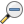
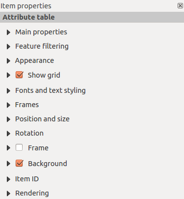

<!-- Recovered from: share/docs/html/en/en/print_composer/print_composer/index.html -->
<!-- Language: en | Section: print_composer/print_composer -->

# Print Composer

With the Print Composer you can create maps and atlasses that can be printed or saved as PDF-file, an image or an SVG-file. This is a powerfull way to share geographical information produced with KADAS that can be included in reports or published.

The Print Composer provides layout and printing capabilities. It allows you to add elements such as the map canvas, text labels, images, legends, scale bars, basic shapes, arrows, attribute tables and HTML frames. You can size, group, align, position and rotate each element and adjust the properties to create your layout. The layout can be printed or exported to image formats, PostScript, PDF or to SVG. You can save the layout as a template and load it again in another session. Finally, generating several maps based on a template can be done through the atlas generator. The following list gives an overview of the available tools which are available in menus and as icons in a toolbar:

-  *Save Project*
-  *New Composer*
-  *Duplicate Composer*
-  *Composer Manager*
-  *Load from template*
-  *Save as template*
-  *Print or export as PostScript*
-  *Export to an image format*
-  *Export print composition to SVG*
-  *Export as PDF*
-  *Revert last change*
-  *Restore last change*
-  *Zoom to full extent*
-  *Zoom to 100%*
-  *Zoom in*
-  *Zoom out*
-  *Refresh View*
-  *Pan*
-  *Zoom to specific region*
-  *Select/Move item in print composition*
-  *Move content within an item*
-  *Add new map from KADAS map canvas*
-  *Add image to print composition*
-  *Add label to print composition*
-  *Add new legend to print composition*
-  *Add scale bar to print composition*
-  *Add basic shape to print composition*
-  *Add arrow to print composition*
-  *Add attribute table to print composition*
-  *Add an HTML frame*
-  *Group items of print composition*
-  *Ungroup items of print composition*
-  *Lock Selected Items*
-  *Unlock All items*
-  *Raise selected items*
-  *Lower selected items*
-  *Move selected items to top*
-  *Move selected items to bottom*
-  *Align selected items left*
-  *Align selected items right*
-  *Align selected items center*
-  *Align selected items center vertical*
-  *Align selected items top*
-  *Align selected items bottom*
-  *Preview Atlas*
-  *First Feature*
-  *Previous Feature*
-  *Next Feature*
-  *Last feature*
-  *Print Atlas*
-  *Export Atlas as Image*
-  *Atlas Settings*

## Overview of the Print Composer

Opening the Print Composer provides you with a blank canvas that represents the paper surface when using the print option. With the buttons on the left beside the canvas you can add map composer items: the current map canvas, text labels, images, legends, scale bars, basic shapes, arrows, attribute tables and HTML frames. In this toolbar you also find toolbar buttons to navigate, zoom in on an area and pan the view on the composer and toolbar buttons to select a map composer item and to move the contents of the map item.

The initial view of the Print Composer before any elements are added is illustrated below:


On the right beside the canvas you find two panels. The upper panel holds the tabs _Items_ and _Command History_ and the lower panel holds the tabs _Composition_, _Item properties_ and _Atlas generation_.

- The _Items_ tab provides a list of all map composer items added to the canvas.
- The _Command history_ tab displays a history of all changes applied to the Print Composer layout. With a mouse click, it is possible to undo and redo layout steps back and forth to a certain status.
- The _Composition_ tab allows you to set paper size, orientation, the page background, number of pages and print quality for the output file in dpi. Furthermore, you can also activate the  _Print as raster_ checkbox. This means all items will be converted to raster before printing or saving as PostScript or PDF. In this tab, you can also customize settings for grid and smart guides.
- The _Item Properties_ tab displays the properties for the selected item. Click the  *Select/Move item* icon to select an item (e.g., legend, scale bar or label) on the canvas. Then click the _Item Properties_ tab and customize the settings for the selected item.
- The _Atlas generation_ tab allows you to enable the generation of an atlas for the current Composer and gives access to its parameters.
- Finally, you can save your print composition with the  *Save Project* button.

In the bottom part of the Print Composer window, you can find a status bar with mouse position, current page number and a combo box to set the zoom level.

You can add multiple elements to the Composer. It is also possible to have more than one map view or legend or scale bar in the Print Composer canvas, on one or several pages. Each element has its own properties and, in the case of the map, its own extent. If you want to remove any elements from the Composer canvas you can do that with the `Delete` or the `Backspace` key.

### Navigation tools

To navigate in the canvas layout, the Print Composer provides some general tools:

-  *Zoom in*
-  *Zoom out*
-  *Zoom full*
-  *Zoom to 100%*
-  *Refresh view* (if you find the view in an inconsistent state)
-  *Pan composer*
-  *Zoom* (zoom to a specific region of the Composer)

You can change the zoom level also using the mouse wheel or the combo box in the status bar. If you need to switch to pan mode while working in the Composer area, you can hold the `Spacebar` or the the mouse wheel. With `Ctrl+Spacebar`, you can temporarily switch to zoom mode, and with `Ctrl+Shift+Spacebar`, to zoom out mode.

## Sample Session

The following steps describe a sample workflow how to create a composer layout:

1. On the left site, select the  *Add new map* toolbar button and draw a rectangle on the canvas holding down the left mouse button. Inside the drawn rectangle the map view to the canvas.
2. Select the  *Add new scalebar* toolbar button and place the map item with the left mouse button on the Print Composer canvas. A scalebar will be added to the canvas.
3. Select the  *Add new legend* toolbar button and draw a rectangle on the canvas holding down the left mouse button. Inside the drawn rectangle the legend will be drawn.
4. Select the  *Select/Move item* icon to select the map on the canvas and move it a bit.
5. While the map item is still selected you can also change the size of the map item. Click while holding down the left mouse button, in a white little rectangle in one of the corners of the map item and drag it to a new location to change it’s size.
6. Click the _Item Properties_ tab on the left lower panel and find the setting for the orientation. Change the value of the setting _Map orientation_ to ‘15.00° ‘. You should see the orientation of the map item change.
7. Finally, you can save your print composition with the  *Save Project* button.

## Print Composer Options

From _Settings → Composer Options_ you can set some options that will be used as default during your work.

- _Compositions defaults_ let you specify the default font to use.
- With _Grid appearance_, you can set the grid style and its color. There are three types of grid: **Dots**, **Solid** lines and **Crosses**.
- _Grid and guide defaults_ defines spacing, offset and tolerance of the grid.

## Composition tab — General composition setup

In the _Composition_ tab, you can define the global settings of your composition.

- You can choose one of the _Presets_ for your paper sheet, or enter your custom _width_ and _height_.
- Composition can now be divided into several pages. For instance, a first page can show a map canvas, and a second page can show the attribute table associated with a layer, while a third one shows an HTML frame linking to your organization website. Set the _Number of pages_ to the desired value. You can choose the page _Orientation_ and its _Exported resolution_. When checked,  _print as raster_ means all elements will be rasterized before printing or saving as PostScript or PDF.
- _Grid and guides_ lets you customize grid settings like _spacings_, _offsets_ and _tolerance_ to your need. The tolerance is the maximum distance below which an item is snapped to smart guides.

Snap to grid and/or to smart guides can be enabled from the _View_ menu. In this menu, you can also hide or show the grid and smart guides.

## Composer items common options

Composer items have a set of common properties you will find on the bottom of the _Item Properties_ tab: Position and size, Rotation, Frame, Background, Item ID and Rendering.


- The _Position and size_ dialog lets you define size and position of the frame that contains the item. You can also choose which _Reference point_ will be set at the **X** and **Y** coordinates previously defined.
- The _Rotation_ sets the rotation of the element (in degrees).
- The  _Frame_ shows or hides the frame around the label. Use the _Frame color_ and _Thickness_ menus to adjust those properties.
- Use the _Background color_ menu for setting a background color. With the dialog you can pick a color.
- _Rendering_ mode can be selected in the option field.

KADAS allows advanced rendering for Composer items just like vector and raster layers.


- _Transparency_: You can make the underlying item in the Composer visible with this tool. Use the slider to adapt the visibility of your item to your needs. You can also make a precise definition of the percentage of visibility in the menu beside the slider.
-  _Exclude item from exports_: You can decide to make an item not visible in all exports. After activating this checkbox, the item will not be included in PDF’s, prints etc..
- _Blending mode_: You can achieve special rendering effects with these tools that you previously only may know from graphics programs. The pixels of your overlaying and underlaying items are mixed through the settings described below.

  > - Normal: This is the standard blend mode, which uses the alpha channel of the top pixel to blend with the pixel beneath it; the colors aren’t mixed.
  > - Lighten: This selects the maximum of each component from the foreground and background pixels. Be aware that the results tend to be jagged and harsh.
  > - Screen: Light pixels from the source are painted over the destination, while dark pixels are not. This mode is most useful for mixing the texture of one layer with another layer (e.g., you can use a hillshade to texture another layer).
  > - Dodge: Dodge will brighten and saturate underlying pixels based on the lightness of the top pixel. So, brighter top pixels cause the saturation and brightness of the underlying pixels to increase. This works best if the top pixels aren’t too bright; otherwise the effect is too extreme.
  > - Addition: This blend mode simply adds pixel values of one layer with pixel values of the other. In case of values above 1 (as in the case of RGB), white is displayed. This mode is suitable for highlighting features.
  > - Darken: This creates a resultant pixel that retains the smallest components of the foreground and background pixels. Like lighten, the results tend to be jagged and harsh.
  > - Multiply: Here, the numbers for each pixel of the top layer are multiplied with the numbers for the corresponding pixel of the bottom layer. The results are darker pictures.
  > - Burn: Darker colors in the top layer cause the underlying layers to darken. Burn can be used to tweak and colorise underlying layers.
  > - Overlay: This mode combines the multiply and screen blending modes. In the resulting picture, light parts become lighter and dark parts become darker.
  > - Soft light: This is very similar to overlay, but instead of using multiply/screen it uses color burn/dodge. This mode is supposed to emulate shining a soft light onto an image.
  > - Hard light: Hard light is very similar to the overlay mode. It’s supposed to emulate projecting a very intense light onto an image.
  > - Difference: Difference subtracts the top pixel from the bottom pixel, or the other way around, to always get a positive value. Blending with black produces no change, as the difference with all colors is zero.
  > - Subtract: This blend mode simply subtracts pixel values of one layer with pixel values of the other. In case of negative values, black is displayed.

## The Map item

Click on the  *Add new map* toolbar button in the Print Composer toolbar to add the KADAS map canvas. Now, drag a rectangle onto the Composer canvas with the left mouse button to add the map. To display the current map, you can choose between three different modes in the map _Item Properties_ tab:

- **Rectangle** is the default setting. It only displays an empty box with a message ‘Map will be printed here’.
- **Cache** renders the map in the current screen resolution. If you zoom the Composer window in or out, the map is not rendered again but the image will be scaled.
- **Render** means that if you zoom the Composer window in or out, the map will be rendered again, but for space reasons, only up to a maximum resolution.

**Cache** is the default preview mode for newly added Print Composer maps.

You can resize the map element by clicking on the  *Select/Move item* button, selecting the element, and dragging one of the blue handles in the corner of the map. With the map selected, you can now adapt more properties in the map _Item Properties_ tab.

To move layers within the map element, select the map element, click the *Unlock All Items* icon will unlock all locked composer items.

### Main properties

The _Main properties_ dialog of the map _Item Properties_ tab provides the following functionalities:

- The **Preview** area allows you to define the preview modes ‘Rectangle’, ‘Cache’ and ‘Render’, as described above. If you change the view on the KADAS map canvas by changing vector or raster properties, you can update the Print Composer view by selecting the map element in the Print Composer and clicking the **[Update preview]** button.
- The field _Scale_  sets a manual scale.
- The field _Map rotation_  allows you to rotate the map element content clockwise in degrees. The rotation of the map view can be imitated here. Note that a correct coordinate frame can only be added with the default value 0 and that once you defined a _Map rotation_ it currently cannot be changed.
-  _Draw map canvas items_ lets you show annotations that may be placed on the map canvas in the main KADAS window.
- You can choose to lock the layers shown on a map item. Check  _Lock layers for map item_. After this is checked, any layer that would be displayed or hidden in the main KADAS window will not appear or be hidden in the map item of the Composer. But style and labels of a locked layer are still refreshed according to the main KADAS interface. You can prevent this by using _Lock layer styles for map item_.


### Extents

The _Extents_ dialog of the map item tab provides the following functionalities:


- The **Map extents** area allows you to specify the map extent using X and Y min/max values and by clicking the **[Set to map canvas extent]** button. This button sets the map extent of the composer map item to the extent of the current map view in the main KADAS application. The button **[View extent in map canvas]** does exactly the opposite, it updates the extent of the map view in the QGIS application to the extent of the composer map item.

If you change the view on the KADAS map canvas by changing vector or raster properties, you can update the Print Composer view by selecting the map element in the Print Composer and clicking the **[Update preview]** button in the map _Item Properties_ tab.

### Grids

The _Grids_ dialog of the map _Item Properties_ tab provides the possibility to add several grids to a map item.

- With the plus and minus button you can add or remove a selected grid.
- With the up and down button you can move a grid in the list and set the drawing priority.

When you double click on the added grid you can give it another name.


After you have added a grid, you can activate the checkbox to draw the grid.


As grid type, you can specify to use a ‘Solid’, ‘Cross’, ‘Markers’ or ‘Frame and annotations only’. ‘Frame and annotations only’ is especially useful when working with rotated maps or reprojected grids. In the devisions section of the Grid Frame Dialog mentioned below you then have a corresponding setting. Symbology of the grid can be chosen. Furthermore, you can define an interval in the X and Y directions, an X and Y offset, and the width used for the cross or line grid type.


- There are different options to style the frame that holds the map. Following options are available: No Frame, Zebra, Interior ticks, Exterior ticks, Interior and Exterior ticks and Lineborder.
- With ‘LatitudeY/ only’ and ‘Longitude/X only’ setting in the devisions section you have the possibility to prevent a mix of latitude/y and longitude/x coordinates showing on a side when working with rotated maps or reprojected grids.
- Advanced rendering mode is also available for grids.
- The  _Draw coordinates_ checkbox allows you to add coordinates to the map frame. You can choose the annotation numeric format, the options range from decimal to degrees, minute and seconds, with or without suffix, and aligned or not. You can choose which annotation to show. The options are: show all, latitude only, longitude only, or disable(none). This is useful when the map is rotated. The annotation can be drawn inside or outside the map frame. The annotation direction can be defined as horizontal, vertical ascending or vertical descending. In case of map rotation you can Finally, you can define the annotation font, the annotation font color, the annotation distance from the map frame and the precision of the drawn coordinates.


### Overviews

The _Overviews_ dialog of the map _Item Properties_ tab provides the following functionalities:


You can choose to create an overview map, which shows the extents of the other map(s) that are available in the composer. First you need to create the map(s) you want to include in the overview map. Next you create the map you want to use as the overview map, just like a normal map.

- With the plus and minus button you can add or remove an overview.
- With the up and down button you can move an overview in the list and set the drawing priority.

Open _Overviews_ and press the green plus icon-button to add an overview. Initially this overview is named ‘Overview 1’. You can change the name when you double-click on the overview item in the list named ‘Overview 1’ and change it to another name.

When you select the overview item in the list you can customize it.

- The  _Draw “<name\_overview>” overview_ needs to be activated to draw the extent of selected map frame.
- The _Map frame_ combo list can be used to select the map item whose extents will be drawn on the present map item.
- The _Frame Style_ allows you to change the style of the overview frame.
- The _Blending mode_ allows you to set different transparency blend modes.
- The  _Invert overview_ creates a mask around the extents when activated: the referenced map extents are shown clearly, whereas everything else is blended with the frame color.
- The  _Center on overview_ puts the extent of the overview frame in the center of the overview map. You can only activate one overview item to center, when you have added several overviews.

## The Label item

To add a label, click the  *Add label* icon, place the element with the left mouse button on the Print Composer canvas and position and customize its appearance in the label _Item Properties_ tab.

The _Item Properties_ tab of a label item provides the following functionality for the label item:


### Main properties

- The main properties dialog is where the text (HTML or not) or the expression needed to fill the label is added to the Composer canvas.
- Labels can be interpreted as HTML code: check  _Render as HTML_. You can now insert a URL, a clickable image that links to a web page or something more complex.
- You can also insert an expression. Click on **[Insert an expression]** to open a new dialog. Build an expression by clicking the functions available in the left side of the panel. Two special categories can be useful, particularly associated with the atlas functionality: geometry functions and records functions. At the bottom, a preview of the expression is shown.

### Appearance

- Define _Font_ by clicking on the **[Font...]** button or a _Font color_ selecting a color using the color selection tool.
- You can specify different horizontal and vertical margins in mm. This is the margin from the edge of the composer item. The label can be positioned outside the bounds of the label e.g. to align label items with other items. In this case you have to use negative values for the margin.
- Using the _Alignment_ is another way to position your label. Note that when e.g. using the _Horizontal alignment_ in _Center_ Position the _Horizontal margin_ feature is disabled.

## The Image item

To add an image, click the  *Add image* icon, place the element with the left mouse button on the Print Composer canvas and position and customize its appearance in the image _Item Properties_ tab.

The picture _Item Properties_ tab provides the following functionalities:


You first have to select the image you want to display. There are several ways to set the _image source_ in the **Main properties** area.

1. Use the browse button  of _image source_ to select a file on your computer using the browse dialog. The browser will start in the SVG-libraries provided with KADAS. Besides `SVG`, you can also select other image formats like `.png` or `.jpg`.
2. You can enter the source directly in the _image source_ text field. You can even provide a remote URL-address to an image.
3. From the **Search directories** area you can also select an image from _loading previews ..._ to set the image source.
4. Use the data defined button  to set the image source from a record or using a regular expression.

With the _Resize mode_ option, you can set how the image is displayed when the frame is changed, or choose to resize the frame of the image item so it matches the original size of the image.

You can select one of the following modes:

- Zoom: Enlarges the image to the frame while maintaining aspect ratio of picture.
- Stretch: Stretches image to fit inside the frame, ignores aspect ratio.
- Clip: Use this mode for raster images only, it sets the size of the image to original image size without scaling and the frame is used to clip the image, so only the part of the image inside the frame is visible.
- Zoom and resize frame: Enlarges image to fit frame, then resizes frame to fit resultant image.
- Resize frame to image size: Sets size of frame to match original size of image without scaling.

Selected resize mode can disable the item options ‘Placement’ and ‘Image rotation’. The _Image rotation_ is active for the resize mode ‘Zoom’ and ‘Clip’.

With _Placement_ you can select the position of the image inside it’s frame. The **Search directories** area allows you to add and remove directories with images in SVG format to the picture database. A preview of the pictures found in the selected directories is shown in a pane and can be used to select and set the image source.

Images can be rotated with the _Image rotation_ field. Activating the  _Sync with map_ checkbox synchronizes the rotation of a picture in the KADAS map canvas (i.e., a rotated north arrow) with the appropriate Print Composer image.

It is also possible to select a north arrow directly. If you first select a north arrow image from **Search directories** and then use the browse button.

Note

Many of the north arrows do not have an ‘N’ added in the north arrow, this is done on purpose for languages that do not use an ‘N’ for North, so they can use another letter.


## The Legend item

To add a map legend, click the  *Add new legend* icon, place the element with the left mouse button on the Print Composer canvas and position and customize the appearance in the legend _Item Properties_ tab.

The _Item properties_ of a legend item tab provides the following functionalities:


### Main properties

The _Main properties_ dialog of the legend _Item Properties_ tab provides the following functionalities :


In Main properties you can:

- Change the title of the legend.
- Set the title alignment to Left, Center or Right.
- You can choose which _Map_ item the current legend will refer to in the select list.
- You can wrap the text of the legend title on a given character.

### Legend items

The _Legend items_ dialog of the legend _Item Properties_ tab provides the following functionalities:


- The legend will be updated automatically if  _Auto-update_ is checked. When _Auto-update_ is unchecked this will give you more control over the legend items. The icons below the legend items list will be activated.
- The legend items window lists all legend items and allows you to change item order, group layers, remove and restore items in the list, edit layer names and add a filter.
    - The item order can be changed using the **[Up]** and **[Down]** buttons or with ‘drag-and-drop’ functionality. The order can not be changed for WMS legend graphics.
    - Use the **[Add group]** button to add a legend group.
    - Use the **[plus]** and **[minus]** button to add or remove layers.
    - The **[Edit]** button is used to edit the layer-, groupname or title, first you need to select the legend item.
    - The **[Sigma]** button adds a feature count for each vector layer.
    - Use the **[filter]** button to filter the legend by map content, only the legend items visible in the map will be listed in the legend.

  After changing the symbology in the KADAS main window, you can click on **[Update All]** to adapt the changes in the legend element of the Print Composer.

### Fonts, Columns, Symbol

The _Fonts_, _Columns_ and _Symbol_ dialogs of the legend _Item Properties_ tab provide the following functionalities:


- You can change the font of the legend title, group, subgroup and item (layer) in the legend item. Click on a category button to open a **Select font** dialog.
- You provide the labels with a **Color** using the advanced color picker, however the selected color will be given to all font items in the legend..
- Legend items can be arranged over several columns. Set the number of columns in the _Count_  field.
    -  _Equal column widths_ sets how legend columns should be adjusted.
    - The  _Split layers_ option allows a categorized or a graduated layer legend to be divided between columns.
- You can change the width and height of the legend symbol in this dialog.

### WMS LegendGraphic and Spacing

The _WMS LegendGraphic_ and _Spacing_ dialogs of the legend _Item Properties_ tab provide the following functionalities:


When you have added a WMS layer and you insert a legend composer item, a request will be send to the WMS server to provide a WMS legend. This Legend will only be shown if the WMS server provides the GetLegendGraphic capability. The WMS legend content will be provided as a raster image.

_WMS LegendGraphic_ is used to be able to adjust the _Legend width_ and the _Legend height_ of the WMS legend raster image.

Spacing around title, group, subgroup, symbol, icon label, box space or column space can be customized through this dialog.

## The Scale Bar item

To add a scale bar, click the  *Add new scalebar* icon, place the element with the left mouse button on the Print Composer canvas and position and customize the appearance in the scale bar _Item Properties_ tab.

The _Item properties_ of a scale bar item tab provides the following functionalities:


### Main properties

The _Main properties_ dialog of the scale bar _Item Properties_ tab provides the following functionalities:


- First, choose the map the scale bar will be attached to.
- Then, choose the style of the scale bar. Six styles are available:
    - **Single box** and **Double box** styles, which contain one or two lines of boxes alternating colors.
    - **Middle**, **Up** or **Down** line ticks.
    - **Numeric**, where the scale ratio is printed (i.e., 1:50000).

### Units and Segments

The _Units_ and _Segments_ dialogs of the scale bar _Item Properties_ tab provide the following functionalities:


In these two dialogs, you can set how the scale bar will be represented.

- Select the map units used. There are four possible choices: **Map Units** is the automated unit selection; **Meters**, **Feet** or **Nautical Miles** force unit conversions.
- The _Label_ field defines the text used to describe the units of the scale bar.
- The _Map units per bar unit_ allows you to fix the ratio between a map unit and its representation in the scale bar.
- You can define how many _Segments_ will be drawn on the left and on the right side of the scale bar, and how long each segment will be (_Size_ field). _Height_ can also be defined.

### Display

The _Display_ dialog of the scale bar _Item Properties_ tab provide the following functionalities:


You can define how the scale bar will be displayed in its frame.

- _Box margin_ : space between text and frame borders
- _Labels margin_ : space between text and scale bar drawing
- _Line width_ : line widht of the scale bar drawing
- _Join style_ : Corners at the end of scalebar in style Bevel, Rounded or Square (only available for Scale bar style Single Box & Double Box)
- _Cap style_ : End of all lines in style Square, Round or Flat (only available for Scale bar style Line Ticks Up, Down and Middle)
- _Alignment_ : Puts text on the left, middle or right side of the frame (works only for Scale bar style Numeric)

### Fonts and colors

The _Fonts and colors_ dialog of the scale bar _Item Properties_ tab provide the following functionalities:


You can define the fonts and colors used for the scale bar.

- Use the **[Font]** button to set the font
- _Font color_: set the font color
- _Fill color_: set the first fill color
- _Secondary fill color_: set the second fill color
- _Stroke color_: set the color of the lines of the Scale Bar

Fill colors are only used for scale box styles Single Box and Double Box. To select a color you can use the list option using the dropdown arrow to open a simple color selection option or the more advanced color selection option, that is started when you click in the colored box in the dialog.

## The Basic Shape Items

To add a basic shape (ellipse, rectangle, triangle), click the  *Add Arrow* icon, place the element holding down the left mouse. Customize the appearance in the _Item Properties_ tab.

When you also hold down the `Shift` key while placing the basic shape you can create a perfect square, circle or triangle.


The _Shape_ item properties tab allows you to select if you want to draw an ellipse, rectangle or triangle inside the given frame.

You can set the style of the shape using the advanced symbol style dialog with which you can define its outline and fill color, fill pattern, use markers etcetera.

For the rectangle shape, you can set the value of the corner radius to round of the corners.

_Note_: Unlike other items, you can not style the frame or the background color of the frame.

## The Arrow item

To add an arrow, click the  *Add Arrow* icon, place the element holding down the left mouse button and drag a line to draw the arrow on the Print Composer canvas and position and customize the appearance in the scale bar _Item Properties_ tab.

When you also hold down the `Shift` key while placing the arrow, it is placed in an angle of exactly 45° .

The arrow item can be used to add a line or a simple arrow that can be used, for example, to show the relation between other print composer items. To create a north arrow, the image item should be considered first. KADAS has a set of North arrows in SVG format. Furthermore you can connect an image item with a map so it can rotate automatically with the map.


### Item Properties

The _Arrow_ item properties tab allows you to configure an arrow item.

The **[Line style ...]** button can be used to set the line style using the line style symbol editor.

In _Arrows markers_ you can select one of three radio buttons.

- _Default_ : To draw a regular arrow, gives you options to style the arrow head
- _None_ : To draw a line without arrow head
- _SVG Marker_ : To draw a line with an SVG _Start marker_ and/or _End marker_

For _Default_ Arrow marker you can use following options to style the arrow head.

- _Arrow outline color_ : Set the outline color of the arrow head
- _Arrow fill color_ : Set the fill color of the arrow head
- _Arrow outline width_ : Set the outline width of the arrow head
- _Arrow head width_: Set the size of the arrow head

For _SVG Marker_ you can use following options.

- _Start marker_ : Choose an SVG image to draw at the beginning of the line
- _End marker_ : Choose an SVG image to draw at the end of the line
- _Arrow head width_: Sets the size of Start and/or End marker

SVG images are automatically rotated with the line. The color of the SVG image can not be changed.

## The Attribute Table item

It is possible to add parts of a vector attribute table to the Print Composer canvas: Click the  *Add attribute table* icon, place the element with the left mouse button on the Print Composer canvas, and position and customize the appearance in the _Item Properties_ tab.

The _Item properties_ of an attribute table item tab provides the following functionalities:



### Main properties

The _Main properties_ dialogs of the attribute table _Item Properties_ tab provide the following functionalities:


- For _Source_ you can normally select only ‘Layer features’.
- With _Layer_ you can choose from the vector layers loaded in the project.
- The button **[Refresh table data]** can be used to refresh the table when the actual contents of the table has changed.
- In case you activated the atlas generation.


- The button **[Attributes...]** starts the _Select attributes_ menu, that can be used to change the visible contents of the table. After making changes use the **[OK]** button to apply changes to the table.

In the _Columns_ section you can:

- Remove an attribute, just select an attribute row by clicking anywhere in a row and press the minus button to remove the selected attribute.
- Add a new attribute use the plus button. At the end a new empty row appears and you can select empty cell of the column _Attribute_. You can select a field attribute from the list or you can select to build a new attribute using a regular expression ( button). Of course you can modify every already existing attribute by means of a regular expression.
- Use the up and down arrows to change the order of the attributes in the table.
- Select a cel in the _Headings_ column to change the Heading, just type in a new name.
- Select a cel in the _Alignment_ column and you can choose between Left, Center or Right alignment.
- Select a cel in the _Width_ column and you can change it from _Automatic_ to a width in mm, just type a number. When you want to change it back to _Automatic_, use the cross.
- The **[Reset]** button can always be used to restore it to the original attribute settings.

In the _Sorting_ section you can:

- Add an attribute to sort the table with. Select an attribute and set the sorting order to ‘Ascending’ or ‘Descending’ and press the plus button. A new line is added to the sort order list.
- Select a row in the list and use the up and down button to change the sort priority on attribute level.
- Use the minus button to remove an attribute from the sort order list.


### Feature filtering

The _Feature filtering_ dialogs of the attribute table _Item Properties_ tab provide the following functionalities:


You can:

- Define the _Maximum rows_ to be displayed.
- Activate  _Remove duplicate rows from table_ to show unique records only.
- Activate  _Show only visible features within a map_ and select the corresponding _Composer map_ to display the attributes of features only visible on selected map.
- Activate  _Generate an atlas_. When activated it will show a table with only the features shown on the map of that particular page of the atlas.
- Activate  expression button. A few examples of filtering statements you can use when you have loaded the airports layer from the Sample dataset:
    - `ELEV > 500`
    - `NAME = 'ANIAK'`
    - `NAME NOT LIKE 'AN%`
    - `regexp_match( attribute( $currentfeature, 'USE' )  , '[i]')`

  The last regular expression will include only the arpoirts that have a letter ‘i’ in the attribute field ‘USE’.

### Appearance

The _Appearance_ dialogs of the attribute table _Item Properties_ tab provide the following functionalities:


- Click  _Show empty rows_ to make empty entries in the attribute table visible.
- With _Cell margins_ you can define the margin around text in each cell of the table.
- With _Display header_ you can select from a list one of ‘On first frame’, ‘On all frames’ default option, or ‘No header’.
- The option _Empty table_ controls what will be displayed when the result selection is empty.
    - **Draw headers only**, will only draw the header except if you have choosen ‘No header’ for _Display header_.
    - **Hide entire table**, will only draw the background of the table. You can activate  _Don’t draw background if frame is empty_ in _Frames_ to completely hide the table.
    - **Draw empty cells**, will fill the attribute table with empty cells, this option can also be used to provide additional empty cells when you have a result to show!
    - **Show set message**, will draw the header and adds a cell spanning all columns and display a message like ‘No result’ that can be provided in the option _Message to display_
- The option _Message to display_ is only activated when you have selected **Show set message** for _Empty table_. The message provided will be shown in the table in the first row, when the result is an empty table.
- With _Background color_ you can set the background color of the table.

### Show grid

The _Show grid_ dialog of the attribute table _Item Properties_ tab provide the following functionalities:


- Activate  _Show grid_ when you want to display the grid, the outlines of the table cells.
- With _Stroke width_ you can set the thickness of the lines used in the grid.
- The _Color_ of the grid can be set using the color selection dialog.

### Fonts and text styling

The _Fonts and text styling_ dialog of the attribute table _Item Properties_ tab provide the following functionalities:


- You can define _Font_ and _Color_ for _Table heading_ and _Table contents_.
- For _Table heading_ you can additionally set the _Alignment_ and choose from Follow column alignment, Left, Center or Right. The column alignment is set using the _Select Attributes_ dialog.

### Frames

The _Frames_ dialog of the attribute table _Item Properties_ tab provide the following functionalities:


- With _Resize mode_ you can select how to render the attribute table contents:
    - Use existing frames displays the result in the first frame and added frames only.
    - Extent to next page will create as many frames (and corresponding pages) as necessary to display the full selection of attribute table. Each frame can be moved around on the layout. If you resize a frame, the resulting table will be divided up between the other frames. The last frame will be trimmed to fit the table.
    - Repeat until finished will also create as many frames as the Extend to next page option, except all frames will have the same size.
- Use the **[Add Frame]** button to add another frame with the same size as selected frame. The result of the table that will not fit in the first frame will continue in the next frame when you use the resize mode Use existing frames.
- Activate  _Don’t export page if frame is empty_ prevents the page to be exported when the table frame has no contents. This means all other composer items, maps, scalebars, legends etc. will not be visible in the result.
- Activate  _Don’t draw background if frame is empty_ prevents the background to be drawn when the table frame has no contents.

## The HTML frame item

It is possible to add a frame that displays the contents of a website or even create and style your own HTML page and display it.


### HTML Source

As an HTML source, you can either set a URL and activate the URL radiobutton or enter the HTML source directly in the textbox provided and activate the Source radiobutton.

The _HTML Source_ dialog of the HTML frame _Item Properties_ tab provides the following functionalities:


- In _URL_ you can enter the URL of a webpage you copied from your internet browser or select an HTML file using the browse button . There is also the option to use the Data defined override button, to provide an URL from the contents of an attribute field of a table or using a regular expression.
- In _Source_ you can enter text in the textbox with some HTML tags or provide a full HTML page.
- The **[insert an expression]** button can be used to insert an expression like `[%Year($now)%]` in the Source textbox to display the current year. This button is only activated when radiobutton _Source_ is selected. After inserting the expression click somewhere in the textbox before refreshing the HTML frame, otherwise you will lose the expression.
- Activate  _Evaluate QGIS expressions in HTML code_ to see the result of the expression you have included, otherwise you will see the expression instead.
- Use the **[Refresh HTML]** button to refresh the HTML frame(s) to see the result of changes.

### Frames

The _Frames_ dialog of the HTML frame _Item Properties_ tab provides the following functionalities:


- With _Resize mode_ you can select how to render the HTML contents:
    - Use existing frames displays the result in the first frame and added frames only.
    - Extent to next page will create as many frames (and corresponding pages) as necessary to render the height of the web page. Each frame can be moved around on the layout. If you resize a frame, the webpage will be divided up between the other frames. The last frame will be trimmed to fit the web page.
    - Repeat on every page will repeat the upper left of the web page on every page in frames of the same size.
    - Repeat until finished will also create as many frames as the Extend to next page option, except all frames will have the same size.
- Use the **[Add Frame]** button to add another frame with the same size as selected frame. If the HTML page that will not fit in the first frame it will continue in the next frame when you use _Resize mode_ or _Use existing frames_.
- Activate  _Don’t export page if frame is empty_ prevents the map layout from being exported when the frame has no HTML contents. This means all other composer items, maps, scalebars, legends etc. will not be visible in the result.
- Activate  _Don’t draw background if frame is empty_ prevents the HTML frame being drawn if the frame is empty.

### Use smart page breaks and User style sheet

The _Use smart page breaks_ dialog and _User style sheet_ dialog of the HTML frame _Item Properties_ tab provides the following functionalities:


- Activate  _Use smart page breaks_ to prevent the html frame contents from breaking mid-way a line of text so it continues nice and smooth in the next frame.
- Set the _Maximum distance_ allowed when calculating where to place page breaks in the html. This distance is the maximum amount of empty space allowed at the bottom of a frame after calculating the optimum break location. Setting a larger value will result in better choice of page break location, but more wasted space at the bottom of frames. This is only used when _Use smart page breaks_ is activated.
- Activate  _User stylesheet_ to apply HTML styles that often is provided in cascading style sheets. An example of style code is provide below to set the color of `<h1>` header tag to green and set the font and fontsize of text included in paragraph tags `<p>`.

  ```
  h1 {color: #00ff00;
  }
  p {font-family: "Times New Roman", Times, serif;
     font-size: 20px;
  }
  ```
- Use the **[Update HTML]** button to see the result of the stylesheet settings.

# Manage items

## Size and position

Each item inside the Composer can be moved/resized to create a perfect layout. For both operations the first step is to activate the  *Select/Move item* tool and to click on the item; you can then move it using the mouse while holding the left button. If you need to constrain the movements to the horizontal or the vertical axis, just hold the `Shift` while moving the mouse. If you need a better precision, you can move a selected item using the `Arrow keys` on the keyboard; if the movement is too slow, you can speed up it by holding `Shift`.

A selected item will show squares on its boundaries; moving one of them with the mouse, will resize the item in the corresponding direction. While resizing, holding `Shift` will maintain the aspect ratio. Holding `Alt` will resize from the item center.

The correct position for an item can be obtained using snapping to grid or smart guides. Guides are set by clicking and dragging in the rulers. Guides are moved by clicking in the ruler, level with the guide and dragging to a new place. To delete a guide move it off the canvas. If you need to disable the snap on the fly just hold `Ctrl` while moving the mouse.

You can choose multiple items with the  *Select/Move item* button. Just hold the `Shift` button and click on all the items you need. You can then resize/move this group just like a single item.

Once you have found the correct position for an item, you can lock it by using the items on the toolbar or ticking the box next to the item in the _Items_ tab. Locked items are **not** selectable on the canvas.

Locked items can be unlocked by selecting the item in the _Items_ tab and unchecking the tickbox or you can use the icons on the toolbar.

To unselect an item, just click on it holding the `Shift` button.

Inside the _Edit_ menu, you can find actions to select all the items, to clear all selections or to invert the current selection.

## Alignment


To use an alignment functionality, you first select some elements and then click on the matching alignment icon. All selected elements will then be aligned within to their common bounding box. When moving items on the Composer canvas, alignment helper lines appear when borders, centers or corners are aligned.

## Copy/Cut and Paste items

The print composer includes actions to use the common Copy/Cut/Paste functionality for the items in the layout. As usual first you need to select the items using one of the options seen above; at this point the actions can be found in the _Edit_ menu. When using the Paste action, the elements will be pasted according to the current mouse position.

Note

HTML items can not be copied in this way. As a workaround, use the **[Add Frame]** button in the _Item Properties_ tab.

During the layout process, it is possible to revert and restore changes. This can be done with the revert and restore tools:

-  *Revert last change*
-  *Restore last change*

This can also be done by mouse click within the _Command history_ tab.


The Print Composer includes generation functions that allow you to create map books in an automated way. The concept is to use a coverage layer, which contains geometries and fields. For each geometry in the coverage layer, a new output will be generated where the content of some canvas maps will be moved to highlight the current geometry. Fields associated with this geometry can be used within text labels.

Every page will be generated with each feature. To enable the generation of an atlas and access generation parameters, refer to the Atlas generation tab. This tab contains the following widgets:


-  _Generate an atlas_, which enables or disables the atlas generation.
- A _Coverage layer_  combo box that allows you to choose the (vector) layer containing the geometries on which to iterate over.
- An optional  _Hidden coverage layer_ that, if checked, will hide the coverage layer (but not the other ones) during the generation.
- An optional _Filter with_ text area that allows you to specify an expression for filtering features from the coverage layer. If the expression is not empty, only features that evaluate to `True` will be selected. The button on the right allows you to display the expression builder.
- An _Output filename expression_ textbox that is used to generate a filename for each geometry if needed. It is based on expressions. This field is meaningful only for rendering to multiple files.
- A  _Single file export when possible_ that allows you to force the generation of a single file if this is possible with the chosen output format (PDF, for instance). If this field is checked, the value of the _Output filename expression_ field is meaningless.
- An optional  _Sort by_ that, if checked, allows you to sort features of the coverage layer. The associated combo box allows you to choose which column will be used as the sorting key. Sort order (either ascending or descending) is set by a two-state button that displays an up or a down arrow.

You can use multiple map items with the atlas generation; each map will be rendered according to the coverage features. To enable atlas generation for a specific map item, you need to check _Controlled by Atlas_ under the item properties of the map item. Once checked, you can set:

- A radiobutton  _Margin around feature_ that allows you to select the amount of space added around each geometry within the allocated map. Its value is meaningful only when using the auto-scaling mode.
- A  _Predefined scale_ (best fit). It will use the best fitting option from the list of predefined scales in your project properties settings (see _Project → Project Properties → General → Project Scales_ to configure these predefined scales).
- A  _Fixed scale_ that allows you to toggle between auto-scale and fixed-scale mode. In fixed-scale mode, the map will only be translated for each geometry to be centered. In auto-scale mode, the map’s extents are computed in such a way that each geometry will appear in its entirety.

## Labels

In order to adapt labels to the feature the atlas plugin iterates over, you can include expressions. For example, for a city layer with fields `CITY_NAME` and `ZIPCODE`, you could insert this:

```
The area of [% upper(CITY_NAME) || ',' || ZIPCODE || ' is ' format_number($area/1000000,2) %] km2
```

The information [% upper(CITY\_NAME) || ‘,’ || ZIPCODE || ‘ is ‘ format\_number($area/1000000,2) %] is an expression used inside the label. That would result in the generated atlas as:

The area of PARIS,75001 is 1.94 km2

## Data Defined Override Buttons

There are several places where you can use a  *Data Defined Override* button to override the selected setting. These options are particularly usefull with Atlas Generation.

With a Data Defined Override button you can dynamically set the paper orientation. For instance when the height (north-south) of the extents of a region is greater than it’s width (east-west), you rather want to use portrait instead of landscape orientation to optimize the use of paper.

In the _Composition_ you can set the field _Orientation_ and select Landscape or Portrait. We want to set the orientation dynamically using an expression depending on the region geometry. press the  button of field _Orientation_, select _Edit ..._ so the _Expression string builder_ dialog opens. Give following expression:

```
CASE WHEN bounds_width($atlasgeometry) > bounds_height($atlasgeometry) THEN 'Landscape' ELSE 'Portrait' END
```

Now the paper orients itself automatically for each Region you need to reposition the location of the composer item as well. For the map item you can use the  button of field _Width_ to set it dynamically using following expression:

```
(CASE WHEN bounds_width($atlasgeometry) > bounds_height($atlasgeometry) THEN 297 ELSE 210 END) - 20
```

Use the  button of field _Heigth_ to provide following expression:

```
(CASE WHEN bounds_width($atlasgeometry) > bounds_height($atlasgeometry) THEN 210 ELSE 297 END) - 20
```

When you want to give a title above map in the center of the page, insert a label item above the map. First use the item properties of the label item to set the horizontal alignment to  _Center_. Next activate from _Reference point_ the upper middle checkbox. You can provide following expression for field _X_ :

```
(CASE WHEN bounds_width($atlasgeometry) > bounds_height($atlasgeometry) THEN 297 ELSE 210 END) / 2
```

For all other composer items you can set the position in a similar way so they are correctly positioned when page is automatically rotated in portrait or landscape.

This is just one example of how you can use Data Defined Overrides.

## Preview

Once the atlas settings have been configured and map items selected, you can create a preview of all the pages by clicking on _Atlas → Preview Atlas_ and using the arrows, in the same menu, to navigate through all the features.

## Generation

The atlas generation can be done in different ways. For example, with _Atlas → Print Atlas_, you can directly print it. You can also create a PDF using _Atlas → Export Atlas as PDF_: The user will be asked for a directory for saving all the generated PDF files (except if the  _Single file export when possible_ has been selected). If you need to print just a page of the atlas, simply start the preview function, select the page you need and click on _Composer → Print_ (or create a PDF).

To maximise the space available to interact with a composition you can use _View →_  _Hide panels_ or press `F10`.

_Note_: It's also possible to switch to a full screen mode to have more space to interact by pressing `F11` or using _View → Toggle full screen_.


Before printing a layout you have the possibility to view your composition without bounding boxes. This can be enabled by deactivating _View →_  _Show bounding boxes_ or pressing the shortcut `Ctrl+Shift+B`.

The Print Composer allows you to create several output formats, and it is possible to define the resolution (print quality) and paper size:

- The  *Print* icon allows you to print the layout to a connected printer or a PostScript file, depending on installed printer drivers.
- The  *Export as image* icon exports the Composer canvas in several image formats, such as PNG, BPM, TIF, JPG,...
-  *Export as PDF* saves the defined Print Composer canvas directly as a PDF.
- The  *Export as SVG* icon saves the Print Composer canvas as an SVG (Scalable Vector Graphic).

If you need to export your layout as a **georeferenced image** (i.e., to load back inside KADAS), you need to enable this feature under the Composition tab. Check  _World file on_ and choose the map item to use. With this option, the ‘Export as image’ action will also create a world file.
