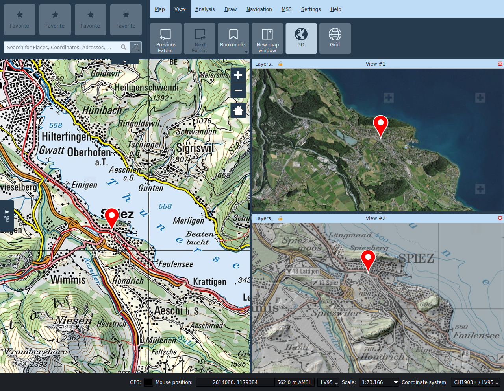
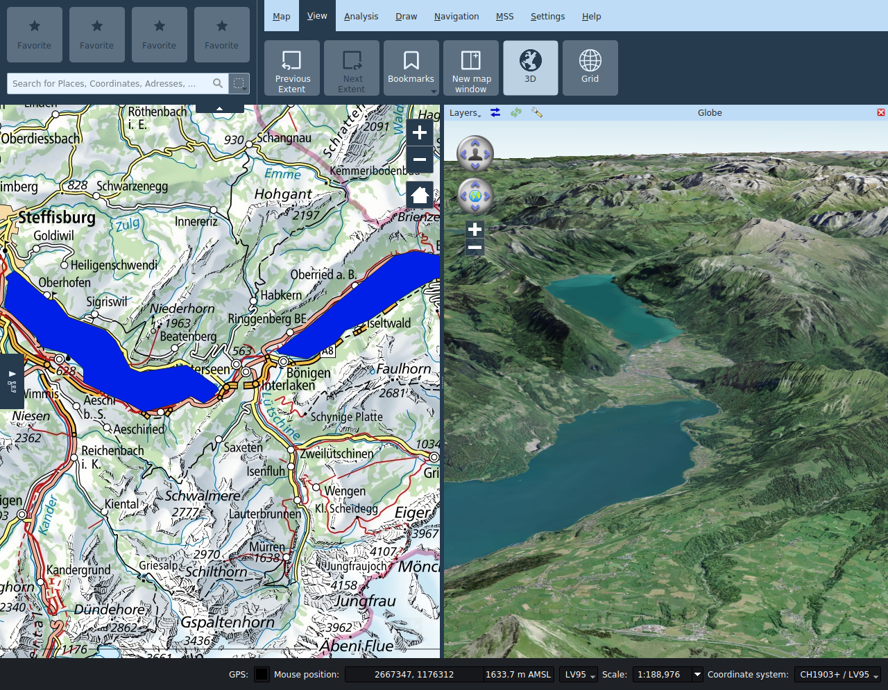
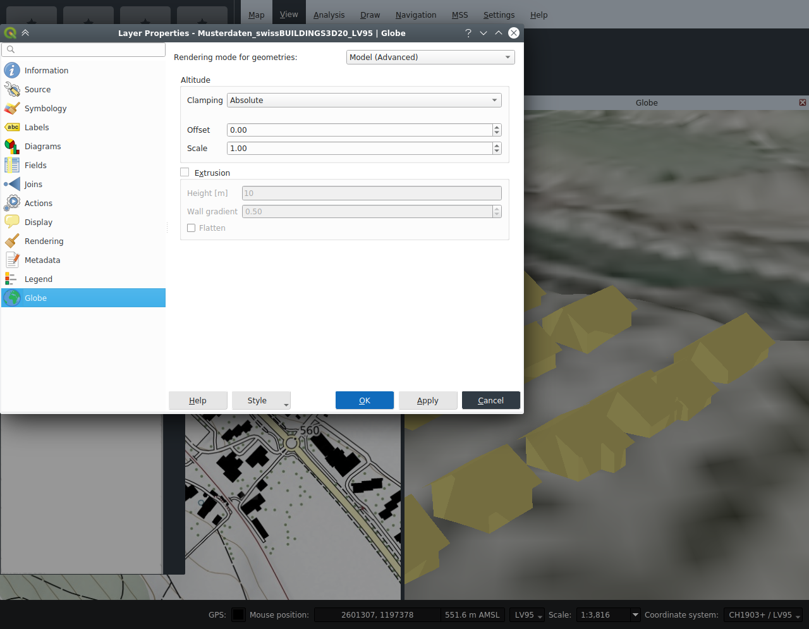

<!-- Recovered from: share/docs/html/en/en/view/index.html -->
<!-- Language: en | Section: view -->

# View

## Previous/Next extent

After panning or zooming the map, the function **Previous extent** allows the user to return to the previously visible map extent. Similarly the function **Next extent** allows to move forward in the extent history.

## Bookmarks

Bookmarks allow to store and restore the current map state, specifically the map extent and the layer configuration. Note that restoring a bookmark won't restore layers which have since been removed from the project.

## New map window

The **New map window** function opens up secondary map views. These can be placed anywhere within the main window or decoupled from it by dragging the title bar.

In the subwindow views, you can enable and disable layers independently from the main view. The visible extent can be controlled independently of the main view or synchronized by toggling the lock icon in the title bar of the subwindow.

In secondary map views, only the navigation tool is available, all other tools can only be used in the main view.

The title of the subwindow can be changed if necessary.

## 3D

The **3D** function opens an additional child window with a 3D globe view. It can be moved around within or outside the application window by dragging on their title bar.

### Settings

The following functions are available in the title bar of the 3D window:

- **Layer selection**: Allows selecting the layers of the 2D view to be displayed on the globe.
- **Synchronize extent**: This button synchronizes the globe viewport with the current extent of the main map view.
- **Reload scene**: This button triggers a refresh of all layers displayed on the globe.
- **Globe settings**: This button opens the globe configuration dialog. Among other things, the terrain models for the 3D view are configured there, and imagery layers can also be added. The 2D layers to be displayed are selected in the menu on the left side of the title bar. In the interest of performance, only local layers of the 2D view are activated by default - background image layers should, if possible, be added directly as imagery layers in the globe settings dialog.

All 2D map layers are by default drawn as a draped textures on the globe. Vector layers (including redlining) can alternatively be drawn either as extruded 2.5D models or as 3D models, with the style of the 2D view adopted as far as possible in the 3D view. For representation as 3D models, the geometries of the layer must be provided with elevation information (Z coordinates), and these must be either expressed with respect to the terrain or the sea level. The display options for vector levels can be set in the corresponding layer properties.

**Note**: The tooltips of the input fields in the globe settings of the layer describe the various options in detail.

**Note**: The shading of 3D models depends on the position of the sun. The position of the sun can be controlled by specifying time and date in the globe settings.

Pins, camera images and one-point MSS symbols are displayed as billboards.

### Navigation in the 3D view

- **Viewing angles**: The upper navigation control allows the user to modify the horizontal and vertical viewing angles of the camera.
- **Camera position**: The lower navigation control allows moving the camera position around the globe. The same can be accomplished by pressing the keyboard arrows.
- **+**: Reduces the camera height.
- **-**: Increases the camera height.

## Grid

The map **grid** can be activated in the View tab.

In the properties panel of the grid it is possible to personalize the grid type, its intervals as well as the appearance.
