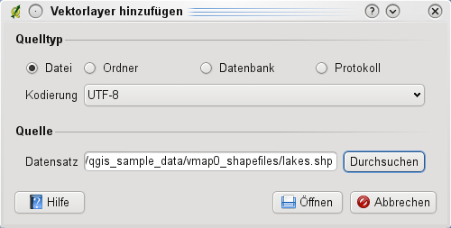
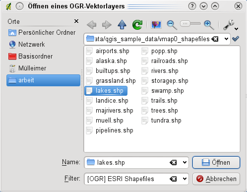

<!-- Recovered from: docs_old/html/en/en/working_with_vector/supported_data/index.html -->
<!-- Language: en | Section: working_with_vector/supported_data -->

# Supported Data Formats

KADAS uses the OGR library to read and write vector data formats, including ESRI shapefiles, MapInfo and MicroStation file formats, AutoCAD DXF, PostGIS, SpatiaLite, Oracle Spatial and MSSQL Spatial databases, and many more. GRASS vector and PostgreSQL support is supplied by native KADAS data provider plugins. Vector data can also be loaded in read mode from zip and gzip archives into KADAS. As of the date of this document, 69 vector formats are supported by the OGR library. The complete list is available at [http://www.gdal.org/ogr/ogr_formats.html](https://gdal.org/en/stable/drivers/vector/index.html).

## ESRI Shapefiles

The standard vector file format used in KADAS is the ESRI shapefile. Support is provided by the OGR Simple Feature Library (<http://www.gdal.org/>).

A shapefile actually consists of several files. The following three are required:

1. `.shp` file containing the feature geometries
2. `.dbf` file containing the attributes in dBase format
3. `.shx` index file

Shapefiles also can include a file with a `.prj` suffix, which contains the projection information. While it is very useful to have a projection file, it is not mandatory. A shapefile dataset can contain additional files. For further details, see the ESRI technical specification at <http://www.esri.com/library/whitepapers/pdfs/shapefile.pdf>.

### Loading a Shapefile

When loading a vector layer, the following dialog opens:

From the available options check  _File_. Click on **[Browse]**. That will bring up a standard open file dialog, which allows you to navigate the file system and load a shapefile or other supported data source. The selection box _Filter_  allows you to preselect some OGR-supported file formats.

You can also select the encoding for the shapefile if desired.

Selecting a shapefile from the list and clicking **[Open]** loads it into KADAS.

**Layer Colors**

When you add a layer to the map, it is assigned a random color. When adding more than one layer at a time, different colors are assigned to each layer.

Once a shapefile is loaded, you can zoom around it using the map navigation tools. To change the style of a layer, open the _Layer Properties_ dialog by double clicking on the layer name or by right-clicking on the name in the legend and choosing _Properties_ from the context menu. See section [_Style Menu_](vector_properties.md#vector-style-menu) for more information on setting symbology of vector layers.

### Improving Performance for Shapefiles

To improve the performance of drawing a shapefile, you can create a spatial index. A spatial index will improve the speed of both zooming and panning. Spatial indexes used by KADAS have a `.qix` extension.

Use these steps to create the index:

- Open the _Layer Properties_ dialog by double-clicking on the shapefile name in the legend or by right-clicking and choosing _Properties_ from the context menu.
- In the _General_ tab, click the **[Create Spatial Index]** button.

### Problem loading a shape .prj file

If you load a shapefile with a `.prj` file and KADAS is not able to read the coordinate reference system from that file, you will need to define the proper projection manually within the _General_ tab of the _Layer Properties_ dialog of the layer by clicking the **[Specify...]** button. This is due to the fact that `.prj` files often do not provide the complete projection parameters as used in KADAS and listed in the _CRS_ dialog.

For the same reason, if you create a new shapefile with KADAS, two different projection files are created: a `.prj` file with limited projection parameters, compatible with ESRI software, and a `.qpj` file, providing the complete parameters of the used CRS. Whenever KADAS finds a `.qpj` file, it will be used instead of the `.prj`.
