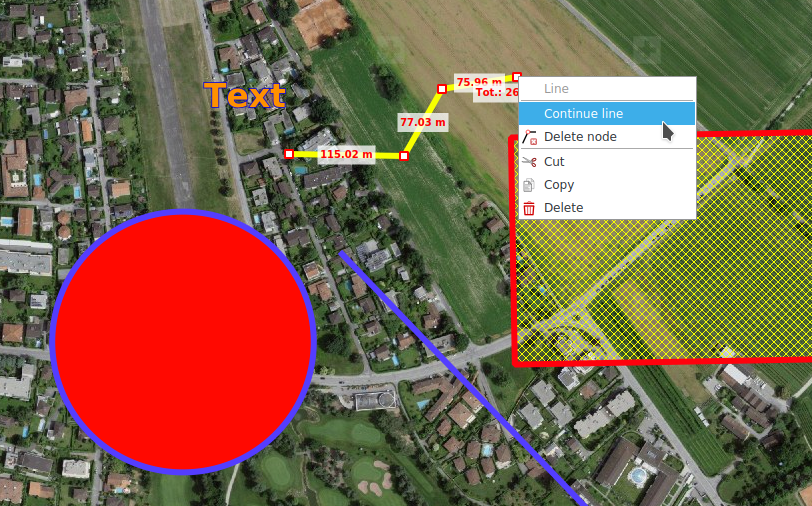
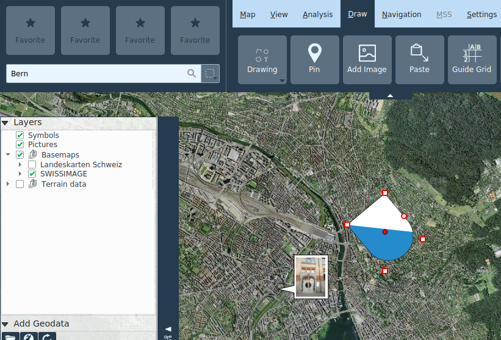
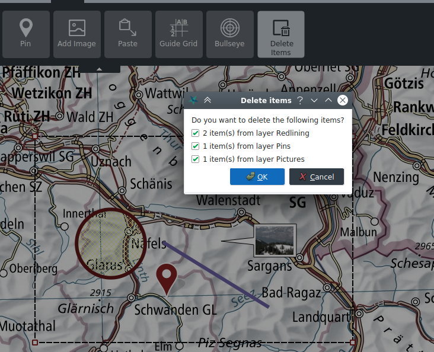

<!-- Recovered from: share/docs/html/fr/fr/draw/index.html -->
<!-- Language: fr | Section: draw -->

# Dessiner

## Géométries et textes (Redlining)

On peut dessiner les géométries des types suivants:

- Points
- Lignes
- Polygones
- Rectangles
- Cercles
- Croix de coordonnées

Selon le type de géométrie, les couleurs et le motif du contour et du remplissage peuvent être adaptés, ainsi que l’épaisseur des lignes ou la taille des points.

Pour les **textes**, les caractères et leur taille ainsi que la couleur de remplissage peuvent être adaptés.

Les géométries dessinées et les textes sont placés sous le niveau **Redlining** du répertoire de la carte.

On peut éditer a posteriori les géométries déjà dessinées ou les textes en les sélectionnant sur la carte. Les objets sélectionnés peuvent être déplacés et, en fonction du type de géométrie, les nœuds peuvent être déplacés individuellement, créées ou éliminés via le menu contextuel. L'ordre z d'une géométrie peut être modifié via le menu contextuel.

Les géométries de lignes et de polygones existantes peuvent être continuées via le menu contextuel sur un nœud.

Les opérations d'édition sur une couche de Redlining peuvent se faire par CTRL+Z et CTRL+Y ou avec les touches correspondantes du bord inférieur de la carte.

Lors de la création et de l'édition de géométries, les valeurs mesurées pertinentes sont affichées en même temps.

Les dessins de Redlining peuvent être copiés / coupé et collé via le menu contextuel ou les raccourcis habituels CTRL+C, CTRL+X et CTRL+V. Plusieurs objets de Redlining peuvent être sélectionnés avec la touche CTRL et déplacés, copiés, coupés et collés en tant que groupe.

## Épingle

Les punaises sont des **marqueurs de positions** géoréférencés qui peuvent également être nommés ou dotés de commentaires.

L’infobulle d’une punaise placée indique la position et l’altitude. Un double clic sur la punaise ouvre sa boîte de dialogue. Un clic droit sur la punaise permet de copier sa position dans le presse-papier.

On peut rechercher des punaises par nom ou par commentaire dans la recherche standard.

## Ajouter image

### Images raster

Les images raster dans les formats habituels (JPG, PNG, BMP) peuvent être ajoutées en tant qu' **annotations** à la carte. Ceux-ci sont affichés dans une bulle de dialogue. Si l'image est géoréférencée (balises EXIF), l'ancre est placée à l'emplacement approprié et l'emplacement est bloqué. Le verrouillage de position peut être activé ou désactivé via le menu contextuel. Un double-clic sur l'ancre ouvre l'image avec la visionneuse d'images par défaut du système d'exploitation. La taille de la bulle peut être modifiée à ses sommets.

Les images raster sont stockées dans la couche Images.

### Graphiques vectoriels

Avec la fonction **Ajouter image** il est possible d'ajouter des graphiques SVG à la carte. Ceux-ci peuvent être augmentés ou réduits avec la souris en faisant glisser les points de contrôle correspondants et en les faisant pivoter.

Les graphiques vectoriels sont stockés dans la couche **SVG graphics**.

## Coller

La fonction **Coller**\*\* permet d'insérer divers objets du presse-papiers dans la carte:

- Géométries: Ces objets sont insérés comme des objets redlining
- Symboles MSS: Ceux-ci sont insérés dans la couche MilX sélectionné
- Graphiques SVG: Ceux-ci sont insérés dans la couche **SVG graphics**

## Symboles SymTaZ

SymTaZ est un programme externe qui peut être utilisé pour créer des symboles, des signes tactiques et des signatures civiles pour des documents militaires conformément au règlement 52.002.03 de l'armée suisse. Ces icônes peuvent être importées dans KADAS, soit par la fonction **Copier dans le Presse-papiers (Formulaire Texte)** dans SymTaZ suivie de **Coller** dans KADAS, ou en enregistrant en format SVG dans SymTaZ puis en ouvrant via **Ajouter image** dans KADAS.

## Grille de conduite

La grille de conduite est une grille dans laquelle les lignes et les colonnes sont identifiées par des chiffres ou des lettres. La grille de conduite est stockée à son propre couche et apparaît dans la légende de la carte. Toutes les propriétés de la grille ainsi que l'affichage des légendes peuvent être ajustées. Par défaut, la grille est créée en fonction de l'étendue actuelle de la carte. Il est possible de créer autant de niveaux de grille de conduite que vous le souhaitez.

## Bullseye

Un Bullseye est dessiné sous la forme d'un nombre de cercles concentriques autour d'un point sélectionné et d'axes correspondants, séparés à intervalles réguliers. Comme la grille de conduite, elle est stockée dans sa propre couche et différentes propriétés peuvent être configurées librement.

## Effacer des objets

Les objets individuels peuvent être supprimés via le menu contextuel ou la touche SUPPR. L'outil **Supprimer les objets** vous permet de supprimer plusieurs objets à la fois dans une section sélectionnée. Cette fonction peut également être appelée via CTRL+Rectangle en mode de navigation.

