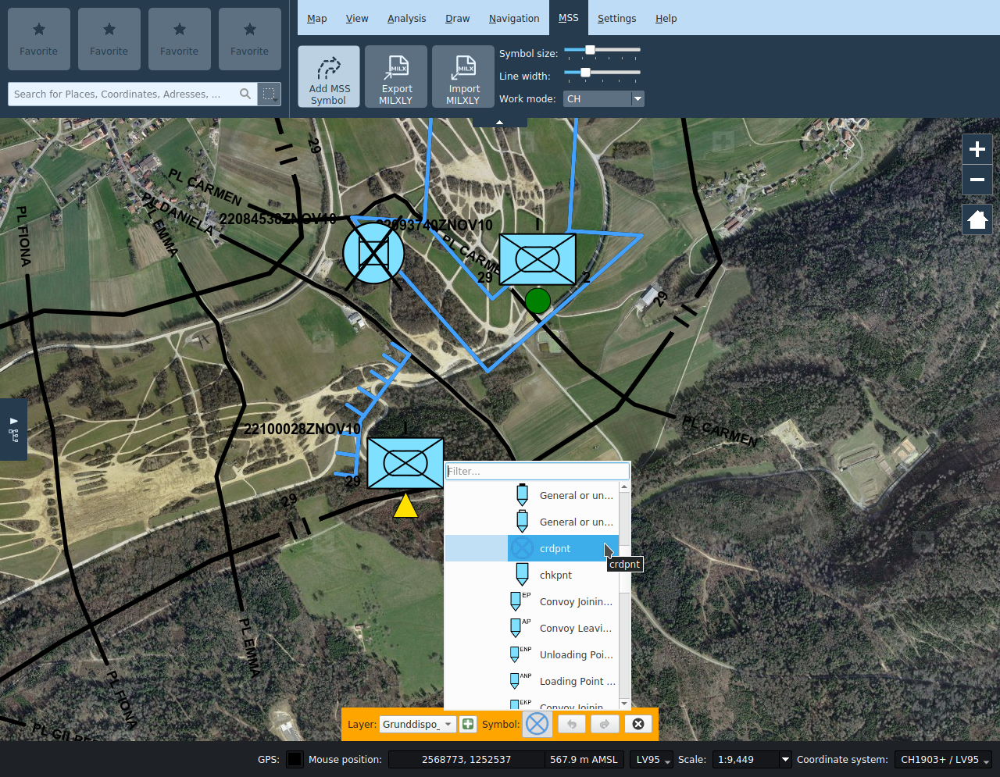
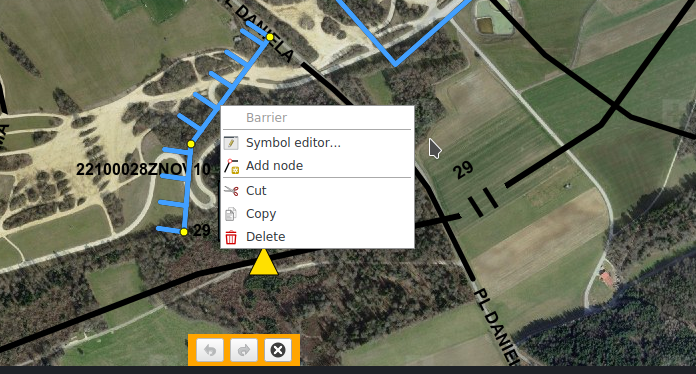

<!-- Recovered from: docs_old/html/fr/fr/mss/index.html -->
<!-- Language: fr | Section: mss -->

# MSS

La fonctionnalité de la représentation de la situation se trouve dans l’onglet MSS. Cet onglet est inactif si l’interface KADAS MSS-MilX n’est pas installée. La fonctionnalité de représentation de la situation comprend le dessin et l’édition de symboles MSS et la gestion de niveaux MilX.

## Dessiner des symboles MSS

Le bouton **Ajouter un symbole** ouvre une galerie de symboles MSS où l’on peut effectuer des recherches. Après avoir sélectionné un symbole dans la galerie, on peut le placer sur la carte.

Les symboles sont placés au niveau MilX. Ils sont visibles dans le répertoire de la carte. On peut créer de nouveaux niveaux MilX et on peut également choisir à quel niveau les symboles que l’on vient de dessiner doivent être ajoutés.

## Editer des symboles MSS

On peut éditer les symboles déjà dessinés a posteriori en les sélectionnant sur la carte. Les **objets sélectionnés** peuvent être déplacés et, selon le type de symbole, les nœuds peuvent être déplacés individuellement, créés ou supprimés via le menu contextuel. L’éditeur de symbole MilX peut être ouvert par double clic ou par Editer dans le menu contextuel.

Pour les **symboles à un point**, il est également possible de choisir entre point d’ancrage symbole ou graphique symbole pour un offset. Dans le mode d’édition, le point d’ancrage est caractérisé par un point rouge, par défaut au milieu du symbole. Si le symbole est déplacé vers le point d’ancrage, le point est déplacé en même temps que le graphique. Si le symbole est vers le graphique, seul le graphique est déplacé et une ligne noire apparaît entre le point d’ancrage et le centre du graphique. On peut supprimer l’offset en faisant un clic droit sur le symbole.

Pour les **symboles à plusieurs points**, il est possible d’éditer des nœuds et des points de contrôle éventuels, tant que les spécifications du symbole le permettent. Dans le mode édition, les nœuds sont représentés par des points jaunes et les points de contrôle par des points rouges. Ces derniers peuvent contrôler la largeur des flèches ou les paramètres d’évaluation des courbes Bézier. En plus de déplacer les points, on peut ajouter de nouveaux noeuds ou en supprimer ou faisant clic droit.

De la même manière que pour les objets redlining, les symboles MSS peuvent être déplacés, copiés, coupés et collés individuellement ou en groupe. En plus des entrées du menu contextuel et des raccourcis clavier habituels, il y a aussi les boutons **Copier vers...** et **Déplacer vers...** en bas de la carte. Ces derniers permettent explicitement de spécifier une couche cible, par défaut la couche MilX actuellement sélectionnée est prise comme cible. Si aucune couche MilX n'est sélectionnée, la couche de destination sera demandée.

## Gestion des couches

Les symboles MSS sont classés dans un **niveau MilX** dédié dans l’arborescence. On peut créer plusieurs niveaux MilX indépendants. Dans la galerie des symboles MSS, on peut choisir à quel niveau un symbole doit être ajouté. Comme d’habitude, les niveaux individuels peuvent être activés ou désactivés dans l’arborescence.

Les niveaux MilX présentent la caractéristique particulière de pouvoir être marqués comme **Approuvé**. Les niveaux approuvés ne peuvent pas être édités et les symboles tactiques apparaissent en noir. On peut marquer un niveau comme approuvé (ou enlever cet attribut) dans le menu contextuel du niveau MilX correspondant.

## Importation et exportation MilX

Les niveaux MilX peuvent être exportés dans un fichier MILXLY ou MILXLYZ, et les fichiers MILXLY et MILXLYZ peuvent être importés en tant que niveaux MilX.

MILXLY (et la variante comprimée MILXLYZ) est un format d’échange de représentations de situation. Il comprend uniquement des symboles MSS de représentation de situation, et aucun autre objet tel que les redlinings, punaises ou images.

Lors de **l'exportation** vers MILXLY (Z), vous pouvez choisir les couches MilX à exporter et dans quelle version le fichier doit être créé. De plus, vous pouvez choisir d'exporter le cartouche de carte défini dans la boîte de dialogue d'impression.

**L'importation** d'un fichier MILXLY (Z) parcourt toutes les couches qu'il contient. Si le fichier MSS contient des définitions de symboles conformes à un ancien standard, ceux-ci sont automatiquement convertis. Les pertes de conversion possibles ou les erreurs sont communiquées à l'utilisateur. Si l'une des couches importées contient un cartouche, l'utilisateur sera invité à l'importer dans KADAS.

## Dimension des symboles, largeur des lignes, standard, largeur et couleur de la ligne de repère

Ces réglages influencent l'affichage de tous les symboles MSS dans carte. Elles peuvent être remplacées individuellement pour chaque couche dans l'onglet MSS de dialogue des propriétés de la couche.
