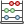
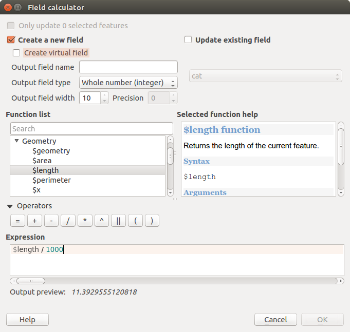

<!-- Recovered from: docs_old/html/fr/fr/working_with_vector/field_calculator/index.html -->
<!-- Language: fr | Section: working_with_vector/field_calculator -->

# Calculatrice de champ

Le bouton  _Ouvrir la calculatrice de champs_ de la table d'attributs permet d'opérer des calculs sur la base des valeurs attributaires ou d'utiliser des fonctions, par exemple pour calculer la longueur ou la surface des entités. Les résultats peuvent être écrits dans une nouvelle colonne attributaire, un champ virtuel ou mettre à jour une colonne existante.

**Champ Virtuels**

- Les champs virtuels ne sont pas permanents et ne sont pas sauvegardés.
- Pour qu'un champ soit virtuel, il faut le spécifier à sa création.

La calculatrice de champ fonctionne avec toutes les couches qui gèrent le mode édition. Lorsque vous cliquez sur le bouton de la calculatrice de champ, la fenêtre s'ouvre. Si la couche n'est pas en mode édition, un avertissement s'affiche et l'utilisation de la calculatrice de champ basculera automatiquement la couche en édition avant d'effectuer le calcul.

La barre de calcul de champ n'est visible que si la couche est en mode édition.

Dans la barre de calcul de champ, vous sélectionnez d'abord le champ à éditer puis ouvrez le calculateur d'expressions pour saisir l'expression ou écrivez directement dans le champ de saisie et enfin cliquez sur le bouton **Tout mettre à jour**.

## Onglet Expression

Dans la Calculatrice de champ, vous devez d'abord spécifier si vous souhaitez mettre à jour uniquement les entités sélectionnées, créer un nouveau champ où les résultats du calcul seront stockés ou mettre à jour un champ existant.



Si vous choisissez d'ajouter un nouveau champ, vous devez lui donner un nom, un type (nombre entier, nombre décimal ou chaîne de caractère), une longueur et sa précision. Par exemple, si vous créez un champ d'une longueur de 10 et doté d'une précision de 3, vous aurez 6 chiffres avant la virgule, la virgule et 3 chiffres après.

L'exemple suivant montre comment la calculatrice de champs fonctionne. Il s'agit de calculer la longueur en km de la couche `railroads` issue de l'échantillon de données KADAS.

1. Chargez le fichier shapefile `railroads.shp` dans QGIS et ouvrez sa  _Table d'Attributs_.
2. Cliquez sur  _Basculer en mode édition_ et ouvrez la  _Calculatrice de champs_.
3. Cochez la case  _Créer un nouveau champ_ pour enregistrer le résultat des calculs dans un nouveau champ.
4. Ajoutez `longueur` dans le nom de ce champ, `réel` en tant que type et définissez une longueur de 10 et une précision de 3.
5. Double-cliquez maintenant sur la fonction `$length` de la catégorie _Géometrie_ pour l'ajouter à la zone d'Expression.
6. Terminez en rentrant 1000 à la fin de l'expression et en cliquant sur le bouton **[Ok]**.
7. Vous pouvez maintenant voir la nouvelle colonne `longueur` dans la table d'attributs.

Les fonctions disponibles sont listées dans [Expressions](../expression/).

## Onglet Editeur de fonction

With the Function Editor you are able to define your own Python custom functions in a comfortable way. The function editor will create new Python files in `qgis2pythonexpressions` and will auto load all functions defined when starting QGIS. Be aware that new functions are only saved in the `expressions` folder and not in the project file. If you have a project that uses one of your custom functions you will need to also share the .py file in the expressions folder.

Here's a short example on how to create your own functions:

```
@qgsfunction(args="auto", group='Custom')
def myfunc(value1, value2 feature, parent):
    pass
```

Ce court exemple crée la fonction _myfunc_ qui vous donnera une fonction avec deux valeurs. Quand vous utilisez l'argument de fonction args=’auto’ le nombre d'arguments de la fonction requis sera calculé selon le nombre d'arguments définis en Python (moins 2 - feature, et parent).

This function then can be used with the following expression:

```
myfunc('test1', 'test2')
```

Votre fonction sera implémentée dans _Custom_ _Fonctions_ de l'onglet _Expression_ après l'utilisation du bouton _Lancer le script_.

Plus d'informations sur la création de code Python peuvent être trouvées sur <http://www.qgis.org/html/en/docs/pyqgis_developer_cookbook/index.html>.

L'éditeur de fonction ne se limite pas à la calculatrice de champ, il est disponible à chaque fois que vous travaillez avec des expressions.
