<!-- Recovered from: share/docs/html/it/it/print_composer/print_composer/index.html -->
<!-- Language: it | Section: print_composer/print_composer -->

# Compositore di stampa

Con Compositore di stampa è possibile creare mappe e occhiali che possono essere stampati o salvati come file PDF, un'immagine o un file SVG. Questo è un modo potente per condividere le informazioni geografiche prodotte con KADAS che possono essere incluse nei report o pubblicate.

Il compositore di stampa offre funzionalità di layout e di stampa. Consente di aggiungere elementi come la mappa, etichette di testo, immagini, legende, barre di scala, forme di base, frecce, tabelle degli attributi e pagine HTML. È possibile dimensionare, raggruppare, allineare, posizionare e ruotare ogni elemento e regolare le proprietà per creare il layout. Il layout può essere stampato o esportato in formati immagine, PostScript, PDF o SVG. È possibile salvare il layout come modello e caricarlo nuovamente in un'altra sessione. Infine, la generazione di diverse mappe basate su un modello può essere effettuata tramite il generatore atlante. Il seguente elenco fornisce una panoramica degli strumenti disponibili nei menu e come icone in una barra degli strumenti:

-  *Salva progetto*
- 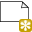 *Nuovo compositore*
- 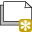 *Duplica compositore*
- 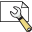 *Gestore compositore*
-  *Carica da modello*
-  *Salva come template*
-  *Stampa o esporta come PostScript*
- 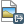 *Esportazione come immagine*
-  *Esportazione come SVG*
- 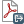 *Esportazione come PDF*
-  *Annulla ultima modifica*
-  *Ripristina ultima modifica*
- 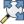 *Zoom in tutta la sua estensione*
- 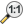 *Zoom al 100%*
- 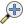 *Aumenta zoom*
-  *Riduci zoom*
-  *Aggiorna*
- 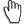 *Pan*
- 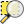 *Zoom sulla regione selezionata*
- 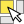 *Seleziona/muovi elemento nella composizione di stampa*
- 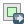 *Sposta contenuto all'interno dell'elemento*
-  *Aggiungi nuovo elemento mappa*
- 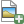 *Aggiungi immagine*
- 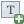 *Aggiungi etichetta*
- 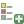 *Aggiungi nuova leggenda*
- 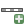 *Aggiungi barra scala*
- 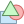 *Aggiungi forma geometrica*
- 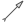 *Aggiungi freccia*
-  *Aggiungi tabella attributi*
- 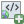 *Aggiungi una pagina HTML*
- 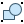 *Raggruppa elementi*
- 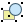 *Separa gruppo di elementi*
-  *Blocca gli elementi selezionati*
-  *Sblocca tutti gli elementi*
- 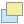 *Sposta elementi selezionati in alto*
- 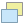 *Sposta elementi selezionati in basso*
- 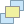 *Sposta elementi selezionati in primo piano*
- 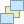 *Sposta elementi selezionati in ultimo piano*
- 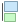 *Allinea elementi selezionati a sinistra*
- 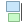 *Allinea elementi selezionati a destra*
- 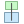 *Centra elementi selezionati orrizontalmente*
- 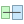 *Centra elementi selezionati verticalmente*
- 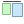 *Allinea elementi selezionati in alto*
- 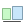 *Allinea elementi selezionati in basso*
-  *Anteprima atlante*
-  *Prima pagina atlante*
-  *Pagina atlante precedente*
-  *Prossima pagina atlante*
-  *Ultima pagina atlante*
-  *Stampa atlante*
-  *Esporta atlante come immagine*
- 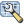 *Impostazioni atlante*

## Panoramica del compositore di stampa

Inizialmente il compositore di stampa si presenta come un'area di disegno vuota, che rappresenta l'area che viene stampata quando si utilizzano le rispettive funzionalità. Con i pulsanti a sinistra dell'area di disegno è possibile aggiungere elementi al compositore di stampla: mappe, etichette di testo, immagini, legende, barre di scala, forme geometriche, frecce, tabelle degli attributi e pagine HTML. In questa barra degli strumenti si trovano anche i pulsanti della barra degli strumenti per navigare, ingrandire un'area e scorrere la vista sul compositore e i pulsanti della barra degli strumenti per selezionare una voce del compositore di mappe e per spostare il contenuto della voce della mappa.

La vista iniziale della composizione di stampa prima di aggiungere elementi è illustrata di seguito:

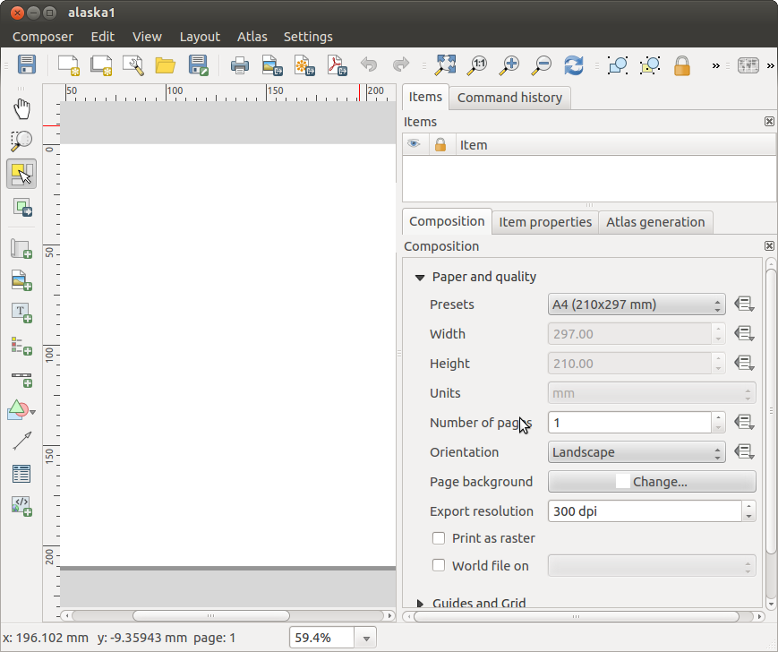

Sulla destra accanto dell'area di disegno si trovano due pannelli. Il pannello superiore contiene le schede _Elementi_ e _Cronologia dei comandi_ e il pannello inferiore contiene le schede _Composizione_, _Proprietà degli oggetti_ e _Generazione atlante_.

- La scheda _Elementi_ fornisce un elenco di tutti gli elementi del compositore di mappe aggiunti alla composizione.
- La scheda _Cronologia comando_ mostra la cronologia di tutte le modifiche apportate al layout del compositore di stampa. Con un clic del mouse, è possibile annullare e rifare le modifiche al layout avanti e indietro fino ad un certo stato.
- La scheda _Composizione_ consente di impostare le dimensioni della pagina, l'orientamento, lo sfondo, il numero di pagine e la qualità di stampa del file di output in dpi. Inoltre, è anche possibile attivare la casella di controllo  _Stampa come raster_. Questo significa che tutti gli elementi saranno convertiti in raster prima di essere stampati o salvati come PostScript o PDF. In questa scheda, è anche possibile personalizzare le impostazioni per la griglia e le guide intelligenti.
- La scheda _Proprietà elemento_ visualizza le proprietà per l'elemento selezionato. Clicca sull'icona  *Seleziona/Move item* per selezionare un elemento (es. legenda, barra di scala o etichetta) nell'area di disegno. Quindi fare clic sulla scheda _Proprietà elemento_ e personalizzare le impostazioni per l'elemento selezionato.
- La scheda _Generazione Atlante_ permette di abilitare la generazione di un atlante per il compositore corrente e dà accesso ai suoi parametri.
- Infine, è possibile salvare la composizione di stampa con il pulsante  *Salva progetto*.

Nella parte inferiore della finestra compositore di stampa, è possibile trovare una barra di stato con la posizione del mouse, il numero di pagina corrente e una casella combinata per impostare il livello di zoom.

È possibile aggiungere più elementi al compositore. È anche possibile avere più di una mappa, legenda o barra di scala nel compositore di stampa, su una o più pagine. Ogni elemento ha le proprie proprietà e, nel caso della mappa, la propria estensione. È possibile rimuovere qualsiasi elemento dalla composizione con il tasto `Cancella` o il tasto `Backspace`.

### Strumenti di navigazione

Per navigare nel layout dell'area di disegno, il compositore di stampa fornisce alcuni strumenti generali:

-  *Aumenta zoom*
-  *Riduci zoom*
-  *Zoom in tutta la sua estensione*
-  *Zoom al 100%*
-  *Aggiorna*
-  *Pan*
-  *Zoom sulla regione selezionata*

È possibile modificare il livello di zoom anche utilizzando la rotellina del mouse o la casella combinata nella barra di stato. Se avete bisogno di passare alla modalità pan mentre lavorate nell'area Composer, potete tenere premuto il tasto `Spazio` o la rotellina del mouse. Con la `Ctrl+Spazio`, potete passare temporaneamente alla modalità *Aumenta zoom*, e con `Ctrl+Shift+Spazio`, alla modalità *Riduci zoom*.

## Esempio

I passaggi seguenti descrivono un esempio di flusso di lavoro per la creazione di una composizione:

1. Nella barra degli strumenti a sinistra, selezionare il pulsante  *Aggiungi nuova mappa* e disegnare un rettangolo nell'area di disegno tenendo premuto il pulsante sinistro del mouse. All'interno del rettangolo verrà disegnata la mappa.
2. Nella barra degli strumenti, selezionare  *Aggiungi barra scala* e posizionare l'elemento della mappa con il tasto sinistro del mouse nell'area di disegno. Una barra di scala verrà aggiunta alla composizione.
3. Nella barra degli strumenti, selezionare  *Aggiungi legenda* e disegnare un rettangolo nell'area di disegno tenendo premuto il tasto sinistro del mouse. All'interno del rettangolo disegnato verrà disegnata la legenda.
4. Selezionare l'icona  *Seleziona elemento* per selezionare la mappa nell'area di disegno e spostarla.
5. Mentre l'elemento della mappa è ancora selezionato è anche possibile modificare le dimensioni dell'elemento della mappa. Fare clic tenendo premuto il tasto sinistro del mouse, in un piccolo rettangolo bianco in uno degli angoli dell'elemento della mappa e trascinarlo in una nuova posizione per cambiarne le dimensioni.
6. Fare clic sulla scheda _Proprietà elemento_ nel pannello inferiore sinistro e trovare l'impostazione per l'orientamento. Modificare il valore dell'impostazione _orientamento della mappa_ a '15.00°'. Si dovrebbe vedere l'orientamento della voce della mappa cambiare.
7. Infine, è possibile salvare la composizione di stampa con il pulsante  *Salva progetto*.

## Opzioni compositore di stampa

Da _Impostazioni → Opzioni compositore_ è possibile impostare alcune opzioni che verranno utilizzate come predefinito durante il lavoro.

- Le _Impostazioni predefinite compositore_ consentono di specificare il carattere predefinito da utilizzare.
- Con _Aspetto griglia_, è possibile impostare lo stile della griglia e il suo colore. Ci sono tre tipi di griglia: **Punti**, **Linee** e **Croci**.
- Le _Impostazioni predefinite griglia e guida_ definiscono la spaziatura, l'offset e la tolleranza della griglia di allineamento.

## Scheda Composizione - Impostazione composizione generale

Nella scheda _Composizione_, è possibile definire le impostazioni globali della propria composizione.

- È possibile scegliere uno dei _Preset_ per il foglio di carta, oppure immettere _larghezza_ e _altezza_ personalizzati.
- La composizione può essere suddivisa in più pagine. Per esempio, una prima pagina può mostrare una mappa, e una seconda pagina può mostrare la tabella degli attributi associata ad un livello, mentre una terza pagina mostra una pagina HTML che si collega al sito web della vostra organizzazione. Impostare il _Numero di pagine_ al valore desiderato. È possibile scegliere la pagina _Orientamento_ e la sua _risoluzione esportata_. Quando selezionata,  _print as raster_ significa che tutti gli elementi saranno rasterizzati prima della stampa o del salvataggio come PostScript o PDF.
- _Griglia e guide_ consente di personalizzare le impostazioni della griglia come _spazio_, _offset_ e _tolleranza_ in base alle proprie esigenze. La tolleranza è la distanza massima al di sotto della quale un elemento viene agganciato alle guide intelligenti.

È possibile attivare lo snap alla griglia e/o alle guide intelligenti dal menu _Visualizza_. In questo menu è anche possibile nascondere o mostrare la griglia e le guide intelligenti.

## Opzioni comuni per gli elementi della composizione

Gli elementi del compositore hanno un insieme di proprietà comuni che si trovano nella parte inferiore della scheda _Proprietà elemento_: Posizione e dimensione, rotazione, cornice, sfondo, ID elemento e rendering.

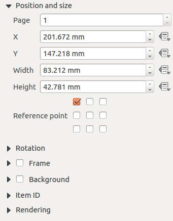

- La finestra di dialogo _Posizione e dimensione_ consente di definire la dimensione e la posizione della cornice che contiene l'elemento. È inoltre possibile scegliere il _punto di riferimento_ per le coordinate **X** e **Y** definite.
- La _Rotazione_ imposta la rotazione dell'elemento (in gradi).
-  _Cornice_ mostra o nasconde la cornice attorno all'etichetta. Utilizzare i menu _Colore cornice_ e _Spessore_ per regolare queste proprietà.
- Utilizzare il menu _Colore di sfondo_ per impostare un colore di sfondo. Con la finestra di dialogo è possibile scegliere un colore.
- La modalità _Rendering_ può essere selezionata nel campo opzione.

KADAS consente il rendering avanzato per gli elementi Composer proprio come i livelli vettoriali e raster.

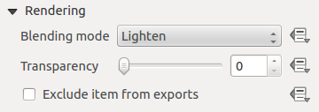

- _Trasparenza_: Con questo strumento è possibile rendere visibile l'elemento sottostante nella composizione. Usa il cursore per adattare la visibilità dell'oggetto alle tue esigenze. È inoltre possibile definire con precisione la percentuale di visibilità nel menu accanto al cursore.
-  _Escludi elemento dall'esportazione_: Puoi decidere nascondere un elemento dalle quando la composizione verrà stampata o esportata a PDF o altri formati.
- _Modalità di sovrapposizione_: È possibile ottenere effetti di rendering speciali con questi strumenti che in precedenza si possono conoscere solo da programmi di grafica. I pixel degli elementi di sovrapposizione e di sottoesposizione sono mischiati attraverso le impostazioni descritte di seguito.

  > - Normale: Questa è la modalità di fusione standard, che utilizza il canale alfa del pixel superiore per fondersi con il pixel sottostante; i colori non sono mescolati.
  > - Alleggerisci: Seleziona il massimo di ogni componente dai pixel di primo piano e di sfondo. Si tenga presente che i risultati tendono ad essere frastagliati e duri.
  > - Schermo: I pixel chiari dalla sorgente sono dipinti sopra la destinazione, mentre i pixel scuri non lo sono. Questa modalità è molto utile per mescolare la texture di un livello con un altro livello (ad esempio, è possibile utilizzare un hillshade per strutturare un altro livello).
  > - Dodge: Dodge illuminerà e saturerà i pixel sottostanti in base alla luminosità del pixel superiore. Così, i pixel superiori più luminosi fanno aumentare la saturazione e la luminosità dei pixel sottostanti. Questo funziona meglio se i pixel superiori non sono troppo luminosi, altrimenti l'effetto è troppo estremo.
  > - Aggiunta: Questa modalità di fusione aggiunge semplicemente i valori dei pixel di un livello con i valori dei pixel dell'altro. Nel caso di valori superiori a 1 (come nel caso di RGB), viene visualizzato il bianco. Questa modalità è adatta per evidenziare le caratteristiche.
  > - Scurisci: crea un pixel risultante che trattiene le componenti più piccole dei pixel di primo piano e di sfondo. Come per schiarire, i risultati tendono ad essere frastagliati e duri.
  > - Moltiplica: Qui, i numeri per ogni pixel dello strato superiore vengono moltiplicati con i numeri per il corrispondente pixel dello strato inferiore. I risultati sono immagini più scure.
  > - Bruciare: colori più scuri nello strato superiore causano l'oscuramento degli strati sottostanti. Le ustioni possono essere usate per modificare e colorare i livelli sottostanti.
  > - Sovrapposizione: Questa modalità combina le modalità di moltiplicazione e di fusione dello schermo. Nell'immagine risultante, le parti chiare diventano più chiare e le parti scure più scure.
  > - Luce morbida: Questo è molto simile alla sovrapposizione, ma invece di usare il moltiplicatore/schermo usa la funzione di masterizzazione colore/bordo. Questa modalità dovrebbe emulare la luce soffusa su un'immagine.
  > - Luce dura: la luce dura è molto simile alla modalità di sovrapposizione. Dovrebbe emulare la proiezione di una luce molto intensa su un'immagine.
  > - Differenza: La differenza sottrae il pixel superiore dal pixel inferiore, o viceversa, per ottenere sempre un valore positivo. La fusione con il nero non produce alcun cambiamento, poiché la differenza con tutti i colori è pari a zero.
  > - Sottrai: Questa modalità di fusione sottrae semplicemente i valori dei pixel di uno strato con i valori dei pixel dell'altro. In caso di valori negativi, viene visualizzato il nero.

## L'elemento mappa

Clicca sul pulsante  *Aggiungi nuova mappa* nella barra degli strumenti del compositore di stampa per aggiungere una mappa. Ora, trascinare un rettangolo nell'area di disegno Composer con il tasto sinistro del mouse per aggiungere la mappa. Per visualizzare la mappa corrente, è possibile scegliere tra tre diverse modalità nella scheda _Proprietà elemento_ della mappa:

- **Rettangolo** è l'impostazione predefinita. Visualizza solo una casella vuota con il messaggio "La mappa sarà stampata qui".
- **Cache** rende la mappa nella risoluzione corrente dello schermo. Se si ingrandisce o si riduce la finestra Composer, la mappa non viene visualizzata di nuovo, ma l'immagine verrà ridimensionata.
- **Render** significa che se si ingrandisce o si riduce la finestra Composer, la mappa sarà nuovamente resa, ma per motivi di spazio, solo fino ad una risoluzione massima.

**Cache** è la modalità di anteprima predefinita per le mappe Compositore di stampa appena aggiunte.

Puoi ridimensionare l'elemento mappa cliccando sul pulsante  *Seleziona elemento*, selezionando l'elemento e trascinando una delle maniglie nell'angolo della mappa. Con la mappa selezionata, è ora possibile adattare altre proprietà nella scheda _Proprietà elemento_ della mappa.

Per spostare i livelli all'interno dell'elemento mappa, selezionare l'elemento mappa, fare clic sull'icona *Sblocca elementi* per sbloccare tutti gli elementi del compositore bloccati.

### Proprietà principali

La finestra di dialogo _Proprietà principali_ della scheda _Proprietà elemento_ della mappa fornisce le seguenti funzionalità:

- L'area **Anteprima** permette di definire le modalità di anteprima _Rettangolo_, _Cache_ e _Render_, come descritto sopra. Se si modifica la visualizzazione sulla mappa KADAS cambiando le proprietà vettoriali o raster, è possibile aggiornare la visualizzazione della composizione di stampa selezionando l'elemento della mappa nella composizione di stampa e cliccando sul pulsante **[Aggiorna anteprima anteprima]**.
- Il campo _Scala_  imposta una scala manuale.
- Il campo _Rotazione mappa_  permette di ruotare il contenuto dell'elemento mappa in senso orario in gradi. La rotazione della visualizzazione della mappa può essere imitata qui. Si noti che un quadro di coordinate corretto può essere aggiunto solo con il valore di default 0 e che una volta definita una _rotazione della mappa_ attualmente non può essere modificata.
-  _Disegna annotazioni_ permette di mostrare le annotazioni che possono essere posizionate sull'area di disegno della mappa di KADAS.
- È possibile scegliere di bloccare i livelli mostrati su un elemento della mappa. Selezionare  _Blocca livelli della mappa_. Dopo che questo è stato selezionato, qualsiasi livello che sarebbe stato visualizzato o nascosto nella mappa KADAS non apparirà o non sarà nascosto nella mappa della composizione. Ma lo stile e le etichette di un livello bloccato sono ancora aggiornate secondo l'interfaccia principale di KADAS. È possibile prevenirlo utilizzando _Blocca stili dei livelli della mappa_.

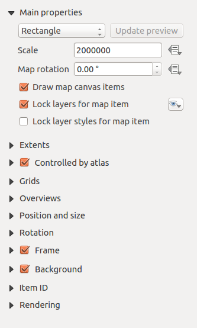

### Estensioni

La finestra di dialogo _Estensioni_ della scheda di proprietà per l'elemento mappa fornisce le seguenti funzionalità:

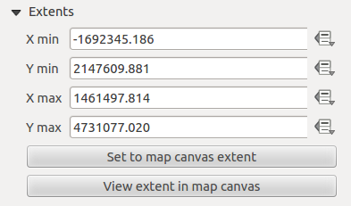

- L'area **Estensioni mappa** consente di specificare l'estensione della mappa utilizzando i valori X e Y min/max e facendo clic sul pulsante **[Usa estensione della mappa principale]**. Questo pulsante imposta l'estensione della mappa dell'elemento della mappa del compositore all'estensione della visualizzazione della mappa di KADAS. Il pulsante **[Usa estensione mappa compositore]** fa esattamente il contrario, aggiorna l'estensione della visualizzazione della mappa KADAS all'estensione dell'elemento della mappa del compositore.

Se si modifica la visualizzazione nell'area di disegno della mappa KADAS cambiando le proprietà vettoriali o raster, è possibile aggiornare la visualizzazione della composizione di stampa selezionando l'elemento della mappa nella composizione di stampa e facendo clic sul pulsante **[Aggiorna anteprima]** nella scheda _Proprietà elemento_ della mappa.

### Griglie

La finestra di dialogo _Griglie_ della scheda _Proprietà elemento_ della mappa offre la possibilità di aggiungere più griglie a un elemento della mappa.

- Con i pulsanti più e meno è possibile aggiungere o rimuovere una griglia selezionata.
- Con i pulsanti su e giù è possibile spostare una griglia nell'elenco e impostare la priorità di disegno.

Quando si fa doppio clic sulla griglia aggiunta, è possibile darle un altro nome.

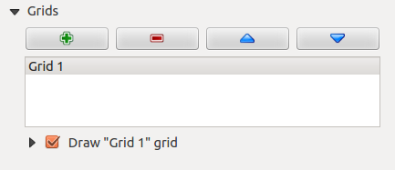

Dopo aver aggiunto una griglia, è possibile attivare la casella di controllo per disegnare la griglia.

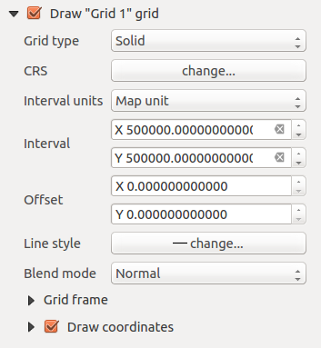

Come tipo di griglia, è possibile specificare di utilizzare un _Solido_, _Croce_, _Marcatori_ o _Cornice e solo annotazioni_. Quest'ultima opzione è particolarmente utile quando si lavora con mappe ruotate o griglie riproiettate. È possibile scegliere la simbologia della griglia. Inoltre, è possibile definire un intervallo nelle direzioni X e Y, un offset X e Y, e la larghezza usata per il tipo di griglia trasversale o lineare.

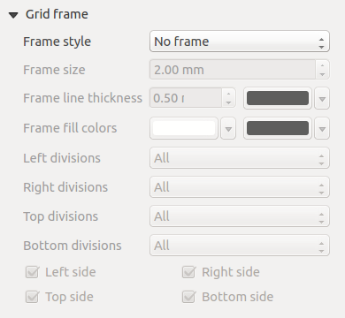

- Ci sono diverse opzioni per modellare la cornice che contiene la mappa.
- Con l'impostazione _Solo latitudine/Y_ e _Solo longitudine/X_ nella sezione deviazioni si ha la possibilità di evitare un mix di latitudine/y e longitudine/x che appaiono su un lato quando si lavora con mappe ruotate o griglie riproiettate.
- La modalità di rendering avanzato è disponibile anche per le griglie.
- La casella di controllo  _Disegna coordinate_ permette di aggiungere coordinate alla cornice della mappa. Puoi scegliere il formato numerico dell'annotazione, le opzioni vanno da decimale a gradi, minuti e secondi, con o senza suffisso, e allineato o meno. È possibile scegliere quale annotazione mostrare. Le opzioni sono: mostra tutte, solo latitudine, solo longitudine o disabilita (nessuna). Questo è utile quando la mappa viene ruotata. L'annotazione può essere disegnata all'interno o all'esterno del riquadro della mappa. La direzione dell'annotazione può essere definita come orizzontale, verticale ascendente o verticale discendente. In caso di rotazione della mappa si può infine definire il font dell'annotazione, il colore del font dell'annotazione, la distanza di annotazione dal riquadro della mappa e la precisione delle coordinate disegnate.

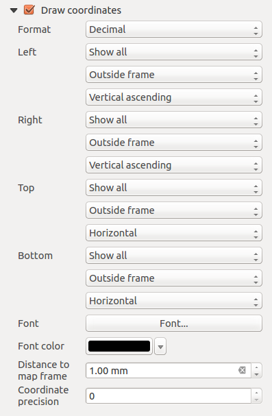

### Panoramiche

La finestra di dialogo _Panoramica_ della scheda _Proprietà elemento_ della mappa fornisce le seguenti funzionalità:

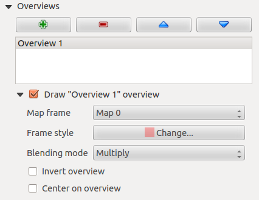

È possibile scegliere di creare una mappa panoramica, che mostra le estensioni delle altre mappe disponibili nel compositore. Per prima cosa è necessario creare le mappe che si desidera includere nella mappa panoramica. Successivamente si crea la mappa che si desidera utilizzare come mappa panoramica, proprio come una mappa normale.

- Con i pulsanti più e meno è possibile aggiungere o rimuovere una panoramica.
- Con i pulsanti su e giù è possibile spostare una panoramica nell'elenco e impostare la priorità di disegno.

Aprire _Panoramiche_ e premere il pulsante verde più l'icona per aggiungere una panoramica. Inizialmente questa panoramica si chiama _Panoramica 1_. È possibile cambiare il nome quando si fa doppio clic sull'elemento della panoramica nell'elenco denominato "Panoramica 1" e cambiarlo in un altro nome.

Quando si seleziona la voce di panoramica nell'elenco, è possibile personalizzarla.

- Il  _Disegna panoramica "<nome\_panoramica>"_ deve essere attivato per disegnare l'estensione della cornice della mappa selezionata.
- La lista _Cornice mappa_ può essere usata per selezionare l'elemento della mappa le cui estensioni saranno disegnate sull'elemento della mappa attuale.
- _Stile cornice_ permette di cambiare lo stile della cornice della panoramica.
- La modalità _Modalità di sovrapposizione_ consente di impostare diverse modalità di miscela di trasparenza.
- Il  _Inverti panoramica_ crea una maschera intorno agli estremi quando viene attivata: gli estremi della mappa di riferimento sono mostrati chiaramente, mentre tutto il resto viene miscelato con il colore del frame.
- Il  _Centra su panoramica_ imposta l'estensione della cornice panoramica al centro della mappa panoramica. È possibile attivare un solo elemento della panoramica da centrare, se sono state aggiunte più panoramiche.

## L'element etichetta

Per aggiungere un'etichetta, clicca sull'icona  *Aggiungi etichetta*, posiziona l'elemento con il tasto sinistro del mouse sull'area di disegno della composizione di stampa e posiziona e personalizza il suo aspetto nella scheda _Proprietà elemento_ dell'etichetta.

La scheda _Proprietà elemento_ di un elemento dell'etichetta fornisce le seguenti funzionalità per l'elemento dell'etichetta:

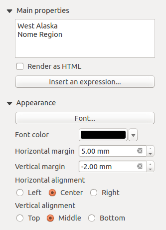

### Proprietà principali

- La finestra di dialogo principale delle proprietà è dove il testo (HTML o meno) o l'espressione necessaria per riempire l'etichetta viene aggiunta all'area di disegno della composizione.
- Le etichette possono essere interpretate come codice HTML: check  _Disegnare come HTML_. Ora è possibile inserire un URL, un'immagine cliccabile che si collega a una pagina web o qualcosa di più complesso.
- Puoi anche inserire un'espressione. Clicca su **[Inserisci un'espressione]** per aprire una nuova finestra di dialogo. Costruisci un'espressione cliccando sulle funzioni disponibili sul lato sinistro del pannello. Possono essere utili due categorie speciali, particolarmente associate alla funzionalità dell'atlante: funzioni geometriche e funzioni di registrazione. Nella parte inferiore viene mostrata un'anteprima dell'espressione.

### Aspetto

- Definire _Carattere_ cliccando sul pulsante **[Carattere....]** o un _Colore carattere_ selezionando un colore utilizzando lo strumento di selezione del colore.
- È possibile specificare diversi margini orizzontali e verticali in mm. Questo è il margine dal bordo dell'elemento compositore. L'etichetta può essere posizionata al di fuori dei limiti dell'etichetta, ad esempio per allineare gli elementi dell'etichetta con altri elementi. In questo caso è necessario utilizzare valori negativi per il margine.
- L'uso di _Allineamento_ è un altro modo per posizionare l'etichetta. Nota che quando, ad esempio, si utilizza _allineamento orizzontale_  _Centro_, la posizione del _margine orizzontale_ è disabilitata.

## L'elemento immagine

Per aggiungere un'immagine, clicca sull'icona  *Add image*, posiziona l'elemento con il tasto sinistro del mouse sull'area di disegno della composizione di stampa e posiziona e personalizza il suo aspetto nella scheda _Proprietà elemento_ dell'immagine.

La scheda _Proprietà dell'immagine_ in _Proprietà elemento_ fornisce le seguenti funzionalità:

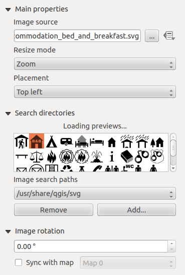

Per prima cosa è necessario selezionare l'immagine che si desidera visualizzare. Ci sono diversi modi per impostare la _origine immagine_ nell'area **Proprietà principali**.

1. Utilizzare il pulsante di navigazione 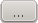 di _immagine_ per selezionare un file sul computer utilizzando la finestra di dialogo di navigazione. Il browser si avvierà nelle librerie SVG fornite con KADAS. Oltre a `SVG`, è anche possibile selezionare altri formati di immagine come `.png` o `.jpg`.
2. È possibile inserire la sorgente direttamente nel campo di testo _immagine_. È anche possibile fornire un indirizzo URL remoto ad un'immagine.
3. Dall'area **Ricerca cartella** è anche possibile selezionare un'immagine da _caricamento anteprime ...._ per impostare la fonte dell'immagine.
4. Utilizzare il pulsante dati definiti 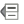 per impostare l'origine dell'immagine da un record o utilizzando un'espressione regolare.

Con l'opzione _Modalità ridimensionamento_, è possibile impostare la visualizzazione dell'immagine quando si cambia cornice, oppure scegliere di ridimensionare la cornice dell'elemento dell'immagine in modo che corrisponda alle dimensioni originali dell'immagine.

È possibile selezionare una delle seguenti modalità:

- Zoom: Ingrandisce l'immagine alla cornice mantenendo il rapporto di aspetto dell'immagine.
- Allungamento: Allunga l'immagine per adattarla all'interno della cornice, ignora il rapporto di aspetto.
- Clip: Utilizzare questa modalità solo per le immagini raster, imposta le dimensioni dell'immagine alle dimensioni originali senza ridimensionamento e la cornice viene utilizzata per ritagliare l'immagine, in modo che solo la parte dell'immagine all'interno della cornice sia visibile.
- Ingrandimento e ridimensionamento della cornice: Ingrandisce l'immagine per adattarla al frame, quindi ridimensiona il frame per adattarlo all'immagine risultante.
- Ridimensiona la cornice in base alle dimensioni dell'immagine: Imposta la dimensione della cornice in modo che corrisponda alla dimensione originale dell'immagine senza ridimensionamento.

La modalità di ridimensionamento selezionata può disabilitare le opzioni _Posizionamento_ e _Rotazione immagine_. La _rotazione immagine_ è attiva per le modalità di ridimensionamento _Zoom_ e _Clip_.

Con _Posizionamento_ è possibile selezionare la posizione dell'immagine all'interno della cornice. L'area **Ricerca cartella** consente di aggiungere e rimuovere directory con immagini in formato SVG nel database immagini. Un'anteprima delle immagini presenti nelle cartelle selezionate viene visualizzata in un riquadro e può essere utilizzata per selezionare e impostare l'origine dell'immagine.

Le immagini possono essere ruotate con il campo _Ruota immagine_. Attivando la casella di controllo  _Sync con mappa_ sincronizza la rotazione di un'immagine nella mappa KADAS (cioè, una freccia nord ruotata) con l'immagine appropriata della composizione di stampa.

È anche possibile selezionare direttamente una freccia nord. Se si seleziona prima un'immagine della freccia nord da **Ricerca cartella** e poi si usa il pulsante di navigazione.

_Nota_: Molte delle frecce nord non hanno una _N_ aggiunta nella freccia nord, questo è fatto apposta per le lingue che non usano una _N_ per il nord, quindi possono usare un'altra lettera.

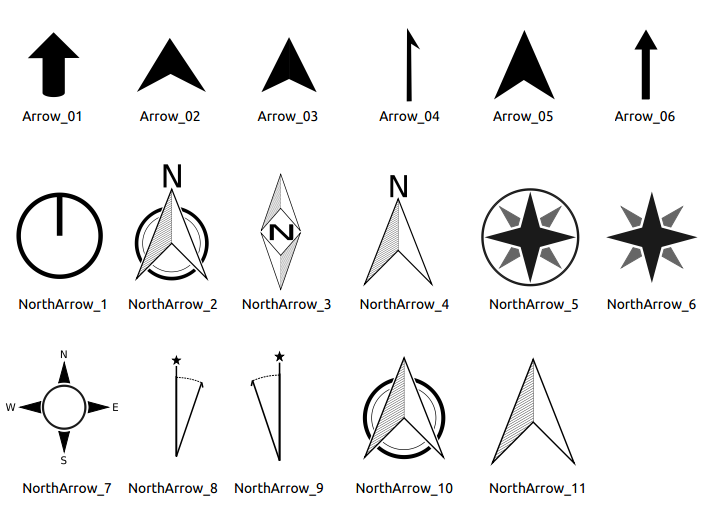

## L'elemento legenda

Per aggiungere una legenda della mappa, clicca sull'icona  *Aggiungi nuova legenda*, posiziona l'elemento con il tasto sinistro del mouse sull'area di disegno della composizione di stampa e posiziona e personalizza l'aspetto nella scheda _Proprietà elemento_.

La scheda _Proprietà elemento_ di una legenda fornisce le seguenti funzionalità:

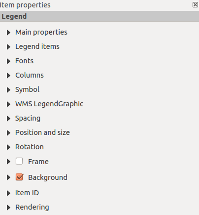

### Proprietà principali

La finestra di dialogo _Proprietà principali_ nella scheda _Proprietà elemento_ della legenda fornisce le seguenti funzionalità:

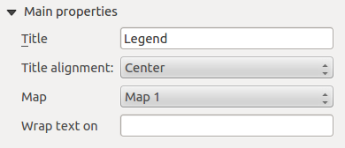

Nelle proprietà principali è possibile:

- Cambiare il titolo della legenda.
- Impostare l'allineamento del titolo su Sinistra, Centro o Destra.
- È possibile scegliere a quale voce _Mappa_ si riferirà la legenda corrente nell'elenco di selezione.
- È possibile avvolgere il testo del titolo della legenda su un dato carattere.

### Voci della leggenda

La finestra di dialogo _Voci legenda_ della scheda _Proprietà elemento_ fornisce le seguenti funzionalità:

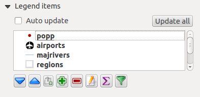

- La legenda verrà aggiornata automaticamente se  _Auto-update_ è selezionato. Quando _Auto-update_ è deselezionato, questo vi darà un maggiore controllo sulle voci della legenda. Verranno attivate le icone sotto l'elenco degli elementi della legenda.
- La finestra Leggende items elenca tutti gli elementi legenda e consente di modificare l'ordine degli elementi, raggruppare i livelli, rimuovere e ripristinare gli elementi nell'elenco, modificare i nomi dei livelli e aggiungere un filtro.
    - L'ordine degli articoli può essere modificato utilizzando i pulsanti **[Up]** e **[Down]** o con la funzione "drag and drop". L'ordine non può essere modificato per la grafica delle legende WMS.
    - Utilizzare il pulsante **[Aggiungi gruppo]** per aggiungere un gruppo di legende.
    - Usa il pulsante **[più]** e **[meno]** per aggiungere o rimuovere i livelli.
    - Il pulsante **[Edit]** è usato per modificare il livello, il nome del gruppo o il titolo, per prima cosa è necessario selezionare la voce legenda.
    - Il pulsante **[Sigma]** aggiunge un conteggio delle caratteristiche per ogni livello vettoriale.
    - Usa il pulsante **[filtro]** per filtrare la legenda in base al contenuto della mappa, solo gli elementi legenda visibili nella mappa saranno elencati nella legenda.

  Dopo aver cambiato la simbologia nella finestra principale di KADAS, puoi cliccare su **[Update All]** per adattare le modifiche nell'elemento legenda della composizione di stampa.

### Carattere, Colonne, Simbolo .

Le finestre di dialogo _Fonts_, _Columns_ e _Symbol_ della scheda _Proprietà elemento_ forniscono le seguenti funzionalità:


- È possibile modificare il carattere del titolo della legenda, del gruppo, del sottogruppo e dell'elemento (livello) nell'elemento legenda. Fare clic sul pulsante di una categoria per aprire una finestra di dialogo **Seleziona font**.
- Si fornisce alle etichette un **Colore** utilizzando il selezionatore avanzato di colori, tuttavia il colore selezionato verrà assegnato a tutti gli elementi del carattere nella legenda.
- Gli elementi della legenda possono essere disposti su più colonne. Impostare il numero di colonne nel campo _Count_ .
    -  _Larghezze colonne uguali_ imposta come regolare le colonne delle legende.
    - L'opzione  _Split layers_ permette di suddividere una legenda classificata o graduata tra le colonne.
- È possibile modificare la larghezza e l'altezza del simbolo della legenda in questa finestra di dialogo.

### WMS LegendGraphic e spaziatura

Le finestre di dialogo _WMS LegendGraphic_ e _Spaziatura_ della scheda _Proprietà elemento_ forniscono le seguenti funzionalità:


Quando si aggiunge un livello WMS e si inserisce una legenda compositore, viene inviata una richiesta al server WMS per fornire una legenda WMS. Questa legenda verrà mostrata solo se il server WMS fornisce la funzionalità GetLegendGraphic. Il contenuto della legenda WMS sarà fornito come immagine raster.

_WMS LegendGraphic_ è usato per regolare la _larghezza_ e l'_altezza_ dell'immagine raster della leggenda WMS.

Attraverso questa finestra di dialogo è possibile personalizzare la spaziatura intorno a titolo, gruppo, sottogruppo, sottogruppo, simbolo, etichetta dell'icona, spazio scatola o spazio colonna.

## L'elemento barra di scala

Per aggiungere una barra di scala, fare clic sull'icona  *Aggiungi nuova barra di scala*, posizionare l'elemento con il tasto sinistro del mouse sull'area di disegno della composizione di stampa e posizionare e personalizzare l'aspetto nella scheda _Proprietà elemento_ della barra di scala.

La scheda _Proprietà elemento_ di una barra di scala fornisce le seguenti funzionalità:


### Proprietà principali

La finestra di dialogo _Proprietà principali_ della scheda _Proprietà elemento_ della barra di scala fornisce le seguenti funzionalità:


- In primo luogo, scegliere la mappa alla quale sarà collegata la barra di scala.
- Quindi, scegliere lo stile della barra della scala. Sono disponibili sei stili:
    - **Cornice singola** e **cornice doppia**, che contengono una o due linee di cornice a colori alternati.
    - Righette sulla linea: **Metà**, **Su** o **Giù**.
    - **Numerico**, dove viene stampato il rapporto di scala (cioè, 1:50000).

### Unità e Segmenti

Le finestre di dialogo _Unità_ e _Segmenti_ della scheda _Proprietà elemento_ della barra di scala forniscono le seguenti funzionalità:


In queste due finestre di dialogo, è possibile impostare come sarà rappresentata la barra della scala.

- Selezionare le unità di misura della mappa utilizzate. Ci sono quattro possibilità di scelta: **Unità mappa** è la selezione automatica delle unità di misura; **Metri**, **Piedi** o **Miglia nautiche** conversioni di unità di forza.
- Il campo _Etichetta_ definisce il testo utilizzato per descrivere le unità della barra della scala.
- Il campo _Map units per bar unit_ permette di fissare il rapporto tra l'unità di una mappa e la sua rappresentazione nella barra di scala.
- È possibile definire quanti _segmenti_ saranno disegnati a sinistra e a destra della barra della scala e quanto tempo sarà lungo ogni segmento (campo _Dimensione_). È possibile definire anche l'altezza.

### Visualizza

La finestra di dialogo _Visualizza_ della scheda _Proprietà elemento_ della barra di scala fornisce le seguenti funzionalità:


È possibile definire come sarà visualizzata la barra della scala nel suo riquadro.

- _Margine della casella_ : spazio tra il testo e i bordi della cornice
- _Margine delle etichette_ : spazio tra il testo e il disegno della barra in scala.
- _Larghezza della linea_ : larghezza della linea in larghezza del disegno della barra in scala
- _Stile unito_ : Angoli alla fine dello scalebar in stile Bevel, Rounded o Square (disponibile solo per Scale bar style Single Box & Double Box)
- _Stile Cap_ : Fine di tutte le linee in stile Square, Round o Flat (disponibile solo per le Line Ticks Up, Down e Middle).
- _Allineamento_ : Mette il testo sul lato sinistro, centrale o destro del riquadro (funziona solo per lo stile della barra di scala Numerico).

### Caratteri e colori

La finestra di dialogo _Fonts and colors_ della scheda _Proprietà elemento_ della barra di scala fornisce le seguenti funzionalità:


È possibile definire i font e i colori utilizzati per la barra della scala.

- Usare il pulsante **[Font\]** per impostare il font
- _Colore font_: imposta il colore del font
- _Colore di riempimento_: impostare il primo colore di riempimento
- _Colore di riempimento secondario_: impostare il secondo colore di riempimento
- _Colore dei tratti_: impostare il colore delle linee della barra di scala.

I colori di riempimento sono utilizzati solo per gli stili di box in scala Box singolo e Box doppio. Per selezionare un colore è possibile utilizzare l'opzione elenco utilizzando la freccia a discesa per aprire una semplice opzione di selezione colore o l'opzione di selezione colore più avanzata, che viene avviata quando si fa clic sulla casella colorata nella finestra di dialogo.

## Elementi figure geometriche

Per aggiungere una forma geometrica (ellisse, rettangolo, triangolo), fare clic sull'icona  *Add Arrow*, posizionare l'elemento tenendo premuto il tasto sinistro del mouse. Personalizza l'aspetto nella scheda _Proprietà elemento_.

Quando si tiene premuto anche il tasto `Shift` mentre si posiziona la forma di base è possibile creare un quadrato, cerchio o triangolo.


La scheda delle proprietà della voce _Forma_ consente di selezionare se si desidera disegnare un'ellisse, un rettangolo o un triangolo all'interno della cornice data.

È possibile impostare lo stile della forma utilizzando la finestra di dialogo avanzata dello stile dei simboli con cui è possibile definire il contorno e il colore di riempimento, il motivo di riempimento, l'uso di marcatori, eccetera.

Per la forma rettangolare, è possibile impostare il valore del raggio di arrotondamento degli angoli.

_Nota_: A differenza di altri elementi, non è possibile modellare la cornice o il colore di sfondo della cornice.

## L'elemento freccia

Per aggiungere una freccia, fare clic sull'icona  *Add Arrow*, posizionare l'elemento tenendo premuto il tasto sinistro del mouse e trascinare una linea per disegnare la freccia nell'area di disegno della composizione di stampa e posizionare e personalizzare l'aspetto nella scheda _Proprietà elemento_ della barra di scala.

Quando si tiene premuto anche il tasto `Shift` mentre si posiziona la freccia, questa viene posizionata in un angolo di 45° esatto.

L'elemento freccia può essere utilizzato per aggiungere una riga o una semplice freccia che può essere utilizzata, ad esempio, per mostrare la relazione tra altri elementi del compositore di stampa. Per creare una freccia nord, l'elemento dell'immagine deve essere considerato per primo. KADAS ha una serie di frecce Nord in formato SVG. Inoltre è possibile collegare un elemento dell'immagine con una mappa in modo che possa ruotare automaticamente con la mappa.


### Proprietà dell'elemento

La scheda delle proprietà della voce _Freccia_ consente di configurare una voce con una freccia.

Il pulsante **[Stile linea ....]** può essere usato per impostare lo stile della linea utilizzando l'editor dei simboli di stile linea.

In _Marcatori freccia_ è possibile selezionare uno dei tre pulsanti di opzione.

- _Default_ : Per disegnare una freccia normale, ti dà la possibilità di disegnare la punta della freccia.
- _Nessuno_ : Per tracciare una linea senza punta di freccia
- Marcatore _SVG_ : Per tracciare una linea con un marcatore SVG _Partire_ e/o _Fine marcatore_.

Per il marcatore di freccia _Default_ è possibile utilizzare le seguenti opzioni per stilizzare la punta della freccia.

- _Colore del contorno delle frecce_ : Impostare il colore del contorno della punta della freccia
- _Colore di riempimento delle frecce_ : Impostare il colore di riempimento della punta della freccia
- _Larghezza del contorno della freccia_ : Impostare la larghezza del contorno della punta della freccia
- _Larghezza della punta della freccia_: Impostare la dimensione della punta della freccia

Per _SVG Marker_ è possibile utilizzare le seguenti opzioni.

- _Punto di partenza_ : Scegliere un'immagine SVG da disegnare all'inizio della linea
- _Indicatore finale_ : Scegliere un'immagine SVG da disegnare alla fine della linea
- Larghezza della punta della freccia: Imposta la dimensione dell'indicatore di inizio e/o fine.

Le immagini SVG vengono ruotate automaticamente con la linea. Il colore dell'immagine SVG non può essere cambiato.

## L'elemento tabella degli attributi .

È possibile aggiungere parti di una tabella di attributi vettoriali composizione: Fare clic sull'icona  *Aggiungi tabella attributi*, posizionare l'elemento con il tasto sinistro del mouse sull'area di disegno della composizione di stampa e posizionare e personalizzare l'aspetto nella scheda _Proprietà elemento_.

La scheda _Proprietà elemento_ della tabella degli attributi fornisce le seguenti funzionalità:


### Proprietà principali

Le finestre di dialogo _Proprietà principali_ della scheda _Proprietà elemento_ della tabella degli attributi forniscono le seguenti funzionalità:


- Per _Source_ normalmente è possibile selezionare solo "Caratteristiche del livello".
- Con _Layer_ è possibile scegliere tra i livelli vettoriali caricati nel progetto.
- Il pulsante **[Aggiorna dati tabella]** può essere usato per aggiornare la tabella quando il contenuto effettivo della tabella è cambiato.
- Nel caso in cui sia stata attivata la generazione dell'atlante.


- Il pulsante **[Attributi....]** avvia il menu _Seleziona attributi_, che può essere utilizzato per modificare il contenuto visibile della tabella. Dopo aver effettuato le modifiche utilizzare il pulsante **[OK]** per applicare le modifiche alla tabella.

Nella sezione _Colonne_ è possibile:

- Rimuovere un attributo, basta selezionare una riga di un attributo cliccando in un punto qualsiasi di una riga e premere il pulsante meno per rimuovere l'attributo selezionato.
- Aggiungere un nuovo attributo utilizzare il pulsante più. Alla fine appare una nuova riga vuota ed è possibile selezionare la cella vuota della colonna _Attributo_. Si può selezionare un attributo di campo dalla lista o si può scegliere di costruire un nuovo attributo usando un'espressione regolare (pulsante ). Naturalmente è possibile modificare ogni attributo già esistente per mezzo di un'espressione regolare.
- Usare le frecce su e giù per cambiare l'ordine degli attributi nella tabella.
- Selezionare una cella nella colonna _Intestazioni_ per cambiare l'intestazione, basta digitare un nuovo nome.
- Selezionare una cella nella colonna _Allineamento_ e si può scegliere tra allineamento a sinistra, centro o destra.
- Selezionare una cella nella colonna _Larghezza_ e si può cambiare da _Automatico_ a una larghezza in mm, basta digitare un numero. Quando si desidera tornare ad _Automatico_, utilizzare la croce.
- Il pulsante **[Reset]** può sempre essere usato per ripristinare le impostazioni degli attributi originali.

Nella sezione _Ordinamento_ è possibile:

- Aggiungere un attributo per ordinare la tabella con cui ordinare la tabella. Selezionare un attributo e impostare l'ordine di ordinamento su _Ascendente_ o _Discendente_ e premere il pulsante più. Una nuova riga viene aggiunta all'elenco degli ordini.
- Selezionare una riga nell'elenco e usare i pulsanti su e giù per cambiare la priorità di ordinamento a livello di attributo.
- Usare il pulsante meno per rimuovere un attributo dall'elenco degli ordini.


### Filtrare oggetti

Le finestre di dialogo _Filtrare oggetti_ della scheda _Proprietà elemento_ della tabella degli attributi forniscono le seguenti funzionalità:


È possibile:

- Definire le _righe massime_ da visualizzare.
- Attivare  _Rimuovere le righe duplicate dalla tabella_ per mostrare solo i record unici.
- Attivare  _Mostra solo le caratteristiche visibili all'interno di una mappa_ e selezionare la corrispondente _Mappa composer_ per visualizzare gli attributi delle caratteristiche visibili solo sulla mappa selezionata.
- Attivare  _Generare atlante_. Quando attivato mostrerà una tabella con solo le caratteristiche mostrate sulla mappa di quella particolare pagina dell'atlante.
- Attivare  pulsante di espressione. Alcuni esempi di istruzioni di filtraggio che puoi usare quando hai caricato il livello aeroporti dal set di dati Sample:
    - `ELEV > 500`
    - `NAME = 'ANIAK'`
    - `NAME NOT LIKE 'AN%`
    - `regexp_match( attribute( $currentfeature, 'USE' )  , '[i]')`

  L'ultima espressione regolare includerà solo le arpoirts che hanno una lettera _i_ nel campo attributo _USE_.

### Aspetto

Le finestre di dialogo _Aspetto_ nelle _Proprietà elemento_ della tabella degli attributi forniscono le seguenti funzionalità:


- Fare clic su  _Mostra righe vuote_ per rendere visibili le voci vuote nella tabella degli attributi.
- Con _Cella margini_ è possibile definire il margine intorno al testo in ogni cella della tabella.
- Con _Mostra intestazione_ puoi selezionare da una lista una delle opzioni predefinite _Sul primo frame_, _Su tutti i frames_ o _Senza intestazione_.
- L'opzione _Tabella vuota_ controlla cosa verrà visualizzato quando la selezione dei risultati è vuota.
    - _Disegna solo intestazioni_, disegnerà solo l'intestazione a meno che non sia stato scelto "Nessuna intestazione" per _Intestazione di visualizzazione_.
    - _Nascondi intero tavolo_, disegnerà solo lo sfondo del tavolo. Puoi attivare  _Non disegnare lo sfondo se il frame è vuoto_ in _Frames_ per nascondere completamente la tabella.
    - _Disegnare celle vuote_, riempirà la tabella degli attributi con celle vuote, questa opzione può anche essere usata per fornire ulteriori celle vuote quando si ha un risultato da mostrare!
    - _Mostra messaggio impostato_, disegnerà l'intestazione e aggiungerà una cella che abbraccia tutte le colonne e visualizzerà un messaggio come _Nessun risultato_ che può essere fornito nell'opzione _Messaggio da visualizzare_.
- L'opzione _Messaggio da visualizzare_ è attivata solo quando si seleziona _Mostra messaggio impostato_ per _Tabella vuota_. Il messaggio fornito sarà mostrato nella tabella nella prima riga, quando il risultato è una tabella vuota.
- Con _colore di sfondo_ è possibile impostare il colore di sfondo della tabella.

### Mostra griglia

La finestra di dialogo _Mostra griglia_ nelle _Proprietà elemento_ della tabella degli attributi fornisce le seguenti funzionalità:


- Attivare  _Mostra griglia_ quando si desidera visualizzare la griglia, i contorni delle celle della tabella.
- Con _Spessore linea_ è possibile impostare lo spessore delle linee utilizzate nella griglia.
- Il _Colore_ della griglia può essere impostato utilizzando la finestra di dialogo di selezione del colore.

### Carattere e formattazione testo .

La finestra di dialogo _Carattere e formattazione testo_ della scheda _Proprietà elemento_ della tabella degli attributi fornisce le seguenti funzionalità:


- È possibile definire _Carattee_ e _Colore_ per _intestazione della tabella_ e _contenuti della tabella_.
- Per l'intestazione della tabella è inoltre possibile impostare il _Allineamento_ e scegliere tra _Seguire l'allineamento della colonna_, _A sinistra_, _Al centro_ o _A destra_. L'allineamento delle colonne viene impostato utilizzando la finestra di dialogo _Seleziona Attributi_.

### Cornici

La finestra di dialogo _Cornici_ nelle _Proprietà elemento_ della tabella degli attributi fornisce le seguenti funzionalità:


- Con _Modalità ridimensionamento_ è possibile selezionare come rendere il contenuto della tabella degli attributi:
    - Usa frames esistenti visualizza il risultato solo nel primo frame e solo i frames aggiunti.
    - L'estensione alla pagina successiva creerà tutti i frames (e le pagine corrispondenti) necessari per visualizzare la selezione completa della tabella degli attributi. Ogni frame può essere spostato sul layout. Se si ridimensiona un frame, la tabella risultante sarà divisa tra gli altri frames. L'ultimo frame sarà tagliato per adattarsi alla tabella.
    - Ripetere fino al termine creerà anche tanti frames quanti sono quelli dell'opzione Estendi alla pagina successiva, tranne che tutti i frames avranno la stessa dimensione.
- Usare il pulsante **[Aggiungi frame]** per aggiungere un altro frame con le stesse dimensioni del frame selezionato. Il risultato della tabella che non si adatta al primo frame continuerà nel frame successivo quando si utilizza la modalità di ridimensionamento _Usa frames esistenti_.
- Attivare  _Non esportare la pagina se il frame è vuoto_ impedisce di esportare la pagina quando il frame della tabella non ha contenuto. Questo significa che tutti gli altri elementi del compositore, mappe, scalebar, legende, ecc. non saranno visibili nel risultato.
- Attivare  _Non disegnare lo sfondo se il frame è vuoto_ impedisce che lo sfondo venga disegnato quando il frame della tabella non ha contenuto.

## L'elemento HTML .

E' possibile aggiungere una cornice che visualizza i contenuti di un sito web o addirittura creare e modellare la propria pagina HTML e visualizzarla.


### Sorgente HTML

Come sorgente HTML, è possibile impostare un URL e attivare il pulsante radio dell'URL oppure inserire la sorgente HTML direttamente nella casella di testo fornita e attivare il pulsante radio Source.

La finestra di dialogo _Sorgente HTML_ della scheda _Proprietà elemento_ dell'elemento HTML fornisce le seguenti funzionalità:


- In _URL_ puoi inserire l'URL di una pagina web che hai copiato dal tuo browser internet o selezionare un file HTML usando il pulsante di navigazione . C'è anche la possibilità di utilizzare il pulsante di override _Definito da dati_, per fornire un URL dal contenuto di un campo attributo di una tabella o utilizzando un'espressione regolare.
- In _Source_ è possibile inserire testo nella casella di testo con alcuni tag HTML o fornire una pagina HTML completa.
- Il pulsante **[inserire un'espressione]** può essere usato per inserire un'espressione come `[%Year($now)%]%]` nella casella di testo sorgente per visualizzare l'anno corrente. Questo pulsante viene attivato solo quando è selezionato il pulsante radio _Source_. Dopo aver inserito l'espressione clicca da qualche parte nella casella di testo prima di aggiornare la cornice HTML, altrimenti perderai l'espressione.
- Attiva  _Valuta le espressioni QGIS in codice HTML_ per vedere il risultato dell'espressione che hai incluso, altrimenti vedrai invece l'espressione.
- Usa il pulsante **[Aggiorna HTML]** per aggiornare i frame HTML per vedere il risultato delle modifiche.

### Cornici

La finestra di dialogo _Cornice_ della scheda _Proprietà elemento_ del frame HTML fornisce le seguenti funzionalità:


- Con _Modalità ridimensionamento_ è possibile selezionare come rendere i contenuti HTML:
    - Usa frames esistenti visualizza il risultato solo nel primo frame e solo i frames aggiunti.
    - L'estensione alla pagina successiva creerà tutti i frames (e le pagine corrispondenti) necessari per rendere l'altezza della pagina web. Ogni frame può essere spostato sul layout. Se si ridimensiona un frame, la pagina web sarà divisa tra gli altri frames. L'ultimo frame sarà tagliato per adattarsi alla pagina web.
    - Ripetere su ogni pagina ripeterà la parte superiore sinistra della pagina web su ogni pagina in frame della stessa dimensione.
    - Ripetere fino al termine creerà anche tanti frames quanti sono quelli dell'opzione Estendi alla pagina successiva, tranne per il fatto che tutti i frames avranno la stessa dimensione.
- Usa il pulsante **[Add Frame]** per aggiungere un altro frame con le stesse dimensioni del frame selezionato. Se la pagina HTML che non si adatta al primo frame, continuerà nel frame successivo quando si usa _Modalità di ridimensionamento_ o _Usa frames esistenti_.
- Attivare  _Non esportare la pagina se il frame è vuoto_ impedisce che il layout della mappa venga esportato quando il frame non ha contenuti HTML. Questo significa che tutti gli altri elementi del compositore, mappe, scalebar, legende, ecc. non saranno visibili nel risultato.
- Attivare  _Non disegnare lo sfondo se il frame è vuoto_ impedisce che il frame HTML venga disegnato se il frame è vuoto.

### Interruzioni di pagina intelligenti e stylesheet personalizzato .

La finestra di dialogo _Interruzioni di pagina intelligenti_ e _Stylesheet personalizzato_ della scheda _Proprietà elemento_ del frame HTML fornisce le seguenti funzionalità:


- Attivare  _Usa interruzioni di pagina intelligenti_ per evitare che il contenuto del frame html rompa a metà di una riga di testo in modo che continui bene e senza intoppi nel frame successivo.
- Impostare la _Distanza massima_ consentita quando si calcola dove posizionare le interruzioni di pagina nell'html. Questa distanza è la quantità massima di spazio vuoto consentito nella parte inferiore di un frame dopo aver calcolato la posizione ottimale di interruzione. Impostando un valore più grande si otterrà una migliore scelta della posizione di interruzione di pagina, ma più spazio sprecato nella parte inferiore dei frames. Questo viene utilizzato solo quando è attivato _Usa interruzioni pagina intelligente_.
- Attivare  _Foglio di stile utente_ per applicare stili HTML che spesso sono forniti in fogli di stile a cascata. Un esempio di codice di stile è fornito di seguito per impostare il colore dell'intestazione ``` <h1>`` in verde e impostare il carattere e la dimensione del testo incluso nei tag di paragrafo ```

  `.

  ```
  h1 {color: #00ff00ff00;
  }
  p {font-family: "Times New Roman", Times, Times, serif;
     font-size: 20px;
  }
  ```
- Usa il pulsante **[Aggiorna HTML]** per vedere il risultato delle impostazioni del foglio di stile.

# Gestire gli elementi

## Dimensioni e posizione

Ogni elemento all'interno del Compositore può essere spostato / ridimensionato per creare un layout perfetto. Per entrambe le operazioni il primo passo è attivare lo strumento  *Seleziona elemento* e cliccare sulla voce; è quindi possibile spostarla tenendo premuto il tasto sinistro del mouse. Se avete bisogno di limitare i movimenti all'asse orizzontale o verticale, basta tenere premuto il tasto `Shift` mentre si muove il mouse. Se hai bisogno di una maggiore precisione, puoi muovere un elemento selezionato usando i "tasti freccia" sulla tastiera; se il movimento è troppo lento, puoi accelerarlo tenendo premuto il tasto `Shift`.

Un elemento selezionato mostrerà dei quadrati sui suoi confini; spostando uno di essi con il mouse, ridimensionerà l'elemento nella direzione corrispondente. Mentre si ridimensiona, tenendo premuto _Shift_ si manterrà il rapporto d'aspetto. Tenendo premuto `Alt` si ridimensionerà dal centro dell'oggetto.

La posizione corretta per un articolo può essere ottenuta con lo snapping alla griglia o alle guide intelligenti. Le guide vengono impostate facendo clic e trascinando i righelli. Le guide vengono spostate facendo clic sul righello, livellando la guida e trascinandola in una nuova posizione. Per eliminare una guida, spostarla fuori dall'area di disegno. Se avete bisogno di disabilitare lo snap al volo basta tenere premuto il tasto `Ctrl` mentre si muove il mouse.

È possibile scegliere più elementi con il pulsante  *Seleziona elemento*. Tieni premuto il pulsante `Shift` e clicca su tutti gli elementi di cui hai bisogno. È quindi possibile ridimensionare/spostare questo gruppo come un singolo elemento.

Una volta trovata la posizione corretta per un elemento, è possibile bloccarlo utilizzando gli elementi sulla barra degli strumenti o spuntando la casella accanto all'elemento nella scheda _Elementi_. Gli elementi bloccati **non** sono selezionabili nell'area di disegno.

Gli elementi bloccati possono essere sbloccati selezionando l'elemento nella scheda _Elementi_ e deselezionando la casella di spunta oppure è possibile utilizzare le icone sulla barra degli strumenti.

Per deselezionare un elemento, basta cliccare su di esso tenendo premuto il pulsante `Shift`.

All'interno del menu _Modifica_, si possono trovare azioni per selezionare tutte le voci, per cancellare tutte le selezioni o per invertire la selezione corrente.

## Allineamento


Per utilizzare una funzionalità di allineamento, si selezionano prima alcuni elementi e poi si clicca sull'icona di allineamento corrispondente. Tutti gli elementi selezionati saranno quindi allineati all'interno del loro comune rettangolo di delimitazione. Quando si spostano elementi sull'area di disegno del Compositore, le linee di aiuto all'allineamento appaiono quando i bordi, i centri o gli angoli sono allineati.

## Copia/Taglia/Incolla elementi

Il compositore di stampa include azioni per utilizzare la comune funzionalità Copia/Taglia/Incolla per gli elementi del layout. Come al solito è necessario prima di tutto selezionare gli elementi utilizzando una delle opzioni viste sopra; a questo punto le azioni possono essere trovate nel menu _Modifica_. Quando si usa l'azione Incolla, gli elementi saranno incollati in base alla posizione corrente del mouse.

_Nota_: Gli elementi HTML non possono essere copiati in questo modo. Come soluzione, usa il pulsante **[Add Frame]** nella scheda _Proprietà elemento_.

Durante il processo di layout è possibile ripristinare e ripristinare le modifiche. Questo può essere fatto con gli strumenti di ripristino e ripristino:

-  *Annulla ultima modifica*
-  *Ripristina ultima modifica*

Questo può essere fatto anche con un clic del mouse all'interno della scheda _Cronologia comando_.


Il compositore di stampa include funzioni di generazione che consentono di creare libri cartografici in modo automatico. Il concetto è quello di utilizzare un livello di copertura, che contiene geometrie e campi. Per ogni geometria del livello di copertura, verrà generato un nuovo output dove il contenuto di alcune mappe verrà spostato per evidenziare la geometria corrente. I campi associati a questa geometria possono essere utilizzati all'interno delle etichette di testo.

Ogni pagina sarà generata con ogni caratteristica. Per abilitare la generazione di un atlante e i parametri di generazione degli accessi, fare riferimento alla scheda di generazione dell'atlante. Questa scheda contiene i seguenti widget:


-  _Generare un atlante_, che abilita o disabilita la generazione dell'atlante.
- Un _Strato di copertura_  combo box che permette di scegliere il livello (vettoriale) contenente le geometrie su cui iterare.
- Un  _Strato di copertura nascosto_ che, se selezionato, nasconderà il livello di copertura (ma non gli altri) durante la generazione.
- Un _Filtro con_ area di testo opzionale che permette di specificare un'espressione per filtrare le caratteristiche del livello di copertura. Se l'espressione non è vuota, saranno selezionate solo le caratteristiche che valutano a `True`. Il pulsante sulla destra permette di visualizzare il costruttore dell'espressione.
- Una casella di testo _Espressione file di uscita_ che viene utilizzata per generare un nome file per ogni geometria, se necessario. Si basa sulle espressioni. Questo campo è significativo solo per il rendering su file multipli.
- A  _Esportazione di un singolo file quando possibile_ che permette di forzare la generazione di un singolo file se possibile con il formato di output scelto (PDF, per esempio). Se questo campo è selezionato, il valore del campo _Espressione file di uscita_ non ha senso.
- Un  _Ordina per_ che, se selezionato, consente di ordinare le caratteristiche del livello di copertura. La combo box associata permette di scegliere quale colonna verrà usata come chiave di ordinamento. L'ordine (ascendente o discendente) è impostato da un pulsante a due stati che visualizza una freccia su o giù.

È possibile utilizzare più elementi della mappa con la generazione dell'atlante; ogni mappa sarà resa in base alle caratteristiche di copertura. Per abilitare la generazione dell'atlante per uno specifico elemento della mappa, è necessario selezionare _Controllato da Atlas_ sotto le proprietà dell'elemento della mappa. Una volta selezionata, è possibile impostare:

- Un botone  _Margine geometria_ che permette di selezionare la quantità di spazio aggiunto intorno ad ogni geometria all'interno della mappa assegnata. Il suo valore è significativo solo quando si utilizza la modalità di autoscalatura.
- A  _Scala predefinita_ (best fit). Utilizzerà la migliore opzione di adattamento dall'elenco delle scale predefinite nelle impostazioni delle proprietà del progetto (vedere _Progetto → Proprietà progretto → Generale → Scale progetto_ per configurare queste scale predefinite).
- A  _Scala fissa_ che permette di passare dalla modalità a scala automatica a quella a scala fissa. In modalità a scala fissa, la mappa sarà tradotta solo per ogni geometria da centrare. In modalità a scala automatica, le estensioni della mappa sono calcolate in modo tale che ogni geometria apparirà nella sua interezza.

## Etichette

Al fine di adattare le etichette alle caratteristiche del plugin iterates over dell'atlante, è possibile includere espressioni. Per esempio, per un livello città con i campi `CITY_NAME` e `ZIPCODE`, si può inserire questo:

```
L'area di [% superiore (CITY_NAME) ||| ',' ||| ZIPCODE |||| ' è ' format_number($area/100000000,2) %] km2
```

L'informazione `upper(CITY\_NAME) ||| ',' |||| ZIPCODE |||| ' è ' format\_number($area/100000000,2)` è un'espressione usata all'interno dell'etichetta. In questo modo l'atlante generato come:

L'area di PARIGI,75001 è di 1,94 km2

## Impostazioni definite da dati

Ci sono diversi punti in cui è possibile utilizzare un pulsante  *Data Defined Override* per sovrascrivere l'impostazione selezionata. Queste opzioni sono particolarmente utili con Atlas Generation.

Con un pulsante di sovrascrittura definita dai dati è possibile impostare dinamicamente l'orientamento della carta. Ad esempio uando l'altezza (nord-sud) delle estensioni di una regione è maggiore della sua larghezza (est-ovest), si preferisce utilizzare l'orientamento verticale anziché orizzontale per ottimizzare l'uso della carta.

Nel campo _Composizione_ è possibile impostare il campo _Orientamento_ e selezionare _Paesaggio_ o _Ritratto_. Vogliamo impostare dinamicamente l'orientamento utilizzando un'espressione in base alla geometria della regione. premere il pulsante  del campo _Orientamento_, selezionare _Modifica ...._ in modo da aprire la finestra di dialogo _Costruttore di stringhe di espressione_. Dare la seguente espressione:

```
CASE WHEN bounds_width($atlasgeometry) > bounds_height($atlasgeometry) THEN 'Landscape' ELSE 'Portrait' END
```

Ora la mappa si orienta automaticamente per ogni regione in cui è necessario riposizionare anche la posizione dell'elemento del compositore. Per l'elemento della mappa è possibile usare il pulsante  del campo _Larghezza_ per impostarlo dinamicamente usando la seguente espressione:

```
(CASE WHEN bounds_width($atlasgeometry) > bounds_height($atlasgeometry) THEN 297 ELSE 210 END) - 20
```

Utilizzare il pulsante " del campo _Altezza_ per specificare la seguente espressione:

```
(CASE WHEN bounds_width($atlasgeometry) > bounds_height($atlasgeometry) THEN 210 ELSE 297 END) - 20
```

Quando si desidera assegnare un titolo sopra la mappa al centro della pagina, inserire un'etichetta sopra la mappa. Innanzitutto utilizzare le proprietà dell'elemento dell'etichetta per impostare l'allineamento orizzontale su  _Centro_. Attivare quindi dalla casella di controllo _Punto di riferimento_ la casella di controllo centrale superiore. È possibile fornire la seguente espressione per il campo _X_ :

```
(CASE WHEN bounds_width($atlasgeometry) > bounds_height($atlasgeometry) THEN 297 ELSE 210 END) / 2
```

Per tutti gli altri elementi del compositore è possibile impostare la posizione in modo simile in modo che siano posizionati correttamente quando la pagina viene ruotata automaticamente in verticale o in orizzontale.

Questo è solo un esempio di come è possibile utilizzare i _Data Defined Overrides_.

## Anteprima

Una volta configurate le impostazioni dell'atlante e selezionate le voci della mappa, è possibile creare un'anteprima di tutte le pagine cliccando su _Atlante → Anteprima atlante_ e utilizzando le frecce, nello stesso menu, per navigare attraverso tutte le funzioni.

## Generazione

La generazione dell'atlante può essere fatta in diversi modi. Ad esempio, con _Atlante → Stampa Atlante_ è possibile stamparlo direttamente. È inoltre possibile creare un PDF utilizzando _Atlante → Esporta Atlante come PDF_: All'utente verrà richiesta una directory per il salvataggio di tutti i file PDF generati (eccetto se è stata selezionata l'esportazione di  _Esporta come singolo file se possibile_). Se è desiderato stampare solo una pagina dell'atlante, è sufficiente avviare la funzione di anteprima, selezionare la pagina desiderata e fare clic su _Compositore → Stampa_ (o creare un PDF).

Per massimizzare lo spazio disponibile per interagire con una composizione è possibile utilizzare _Visualizza →_  _Nascondi pannelli_ o premere `F10`.

_Note_: È anche possibile passare ad una modalità a schermo intero per avere più spazio per interagire premendo `F11` o usando _Visualizza → Schermo intero_.


Prima di stampare un layout c'è la possibilità visualizzare la composizione senza caselle di delimitazione. Questo può essere attivato disattivando _Visualizza →_  _Mostra i rettangoli di selezione_ o premendo i tasti `Ctrl+Shift+B`.

Il compositore di stampa consente di creare diversi formati di output ed è possibile definire la risoluzione (qualità di stampa) e il formato della carta:

- L'icona  *Stampa* permette di stampare il layout su una stampante collegata o un file PostScript, a seconda dei driver di stampa installati.
- L'icona  *Esporta come immagine* esporta la composizione in diversi formati immagine, come PNG, BPM, TIF, JPG,....
-  *Esporta come PDF* salva la composizione di stampa definita direttamente come PDF.
- L'icona  *Esporta come SVG* salva la composizione come SVG (Scalable Vector Graphic).

È possibile attivare l'esportazione della composizione come immagine **georeferenziata** (ad es., da caricare nuovamente in KADAS) sotto la scheda _Composizione_. Selezionare  _File world su_ e scegliere l'elemento mappa da utilizzare. Con questa opzione, l'azione _Esporta come immagine_ creerà anche un file _World_.
