<!-- Recovered from: share/docs/html/it/it/working_with_vector/vector_properties/index.html -->
<!-- Language: it | Section: working_with_vector/vector_properties -->

# Proprietà dei vettori

La finestra di dialogo _Proprietà layer_ fornisce informazioni sul vettore, sulla simbologia e sulle opzioni di visualizzazione delle etichette. Inoltre, se hai caricato il vettore da un database PostgreSQL/PostGIS, puoi modificare l’espressione SQL che hai usato per caricarlo, grazie al _Costruttore di interrogazioni_ nel menu _Generale_. Per accedere alla finestra di dialogo _Proprietà layer_, fai doppio click sul vettore nella legenda o clicca con il tasto destro sul vettore e seleziona _Proprietà_ dal menu contestuale.

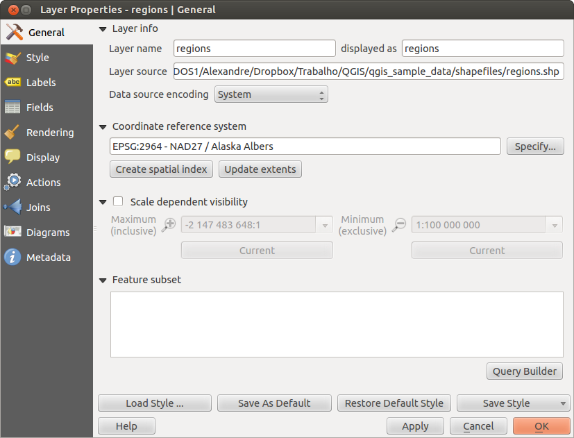

## Menu Stile

Con il menu Stile puoi modificare lo stile e la visualizzazione dei vettori. Puoi usare sia lo strumento _Visualizzazione del layer ‣_, comune a tutti i tipi di vettori, sia simbologie specifiche in funzione del tipo di vettore.

### Tipi di visualizzazioni

Il visualizzatore è responsabile del disegno di una geometria con il simbolo corretto. Ci sono quattro tipi di visualizzazione: simbolo singolo, categorizzato, graduato e tramite regole. Non c’è visualizzatore di colore continuo, perché è solo un caso particolare dello stile graduato. I visualizzatori categorizzato e graduato possono essere creati specificando un simbolo e una scala di colori - i colori per i simboli saranno realizzati in modo appropriato. Per i vettori puntuali, c’è disponibile un visualizzatore spostamento punto. Per ogni tipo di vettori (punti, linee e poligoni), sono disponibili tipi di simboli. A seconda del visualizzatore selezionato, la _Style_ offre diverse sezioni aggiuntive. In basso a destra della finestra di simbologia, c’è un pulsante \*\* [Apri libreria] \*\* , che dà accesso al Gestore di stili (vedi: ref: vector\_style\_manager). Il gestore di stili consente di modificare e rimuovere i simboli esistenti e aggiungerne di nuovi.

Dopo aver fatto le necessarie modifiche, il simbolo nella finestra di dialogo Selettore simbolo può essere aggiunto alla lista dei simboli (utilizzando _Salva_), e quindi può essere facilmente utilizzato in futuro. Inoltre, puoi utilizzare il pulsante **[Salva stile]**  per salvare il simbolo come file KADAS di stile (.qml) o un file SLD (.sld). SLD può essere esportata da qualsiasi tipo di visualizzatore - simbolo singolo, categorizzato o graduato o tramite regole si è laureato o basata su regole - ma se imèporti un file SLD, viene creato uno stile di simbolo singolo o di tramite regole. Ciò significa che gli stili categorizzati o graduati vengono convertiti in tramite regole. Se si desidera mantenere gli stili, è necessario attenersi al formato QML. D’altra parte, può essere molto utile a volte avere questo modo semplice di convertire stili tramite regole.

Se cambi il tipo di visualizzatore mentre imposti lo stile di un vettore, le impostazioni effettuate per il simbolo saranno mantenute. Questo funziona solo per un cambiamento. Se si ripete la modifica del tipo di visualizzatore le impostazioni per il simbolo saranno perse.

Se l'origine dati del livello è un database (PostGIS o Spatialite per esempio), è possibile salvare lo stile del livello all'interno di una tabella del database. Basta cliccare sulla combobox _Salva stile_ e scegliere **Salva nel database**, quindi compilare la finestra di dialogo per definire il nome di uno stile, aggiungere una descrizione, un file ui e se lo stile è uno stile predefinito. Quando si carica un livello dal database, se uno stile esiste già per questo livello, KADAS caricherà il livello e il suo stile. È possibile aggiungere diversi stili nel database. Solo uno sarà comunque lo stile predefinito.

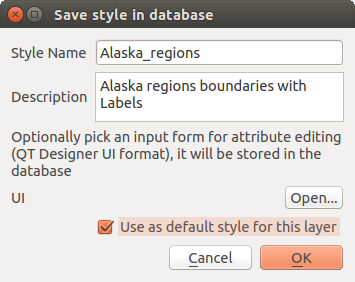

**Selezionare e cambiare simboli multipli**

La Simbologia ti permette di scegliere simboli multipli e di cliccare con il tasto destro per cambiare il coloro, la trasparenza, la dimensione e lo spessore di quello che hai selezionato.

**Visualizzatore Simbolo singolo**

Usa il visualizzatore Simbolo singolo per visualizzare tutti gli elementi di un vettore usando un simbolo singolo predefinito. Le proprietà, che puoi modificare nel menu _Stile_, dipendono parzialmente dal tipo di vettore, ma tutti i vettori condividono la seguente struttura. Nella parte superiore sinistra del menu puoi vedere l’anteprima del simbolo attuale che hai scelto. Nella parte destra del menu vedrai un elenco di simboli già definiti che puoi selezionare semplicemente cliccandoci sopra. Puoi modificare il simbolo che hai scelto usando il menu nella parte destra.

Se clicchi sul primo livello nella parte sinistra puoi definire i parametri come _Unità_, _Traspsrenza_, _Colore_ and _Rotazione_.

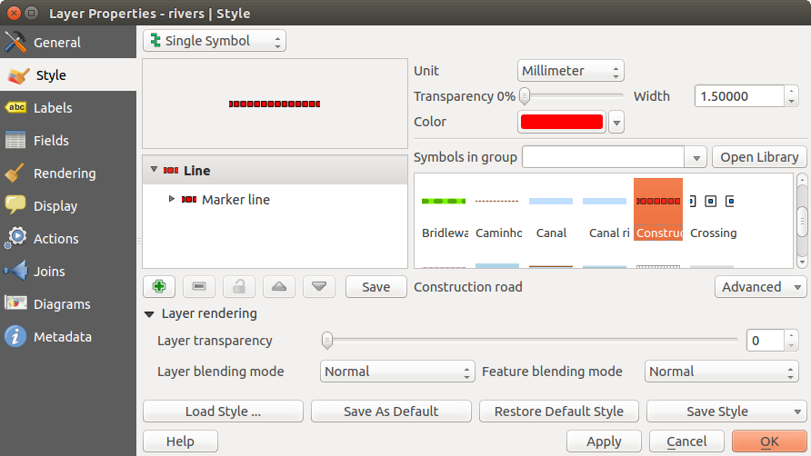

In qualsiasi spinbox di questa finestra di dialogo è possibile inserire espressioni. Ad esempio, è possibile calcolare la matematica semplice come moltiplicando la dimensione esistente di un punto per 3 senza ricorrere a una calcolatrice.

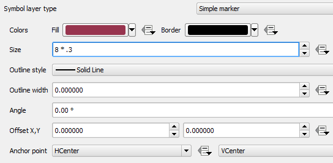

Se si fa clic sul secondo livello nella finestra di dialogo _Livelli simbolo_ è possibile una 'sovrascrittura definita dai dati' per quasi tutte le impostazioni. Quando si usa un colore definito dai dati, si potrebbe voler collegare il colore ad un campo 'budget'. Qui viene inserita una funzionalità di commento.

```
/* This expression will return a color code depending on the field value.
 * Negative value: red
 * 0 value: yellow
 * Positive value: green
 */
CASE
  WHEN value < 0 THEN '#DC143C' -- Negative value: red
  WHEN value = 0 THEN '#CCCC00' -- Value 0: yellow
  ELSE '#228B22'                -- Positive value: green
END
```

**Visualizzatore Categorizzato**

Il visualizzatore Categorizzato viene usato per visualizzare tutti gli elementi di un vettore, dove il colore di un simbolo singolo riflette i valori di un determinato attributo. Il menu _Stile_ ti permette di scegliere:

- L’attributo (usa la lista Colonna o l’espressione  _Imposta espressione_, vedi [_Expressions_](expression.md#vector-expressions))
- Il simbolo (Simbolo)
- I colori (usando la lista gradiente di colore)

Poi click sul pulsante **Classifica** per creare la classi dei distinti valori degli attributi colonna. Ogni classe può essere disabilitata spuntando la casella a sinistra del nome della classe.

Puoi cambiare simbolo, valore ed etichetta della classe, semplicemente facendo doppio-click sull’oggetto che vuoi cambiare

Il tasto destro mostra un menù contestuale con **Copia/Incolla**, **Cambia colore**, **Cambia trasparenza**, **Cambia unità**, Cambia dimensione del simbolo\*\*.

Il pulsante **[Avanzato]** nell’angolo inferiore destro nella finestra di dialogo ti permette di impostare i campi che contengono i valori di dimensione e rotazione. Per comodità, la parte centrale del menu elenca tutti i valori attualmente selezionati, inclusi i simboli che verranno visualizzati.

L’esempio nella seguente figura mostra il dialogo con le categorie di simboli usate per il layer dei fiumi dei dati di esempio di KADAS.

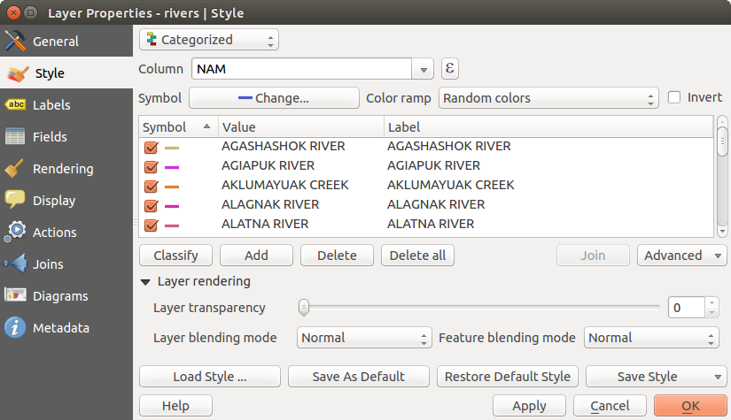

**Visualizzatore Graduato**

Il visualizzatore Graduato visualizza tutti gli elementi del vettore tramite un unico simbolo. I colori riflettono la classificazione in classi dell’attributo scelto.

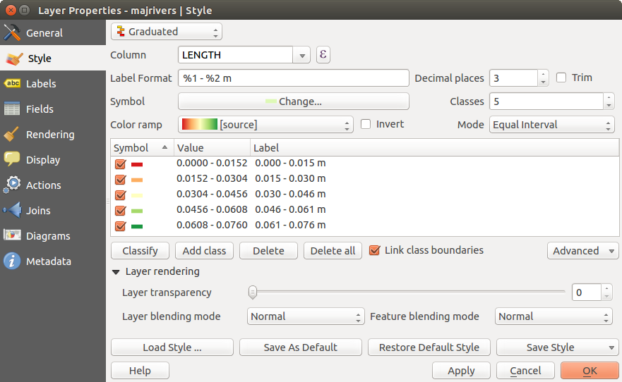

Come il Visualizzatore Categorizzato, quello Graduato ti permette di impostare la rotazione e la dimensione della scala in base a valori presenti in colonne specifiche.

Ugualmente al visualizzatore Categorizzato, la scheda _Stile_ ti permette di selezionare:

- L’attributo (usando il menu a tendina per scegliere la colonna oppure la funzione  _Imposta espressione per la colonna_, vedi il capitolo ref:vector\_expressions)
- Il simbolo (Simbolo)
- I colori (usando la lista gradiente di colore)

Inoltre, puoi specificare il numero di classi e il modo di classificare gli elementi. Hai a disposizione i seguenti tipi di classificazione:

- Intervallo uguale: ogni classe ha la stessa dimensione ( per esempio valori da 0 a 16 e quattro classi, ogni classe ha dimensione 4)
- Quantile: ogni classe avrà lo stesso numero di elementi (l’idea di un diagramma a scatola e baffi)
- Natural Breaks (Jenks): la varianza all’interno di ogni classe è minimo, mentre quella tra le classi è massima;
- Deviazione standard: le classi sono costruite in funzione della deviazione standard dei valori;
- Pretty Breaks: lo stesso del natural breaks ma i numeri estremi di ogni classe sono interi

Nella parte centrale della finestra _Stile_, puoi vedere tutte i valori e le classi di suddivisione insieme ai loro intervalli, etichette e simboli.

Poi click sul pulsante **Classifica** per creare la classi usando il metodo scelto. Ogni classe può essere disabilitata spuntando la casella a sinistra del nome della classe.

Puoi cambiare il simbolo, il valore e/o l’etichetta, basta fare doppio click sulla voce che si desidera modificare.

Il tasto destro mostra un menù contestuale con **Copia/Incolla**, **Cambia colore**, **Cambia trasparenza**, **Cambia unità**, Cambia dimensione del simbolo\*\*.

**Mappe tematiche usando un’espressione**

Puoi creare mappe tematiche categorizzate o graduate usando il risultato di un’espressione. Nella finestra di dialogo delle proprietà del vettore puoi selezionare su  _Imposta espressione della colonna_. Non hai quindi più bisogno di creare una nuova colonna nella tabella degli attributi di un vettore e sceglierla in un secondo momento per la categorizzazione.

**Visualizzatore Tramite regole**

Il visualizzatore Tramite regole visualizza tutti gli elementi di un vettore tramite simboli basati su regole, con i colori che riflettono la classificazione di un attributo di interesse. Le regole si basano su istruzioni SQL, che puoi creare con il Costruttore stringhe. Puoi creare dei raggruppamenti attraverso filtri o scale e puoi decidere se vuoi abilitare i livelli del simbolo oppure se far corrispondere la prima regola.

Per creare una regola, attivare una riga esistente facendo doppio clic su di essa, oppure cliccare su '+' e cliccare sulla nuova regola. Nella finestra di dialogo _Proprietà del modulo_, è possibile definire un'etichetta per la regola. Premere il pulsante  per aprire l'espressione string builder. Nell'elenco **Function List**, fare clic su _Fields and Values_ per visualizzare tutti gli attributi della tabella degli attributi da ricercare. Per aggiungere un attributo al campo calcolatrice **Espressione**, fare doppio clic sul suo nome nell'elenco _Campi e valori_. Generalmente, è possibile utilizzare i vari campi, valori e funzioni per costruire l'espressione di calcolo, o semplicemente digitarla nella casella. È possibile creare una nuova regola copiando e incollando una regola esistente con il tasto destro del mouse. Puoi anche usare la regola 'ELSE' che verrà eseguita se nessuna delle altre regole di quel livello corrisponde. Le regole appaiono in una gerarchia ad albero nella legenda della mappa. È sufficiente fare doppio clic sulle regole nella legenda della mappa e appare il menu Stile delle proprietà del livello che mostra la regola che fa da sfondo al simbolo nell'albero.

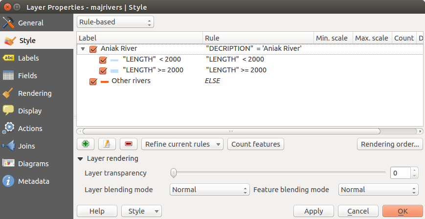

**Visualizzatore Spostamento punto**

Il visualizzatore Spostamento punto ti permette di visualizzare gli elementi di un vettore di punti anche se questi hanno la stessa posizione. I simboli vengono posizionati lungo un cerchio di spostamento intorno al centro del simbolo.

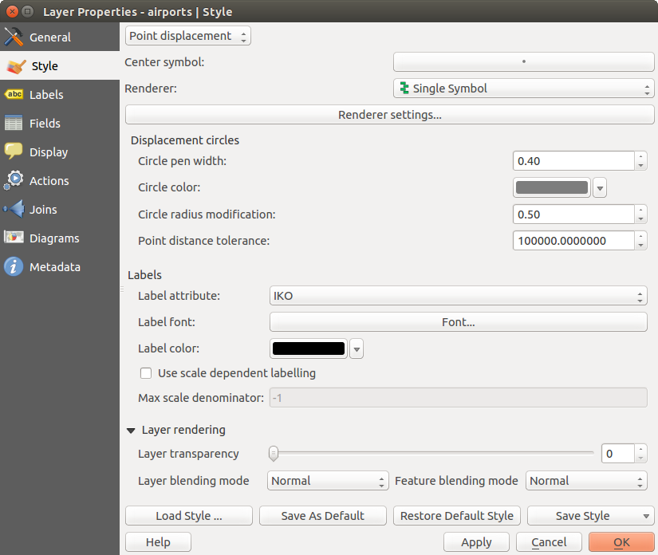

**Esporta simbologia vettore**

Hai la possibilità di esportare la simbologia vettoriale da KADAS in file Google \*.kml, \*.dxf e MapInfo \*.tab. Basta aprire il menu a destra del livello e cliccare su _Salva la selezione come ‣_ per specificare il nome del file di output e il suo formato. Nella finestra di dialogo, utilizzare il menu _Esporta simbologia_ per salvare la simbologia come _Simbologia oggetto ‣_ o come _Livello di simbologia ‣_. Se sono stati utilizzati livelli di simboli, si consiglia di utilizzare la seconda impostazione.

**Poligoni invertiti**

Il renderer invertito per poligoni permette all'utente di definire un simbolo da riempire all'esterno dei poligoni del livello. Come prima è possibile selezionare i subrenderers. Questi subrenderers sono gli stessi dei renderers principali.

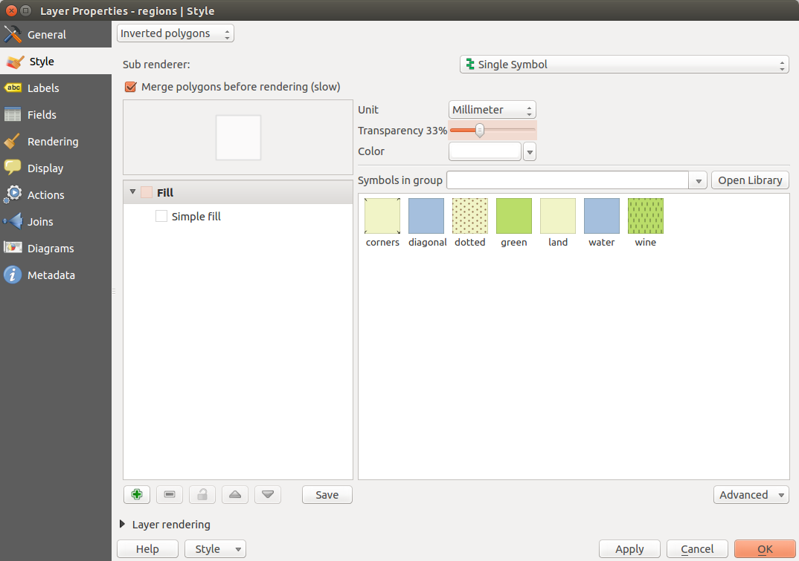

**Cambiare velocemente stili**

Una volta creato uno degli stili sopra menzionati, è possibile fare clic destro sul livello e scegliere _Stili ‣ Aggiungi_ per salvare il proprio stile. Ora puoi passare facilmente da uno stile all'altro che hai creato utilizzando di nuovo il menu _Stili ‣_.

**Heatmap**

Con il renderer Heatmap è possibile creare heatmap dinamiche in tempo reale per livelli (multi)punti. È possibile specificare il raggio della mappa termica in pixel, mm o unità di mappa, scegliere una rampa di colore per lo stile della mappa termica e utilizzare un cursore per selezionare un compromesso tra velocità e qualità del rendering. Quando si aggiunge o rimuove una funzione, il renderer heatmap aggiorna automaticamente lo stile heatmap.

### Selettore di colore

Indipendentemente dal tipo di stile da utilizzare, la finestra di dialogo per scegliere il colore si mostrerà quando fai clic per scegliere un colore - o bordo o colore di riempimento. Questa finestra ha quattro diverse schede che consentono di selezionare i colori: 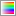 _scala di colori_,  _ruota colori_, 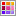 _campioni di colori_ or 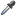 _selettore di colori_.

Qualunque sia il metodo utilizzato, il colore selezionato viene sempre descritto nei cursori dei colori per i valori HSV (Hue, Saturation, Value) e RGB (rosso, verde, blu). C’è anche un cursore _Opacità_ per impostare il livello di trasparenza. Nella parte in basso a sinistra della finestra di dialogo si può vedere un confronto tra il colore vecchio e quello attuale e nella parte in basso a destra si ha la possibilità di aggiungere il colore che appena ottimizzato in un pulsante di archivio colore.

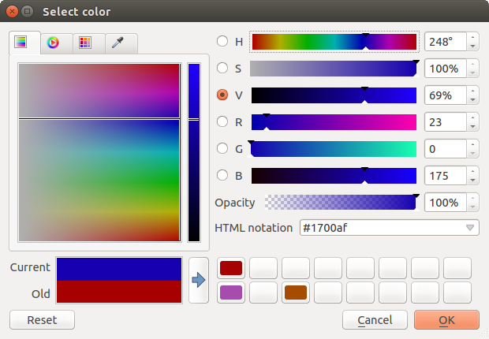

Con  _scala di colori_ o con  _ruota di colori_, è possibile individuare tutte le possibili combinazioni di colori. Ci sono altre possibilità però. Usando campioni di colore  si può scegliere da un elenco preselezionato. Questo elenco preselezionato viene popolato con uno dei tre metodi: _colori recenti_, _colori standard_ o _colori di progetto_.

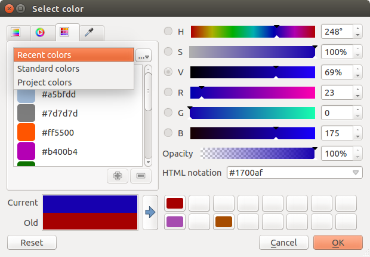

Un’altra opzione è quella di utilizzare il : sup: selettore di colore che permette di campionare un colore da sotto il puntatore del mouse in qualsiasi parte di QGIS o anche da un’altra applicazione premendo la barra spaziatrice. Da notare che il selettore colore dipende dal sistema operativo e non è attualmente supportato da OSX.

**Selettore rapido di colore + copia/incolla colori**

Puoi rapidamente scegliere da _colori recenti_, da _colori atttuali_ or semplicemente _copia_ o _incolla_ un colore facendo click sulla freccia a discesa di un pulsante colore.

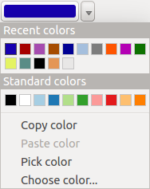

### Visualizzazione del layer

- _Trasparenza del layer_ : con questo strumento puoi decidere il grado di visibilità del vettore. Usa questo cursore per adattare la trasparenza del vettore. Puoi anche impostare un valore preciso di trasparenza nella casella presente a destra del cursore.
- _Modalità fusione layer_ e _Modalità fusione elementi_: grazie a questi strumenti usati soprattutto in ambito grafico, potrai creare effettivi visivi speciali. I pixel del vettore più in alto vengono mischiati con i pixel di tutti i layer sottostanti. Hai molte scelte diverse.
    - Normale: è la modalità fusione predefinita che usa il canale alpha del pixel più in alto fondendolo con quello sotto. I colori non sono quindi mescolati.
    - Schiarisci: seleziona il valore massimo di ogni componente dal basso verso l’alto. Il risultato può apparire frastagliato e duro.
    - Scolorisci: i pixel chiari provenienti dal vettore sorgente vengono dipinti sopra la destinazione, mentre i pixel più scuri no. Questa modalità è molto utile per mescolare le trame di un vettore con un altro (per esempio un raster di ombreggiatura con un altro layer).
    - Scherma: questa modalità schiarirà e saturerà i pixel sottostanti in base a quanto sono chiari i pixel di sopra. In questo modo, i pixel più chiari in cima aumenteranno la saturazione e schiariranno i pixel sottostanti. Otterrai il miglior risultato se i pixel in cima non sono troppo chiari, altrimenti l’effetto sarà troppo estremo.
    - Addizione: questa modalità addiziona semplicemente il valore dei pixel di un vettore con i valori dei layer sottostanti. Se i valori sono maggiori di uno (ovvero quando si lavora con bande RGB) verrà mostrato il bianco. Questa modalità è ottima per evidenziare dei particolari.
    - Scurisci: il pixel finale conserva il valore minore dei pixel del layer in cima e in fondo. Come la modalità schiarsci, il risultato tende a essere frastagliato e duro.
    - Moltiplica: qui, il valore di ogni pixel del layer in cima viene moltiplicato per il valore dei pixel corrispondenti di tutti i layer sottostanti. Il risultato tende quindi a essere piuttosto scuro.
    - Brucia: i colori più scuri del layer in cima scuriranno i layer sottostanti. Questa modalità è utile per aggiustare e colorare i layer sottostanti.
    - Sovrapponi: è una combinazione delle modalità moltiplica e scolorisci. Le parti chiare risulteranno ancora più chiare e quelle scure ancora più scure.
    - Luce diffusa: molto simile alla modalità sovrapponi, ma invece di combinare le modalità moltiplica/scolorisci, combina brucia/scherma. Il risultato è una luce chiara e luccicante su tutta l’immagine.
    - Luce intensa: anche questa modalità è simile alla modalità sovrapponi. Proietta una luce molto intensa su tutta l’immagine.
    - Differenza: vengono sottratti i pixel in cima da quelli sul fondo, oppure al contrario, ma in modo da ottenere sempre valori positivi. Questa modalità non ha effetti con il nero, perché la differenza di questo colore con tutti gli altri è sempre zero.
    - Sottrai: questa modalità sottrae semplicemente i valori di un pixel dagli altri pixel. Se il valore dovesse essere negativo verrà visualizzato il nero.

## Menu Etichette

Lo strumento 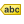 _Etichette_ ti dà la possibilità di etichettare in modo facile e intelligente punti, linee e poligoni specificando solamente pochi parametri. È supportata anche la riproiezione al volo. Abbiamo ridisegnato l’intera applicazione per le etichette, aggiungendo nuove caratteristiche e altre funzionalità. Hai a disposizione questi menu:

- Testo
- Formattazione
- Contorno
- Sfondo
- Ombra
- Posizionamento
- Visualizzazione

Ecco come puoi usare il nuovo menu delle etichette con varie tipologie di vettori.

**Etichettare vettore di punti**

Avvia KADAS e carica un vettore di punti. Attiva il vettore nella legenda e clicca sull’icona  _Opzioni per le etichette dei layer_ nella barra degli strumenti.

Il primo passo è quello di spuntare la casella di controllo  _Etichetta questo vettore con_ e selezionare un attributo fra quelli disponibili. Clicca su  se vuoi definire un’espressione per le etichette.

I seguenti passi descrivono un’etichettatura semplice, senza usare la funzione di _Sovrascrittura definita dai dati_, situata vicino ai menu a tendina.

Puoi specificare lo stile del testo dal menu _Testo_. Usa l’opzione _Tipo maiuscolo_ per cambiare lo stile del testo. Puoi scegliere fra: ‘Tutto maiuscolo’, ‘Tutto minuscolo’ e ‘Prima lettera maiuscola’. Puoi anche usare le modalità di fusione per ricreare alcuni effetti di programmi di grafica.

Nel menu _Formattazione_ puoi scegliere un carattere per andare a capo grazie alla funzione ‘A capo con il carattere’. Usa l’opzione  _Numeri formattati_ per formattare i numeri della tabella degli attributi. Qui puoi inserire la parte decimale. In modo predefinito, se attivi questa opzione, vengono impostati tre decimali.

Per creare un contorno, attiva la casella di controllo  _Disegna contorno del testo_ nel menu _Contorno_. Puoi scegliere sia il colore del contorno che la modalità di fusione.

Se hai attivato la casella  _colore riempimento del contorno_, allora interagirà con il testo, se parzialmente trasparente, e darà risultati di trasparenza del colore misti. Se spegni il riempimento del contorno, ridurrai i colori misti (salvo dove il contorno si interseca con il riempimento del testo), e permetti anche di rendere il testo delineato.

Nel menu _Sfondo_, tramite _Dimensione X_ e _Dimensione Y_ puoi ridimensionare lo sfondo. Usa _Tipo dimensione_ per inserire un ‘Contorno’ aggiuntivo. In questo caso la dimensione dello sfondo è predefinita. Lo sfondo sarà costituito dal contorno più le dimensioni impostate in _Dimensione X_ e _Dimensione Y_. Puoi impostare diversi tipi di _Rotazione_: ‘Sincronizza con l’etichetta’, ‘Offset dell’etichetta’ e ‘Fisso’. Queste due ultime opzioni ti permettono di ruotare lo sfondo. Se imposti un _Offset X,Y_ allora lo sfondo verrò spostato. Ancora, se attivi _Raggio X,Y_ allora lo sfondò avrà gli angoli arrotondati. Infine, puoi scegliere diverse _Modalità fusione_.

Usa il menu _Ombreggiatura_ per aggiungere un’ombra alle etichette. Il risultato finale varierà molto in base alla scelta che farai. Hai a disposizione diverse possibilità: ‘Componente etichetta inferiore’, ‘Testo’, ‘Contorno’ e ‘Sfondo’. L’angolazione dell’ _Offset_ dipende dall’orientamento dell’etichetta. Se spunti la casella di controllo  _Usa ombreggiatura globale_ allora il punto zero dell’angolazione è sempre orientato verso nord e non dipende dall’orientamento dell’etichetta. Puoi influenzare l’apparenza dell’ombra tramite _Raggio di sfumatura_: più è alto il valore e più leggera sarà l’ombra. Puoi usare anche diverse modalità di fusione.

Scegliere il menu _Placement_ per il posizionamento dell'etichetta e la priorità di etichettatura. Usando  l'impostazione _Offset da punto_, ora avete la possibilità di usare _Quadrante_ per posizionare l'etichetta. Inoltre, è possibile modificare l'angolo di posizionamento dell'etichetta con l'impostazione _Rotazione_. In questo modo, è possibile posizionare l'etichetta in un certo quadrante con una certa rotazione. Nella sezione _priorità_ è possibile definire con quale priorità vengono visualizzate le etichette. Interagisce con le etichette degli altri livelli vettoriali nell'area di disegno della mappa. Se ci sono etichette di diversi livelli nella stessa posizione, verrà visualizzata l'etichetta con la priorità più alta e l'altra verrà tralasciata.

Nel menu _Visualizzazione_ puoi impostare opzioni relative alle etichette e agli elementi delle etichette. Dal sottomenu _Opzioni etichetta_ puoi impostare la visibilità delle etichette in funzione della scala. Puoi dire a KADAS di visualizzare solamente le etichette selezionate spuntando la casella di controllo  _Mostra tutte le etichette di questo vettore (incluse le etichette che collidono)_. Il sottomenu _Opzioni elementi_ ti permette di scegliere quali elementi di una geometria di parti multiple devono essere etichettati. Puoi decidere dii limitare il numero di elementi da etichettare e puoi spuntare la casella di controllo  _Evita che le etichette si sovrappongano alle geometrie_.

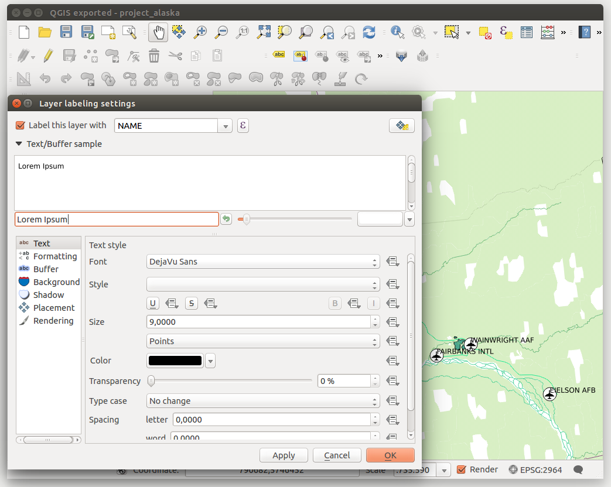

**Etichettare vettore di linee**

Per prima cosa, dalla scheda _Impostazioni delle etichette_ spunta la casella di controllo  _Etichetta questo vettore con_ e seleziona un attributo fra quelli disponibili. Clicca su  se vuoi usare un’espressione per le etichette.

Imposta uno stile del testo dal menu _Testo_. Ci saranno le stesse impostazioni del vettore di punti.

Anche le impostazioni del menu _Formattazione_ sono le stesse sia per i vettori di punti che per quelli di linee.

Il menu _Contorno_ ha le stesse funzionalità di quelle descritte nella sezione [Etichettare vettore di punti](#labeling-point-layers).

Il menu _Sfondo_ ha le stesse voci di quelle descritte nella sezione [Etichettare vettore di punti](#labeling-point-layers).

Anche il menu _Ombra_ ha le stesse funzionalità di quelle descritte nella sezione [Etichettare vettore di punti](#labeling-point-layers).

Nel menu _Posizionamento_ troverai impostazioni particolari per i vettori di linee. Puoi scegliere fra  _Parallelo_,  _Curvato_ oppure  _Orizzontale_. Con le opzioni  _Parallelo_ e  _Curvato_ puoi impostare la posizione  _Sopra la linea_,  _Sulla linea_ e  _Sotto la linea_. Puoi scegliere più impostazioni alla volta. In questo caso, KADAS cercherà automaticamente il posizionamento migliore per le etichette. Se hai scelto l’opzione _Curvato_ puoi impostare anche un _Angolo massimo tra caratteri curvi_.

Puoi impostare una distanza minima per cui non si ripetano le etichette. La distanza può essere in mm oin unità di mappa.

Alcune impostazioni di posizionamento visualizzeranno più opzioni, ad esempio, posizionamento _Curvato_ e _Parallelo_, che permetteranno all'utente di impostare la posizione dell'etichetta (sopra, sotto o sulla linea), _Distanza_ dalla linea, e per _Curvato_, l'utente può anche impostare l'angolo massimo interno/esterno tra l'etichetta curvata. Per quanto riguarda gli i livelli vettoriali di punti si ha la possibilità di definire una _priorità_ per le etichette.

Il menu _Visualizzazione_ ha praticamente le stesse voci dei vettori di punti. Dal sottomenu _Opzioni elementi_ puoi scegliere anche l’opzione _Elimina l’etichettatura degli elementi più piccoli di_.

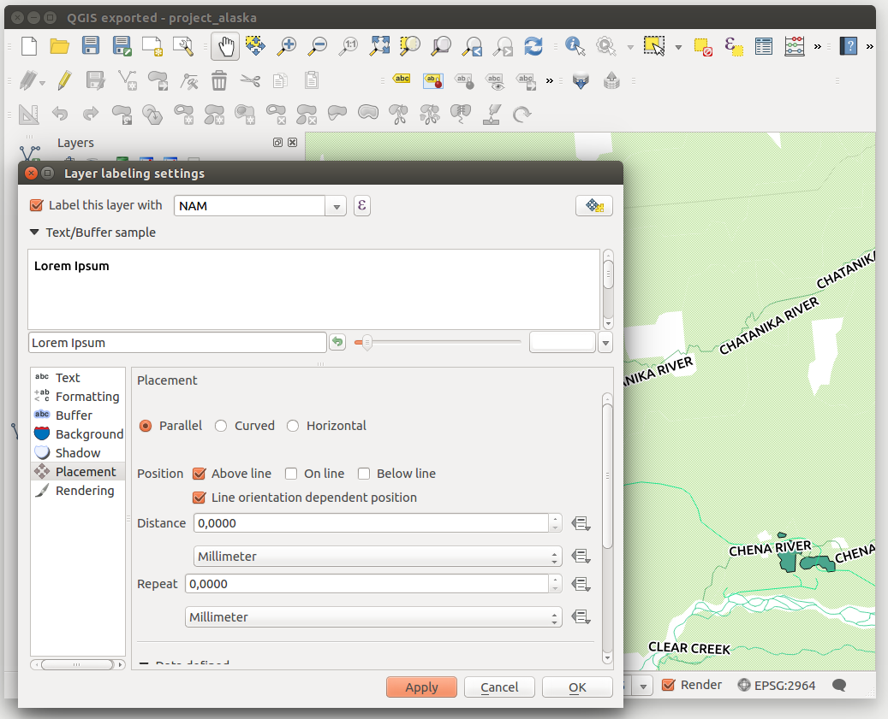

**Etichettare vettore di poligoni**

Per prima cosa spunta la casella di controllo  _Etichetta questo vettore con_ e seleziona un attributo fra quelli disponibili. Clicca su  se vuoi usare un’espressione per definire le etichette - vedi

Il menu _Testo_ ti permette di definire lo stile per il testo. Le voci sono le stesse sia per i vettori di punti che per quelli di linee.

Il menu _Formattazione_ ti permette di scegliere il formato migliore per linee multiple, le opzioni disponibili sono simili per i vettori di punti e quelli di linee.

Come per i vettori di punti e linee, puoi creare un contorno al testo fal menu _Contorno_.

Usa il menu _Sfondo_ per creare uno sfondo complesso per i vettori di poligoni. Puoi usare il menu anche per i vettori di punti e linee.

Le voci nel menu _Ombre_ sono le stesse sia per i punti che per le linee.

Nel menu _Posizionamento_ troverai impostazioni particolari per i vettori di poligoni. Scegli fra:  _Offset dal centroide_,  _Orizzontale (lento)_,  _Attorno al centroide_,  _Libero (lento)_ e  _Utilizzando il perimetro_.

L’opzione  _Offset dal centroide_ ti permette di scegliere fra  _poligono visibile_ o  _intero poligono_. Nel primo caso il centroide viene calcolato per il poligono visibile sulla mappa, nel secondo caso invece viene calcolato sull’intero poligono, anche se non tutte le geometrie sono visibili sulla mappa. Puoi usare il quadrante per determinare la posizione delle etichette, oltre che il loro offset e rotazione. L’opzione  _Attorno al centroide_ ti permette di posizionare le etichette ad una certa distanza attorno al centroide. Anche in questo caso puoi scegliere fra  _poligono visibile_ o  _intero poligono_. L’opzione _Usando il perimetro_ ti permette di scegliere distanza e posizione precise per le etichette. Per la posizione puoi scegliere di spuntare diverse caselle di controllo:  _Sopra la linea_,  _Sulla linea_,  _Sotto la linea_ e  _Posizione dipendente dall’orientazione della linea_.

In relazione alla scelta del posizionamento dell'etichetta, appariranno diverse opzioni. Per quanto riguarda il posizionamento del punto è possibile scegliere la distanza per il contorno del poligono, ripetere l'etichetta intorno al perimetro del poligono.

Come per i livelli vettoriali di punti e linee si ha la possibilità di definire una _Priorità_ per il livello vettoriale di poligoni.

Le voci nel menu _Visualizzazione_ sono le stesse dei vettori di linee. Puoi anche usare l’opzione _Elimina l’etichettatura degli elementi più piccoli di_ dal menu _Opzioni elementi_.

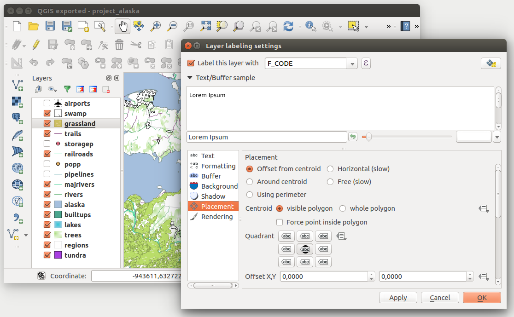

**Definisci le etichette usando un’espressione**

KADAS ti permette di usare delle espressioni per etichettare i vettori. Clicca sull’icona  nel menu  _Etichette_. La seguente figura mostra un esempio di espressione per etichettare la regione dell’Alaska con il nome e la dimensione dell’area. Sono stati scelti il campo ‘NAME\_2’, un breve testo descrittivo e la funzione ‘$area()’ combinata con ‘format\_number()’ per una visualizzazione ottimale.

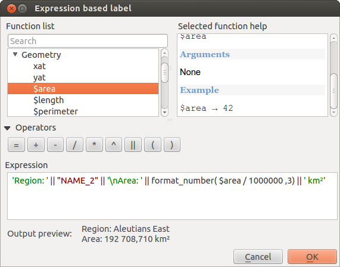

È facile utilizzare le espressioni per etichettare i tuoi dati. Ricordati solo che devi combinare tutti gli elementi (stringhe, campi e funzioni) con il simbolo di concatenazione ‘||’ , che i campi devono essere inclusi fra le “doppie virgolette” e le stringhe fra ‘virgolette singole’. Ecco qualche esempio:

```
 # label based on two fields 'name' and 'place' with a comma as separater
 "name" || ', ' || "place"

 -> John Smith, Paris

 # label based on two fields 'name' and 'place' separated by comma
 'My name is ' || "name" || 'and I live in ' || "place"

 -> My name is John Smith and I live in Paris

 # label based on two fields 'name' and 'place' with a descriptive text
 # and a line break (\n)
 'My name is ' || "name" || '\nI live in ' || "place"

 -> My name is John Smith
    I live in Paris

 # create a multi-line label based on a field and the $area function
 # to show the place name and its area size based on unit meter.
 'The area of ' || "place" || 'has a size of ' || $area || 'm²'

 -> The area of Paris has a size of 105000000 m²

 # create a CASE ELSE condition. If the population value in field
 # population is <= 50000 it is a town, otherwise a city.
 'This place is a ' || CASE WHEN "population <= 50000" THEN 'town' ELSE 'city' END

-> This place is a town
```

Come potete vedere nel costruttore di espressioni, avete a disposizione centinaia di funzioni per creare espressioni semplici e molto complesse per etichettare i vostri dati in QGIS.

**Usare le opzioni definite dai dati sovrascrive le impostazioni dell’etichettatura**

La funzione **definito dai dati** sovrascrive tutte le impostazioni delle etichette e usa le voci presenti nella tabella degli attributii. Usa il tasto destro del mouse per attivare/disattivare questa funzione. Trascinado il mouse sopra il simbolo vedrai quali sono le informazioni usate per etichettare i dati. Ti mostriamo ora un esempio per la funzione 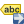_Muovi etichetta_.

1. Importa il file `lakes.shp` dai dati campione.
2. Fai doppio click per aprire la finestra di dialogo Proprietà del layer. Clicca su _Etichette_ e poi scegli _Posizionamento_. Seleziona  _Offset fdal centroide_.
3. Cerca la voce _Dati definiti_. Clicca sull’icona  per scegliere il campo per la _Coordinata_. Scegli ‘xlabel’ per X e ‘ylabel’ per Y. Vedrai le icone evidenziate in giallo.
4. Fai zoom su un lago
5. Vai sulla barra delle Etichette e clicca sull’icona . Ora potrai spostare manualmente le etichette in un’altra posizione. Le coordinate della nuova posizione verranno salvate nelle rispettive colonne della tabella degli attributi.

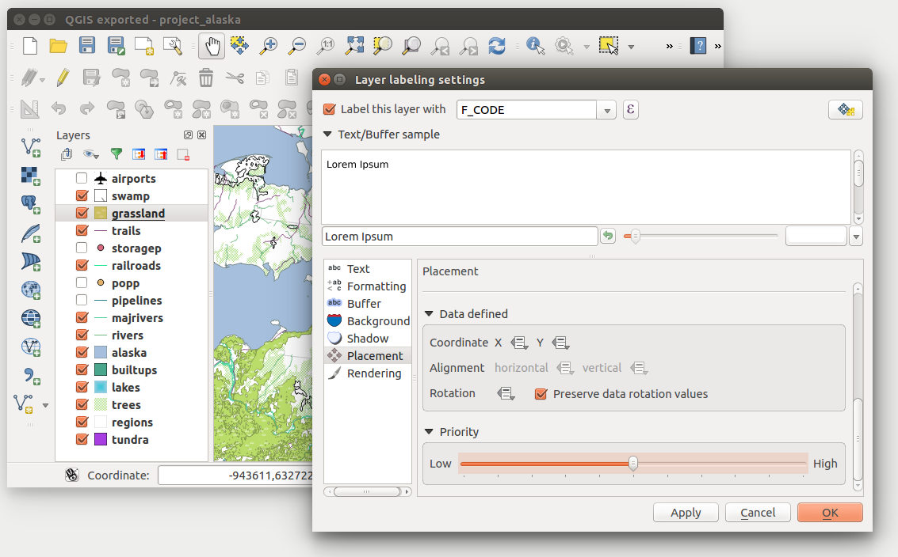

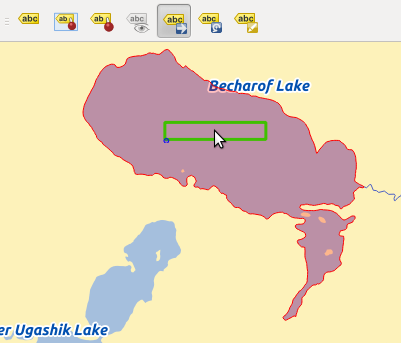

## Menu Campi

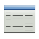 tramite il menu _Campi_, puoi manipolare i campi e gli attributi dell’insieme di dati. Per attivare i pulsanti 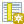 _Nuova colonna_ e 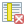 _Elimina colonna_ devi entrare in modalità  _Modifica_.

**Widget modifica**

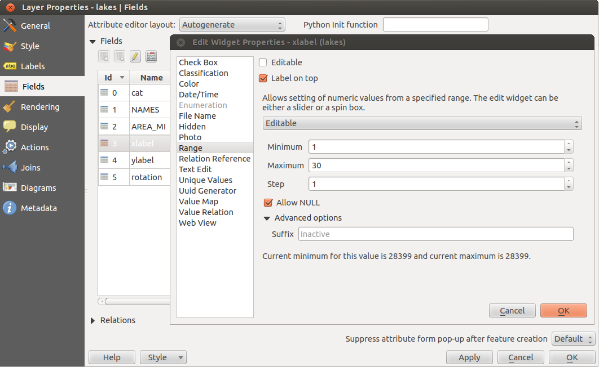

Nel menu _Campi_ hai la possibilità di usare un **widget per la modifica**. In questo modo puoi specificare un tipo paricolare di colonna in funzione dei dati che contiene. Se clicchi sul pulsante **[modifica contenuto]** si aprirà una finestra di dialogo in cui puoi scegliere fra diversi widget:

- **Casella di controllo**: mostra una casella di controllo: se spunti la casella allora l’attributo verrà aggiunto alla colonna, altrimenti verrà rimosso.
- **Classificazione**: visualizza un menu a tendina con i valori usati per la classificazione se hai scelto ‘Categorizzato’ come tipo di visualizzatore nel menu _Stile_ delle proprietà del vettore.
- **Colore** virtualizza un pulsante che permette di scegliere un colore da un finestra Selettore di colore
- **Data/Ora**: Visualizza un campo linea che può aprire un widget calendario per inserire una data, un'ora o entrambi. Il tipo di colonna deve essere testo. È possibile selezionare un formato personalizzato, aprire un calendario, ecc.
- **Enumerazione**: apre un menu a tendina con i valori che possono essere usati nelle tipologie delle colonne. Attualmente questa funzione è supportata solo da PostgreSQL.
- **Nome file**: seleziona un file dal tuo computer grazie alla finestra dedicata.
- **Nascosto**: rende invisibile la colonna, quindi non potrai vederne il contenuto.
- **Foto**: campo che contiene un percorso ad una foto. Puoi specificare sia la larghezza che l’altezza del campo.
- **Intervallo**: ti permette di impostare dei valori di un preciso intervallo numerico. Il widget può apparire come un cursore o come un campo modificabile.
- **Riferimento alla relazione**: questo widget ti permette di nidificare il modulo di una relazione fra vettori. Per maggiori informazioni vedi _vector\_relations_.
- \*\* Text Edit \*\* (default): apre un campo di modifica testo che consente di modificare un testo semplice o più righe da utilizzare. Se si sceglie più linee si può anche scegliere i contenuti html.
- **Valori univoci**: puoi selezionare uno dei valori già presenti nella tabella degli attributi. Se la voce ‘Modificabile’ è attiva, allora comparirà anche una casella con l’autocompletamento, altrimenti verrà visualizzato un menu a tendina.
- **Generatore UUID**: genera un campo UUID (Universally Unique Idetifiers) di sola lettura, se il campo è vuoto.
- **Mappa valori**: un menu a tendina con oggetti predefiniti. Puoi associare una descrizione ad valore: nel menu a tendina potrai scegliere fra le varie descrizioni, ma nella tabella degli attributi verrà scritto il valore associato. Puoi specificare i valori manualmente oppure caricarli da un file CSV.
- **Relazione valore**: potrai scegliere i valori da una tabella associata da un menu a tendina. In modo simile al widget ‘Mappa valori’, scegli un campo dal menu a tendina, ma nella tabella degli attibuti verrà scritto il valore corrispondente.
- **Vista web**: il campo contiene un URL di una pagina internet. Puoi aggiustare la larghezza e l’altezza.

KADAS ha un'opzione avanzata "nascosta" per definire il proprio widget di campo usando python e aggiungerlo a questa impressionante lista di widget. È difficile ma è molto ben spiegato nel seguente eccellente blog che spiega come creare un widget di validazione in tempo reale che può essere usato come i widget descritti. Vedi <http://blog.vitu.ch/10142013-1847/write-your-own-qgis-form-elements>.

Con l'editor **Layout editor attributi**, è ora possibile definire formulari integrati. Questo è utile per i lavori di inserimento dati o per identificare gli oggetti usando l'opzione "apri formulario automaticamente" quando si hanno oggetti con molti attributi. È possibile creare un editor con diverse schede e gruppi di nomi per presentare i campi degli attributi.

Scegliere il "designer Drag and drop" e una colonna attributo. Usare l'icona  per creare una categoria da inserire una scheda o un gruppo con nome. Quando si crea una nuova categoria, KADAS inserirà una nuova scheda o gruppo di nome per la categoria nel modulo integrato. Il passo successivo sarà quello di assegnare i campi rilevanti ad una categoria selezionata con l'icona . È possibile creare più categorie e utilizzare nuovamente gli stessi campi.

Altre opzioni nel dialogo sono _Autogenerare_ e _Specificare file UI_.

- _Autogenerare_ semplicemente crea degli editor per tutti i campi e li organizza in una tabella.
- L'opzione _Specificare file UI_ permette di utilizzare finestre di dialogo complesse realizzate con il Qt-Designer. L'utilizzo di un file UI permette una grande libertà nella creazione di una finestra di dialogo. Per informazioni dettagliate, vedere <http://nathanw.net/2011/09/05/qgis-tips-custom-feature-forms-with-python-logic/>.

Le finestre di dialogo di KADAS possono essere accompagnate da una funzione python che viene caricata quando apri la finestra. Usa questa funzione per aggiungere delle logiche extra. Un esempio è (nel modulo MyForms.py):

```
def open(dialog,layer,feature):
geom = feature.geometry()
control = dialog.findChild(QWidged,"My line edit")
```

Fa riferimento alla funzione Init di python come:

MyForms.py deve essere presente nel PYTHONPATH, in .qgis2/python, oppure nella cartella del progetto.

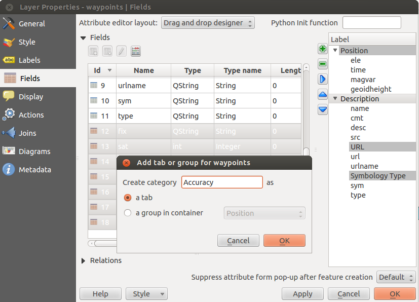

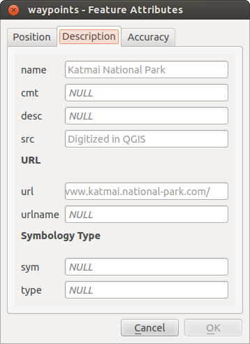

## Menu Generale

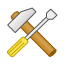 Usa questo menu per gestire le impostazioni principali dei vettori. Hai a disposizione diverse opzioni:

Informazioni del layer

- Cambia il nome visualizzato del vettore in _visualizzato come_
- Specifica la _Sorgente layer_ del vettore
- Specifica la _Codifica sorgente dati_ per abilitare codifiche specifiche e per poter leggere il file

Sistema di Riferimento

- _Specifica_ il sistema di riferimento delle coordinate. Qui puoi vedere o cambiare la proiezione del vettore.
- _Crea indice spaziale_ (solo per formati supportati da OGR)
- _Aggiorna estensione_ del vettore
- Vedi o cambia la proiezione di un vettore cliccando su _Specifica ..._

 _Visibilità dipendente dalla scala_

- Puoi impostare il _Massimo (incluso)_ e _Minimo (escluso)_ della scala. Puoi anche impostare la scale con il pulsante **[attuale]**.

Sottoinsieme di geometrie

- Con il pulsante **[Query Builder]** puoi creare un sottoinsiem di elementi nel vettore che saranno visualizzati (consulta anche la sezione _vector\_query\_builder_).


## Menu Rendering

KADAS supporta la semplificazione al-volo di geometrie. Questo può migliorare i tempi di rendering quando si disegnano molti oggetti complessi a piccole scale. Questa funzione può essere abilitata o disabilitata nelle impostazioni dei livelli usando l'opzione  _Semplifica geometria_. C'è anche una nuova impostazione globale che abilita la generalizzazione di default per i nuovi livelli aggiunti. **Nota**: La semplificazione degli oggetti può introdurre artefatti nell'output di rendering in alcuni casi. Questi possono includere nastri tra i poligoni e rendering impreciso quando si utilizzano livelli di simboli basati sull'offset.

## Menu Visualizzazione

 Questo menu serve per visualizzare i Suggerimenti mappa. I suggerimenti vengono visualizzati in HTML. Quando trascini il mouse sopra un elemento, il suggerimento può corrispondere a un _Campo_, ma ora puoi anche inserire del codice HTML. Per attivare i Suggerimenti mappa, attiva l’opzione dal menu _Visualizza ‣ Suggerimenti mappa_. La figura Figure Display 1 mostra un esempio di codice HTML.

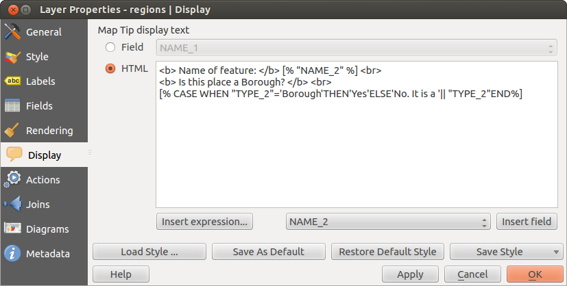

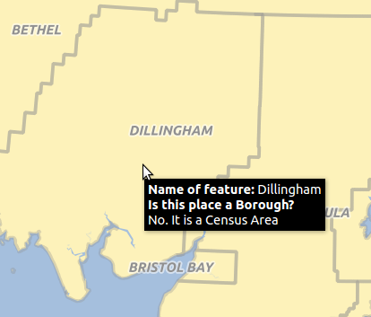

## Menu Azioni

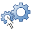 KADAS ti offre la possibilità di creare azioni sulla base degli attributi associati ai singoli elementi del vettore. Potrai cosi creare un grande numero di azioni, per esempio, avviare un programma con argomenti costituiti dagli attributi di un vettore.

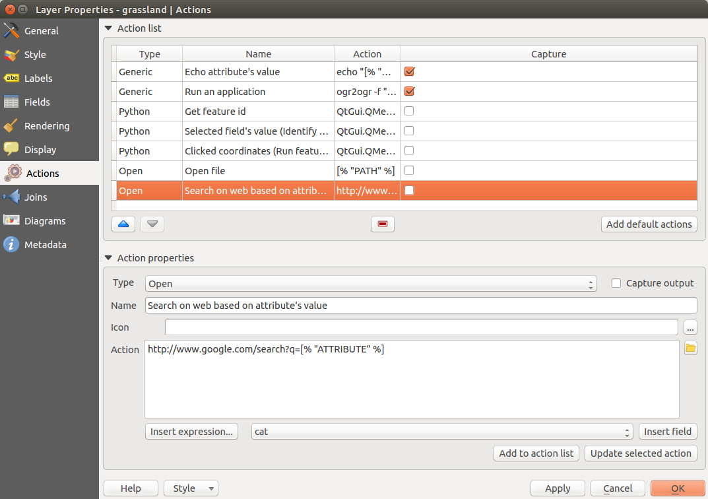

Le azioni sono utili quando vuoi avviare un’applicazione esterna oppure aprire una pagina web sulla base di uno o più valori associati al vettore. Ci sono sei tipologie di azioni che puoi usare nel seguente modo:

- Le azioni Generic, Mac, Windows e Unix avviano un processo esterno.
- Le azioni python eseguono un’espressione python,
- Le azioni generic e python sono visibili ovunque.
- Le azioni Mac, Windows e Unix sono visibili solo sulle rispettive piattaforme (cioè puoi definire le azioni, ma sari in grado di vedere i risultati solamente sulla piattaforma dalla quale è stato lanciato l’editor).

Ci sono diversi esempi presenti nella finestra di dialogo. Puoi caricarli cliccando su **[Aggiungi azioni predefinite]**. Un esempio è eseguire una ricerca sul web basata su un valore presente nella tabella degli attributi. Di seguito una spiegazione.

**Definire le azioni**

Puoi definire le azioni dalla finestra di dialogo _Proprietà layer_. Per definire un’azione, apri questa finestra e clicca sul menu _Azioni_. Dal sottomenu _Proprietà azione_ scegli ‘Generico’ come tipo e inserisci un nome per l’azione. L’azione deve contenere il nome dell’applicazione che verrà eseguita quando lancerai l’azione. Puoi aggiungere uno o più campi come argomenti per l’applicazione. L’azione inizierà sempre con il carattere `%` seguito dal nome del campo che verrà sostituito dal valore del campo stesso. I caratteri speciali %% verranno sostituiti dal valore del campo che hai scelto dalla tabella degli attributi. Puoi usare le doppie virgolette, “ per raggruppare il testo in un singolo argomento per il programma, script o comando. Le doppie virgolette saranno ignorate se precedute dal carattere [``](#id1)[``](#id3).

Se si hanno nomi di campo che sono sottostringhe di altri nomi di campo (ad esempio, `col1` e `col10`), si dovrebbe indicare che circondando il nome del campo (e il carattere %) con parentesi quadre (ad esempio, `[%col10]`). Ciò impedirà che il nome del campo `%col10` venga scambiato per il nome del campo `%col1` con un `0` alla fine. Le parentesi saranno rimosse da KADAS quando sostituisce nel valore del campo. Se volete che il campo sostituito sia circondato da parentesi quadre, usate un secondo set come questo: [[%col10]]`.

La finestra di dialogo _Informazione sui risultati_ che compare quando usi lo strumento _Informazioni elementi_ ha una voce _(Derivato)_ che contiene informazioni che dipendono dal tipo di vettore interrogato. Puoi accedere ai valori di questa voce in modo simile a come accedi ad altri campi della tabella attributi anteponendo al nome del campo `(Derivato)`. Per esempio un vettore di punti ha due campi, `X` e `Y`, e puoi usare il loro valore nell’azione con l’espressione `%(Derivato).X` e `%(Derivato).Y`. Gli attributi derivati sono disponibili solo nella finestra _Informazione sui risultati_ e non nella finestra _Tabella degli attributi_.

Due esempi di azioni sono di seguito indicati:

- `konqueror http://www.google.com/search?q=%nam`
- `konqueror http://www.google.com/search?q=%%`

Nel primo esempio, verrà lanciato il browser konqueror che aprirà un URL. L’URL crea una ricerca Google sul valore del campo `nam` nel vettore. Il programma o lo script richiamato dall’azione deve essere nel path delle variabili d’ambiente altrimenti dovrai specificare il percorso completo del programma. Il primo esempio infatti è accessibile anche con `/opt/kde3/bin/konqueror http://www.google.com/search?q=%nam`. In questo modo sei sicuro che l’applicazione konqueror verrà eseguita quando si richiama l’azione..

Il secondo esempio utilizza la notazione %%%, che non si basa su un particolare campo per il suo valore. Quando l'azione è invocata, %% sarà sostituito dal valore del campo selezionato nella tabella di identificazione dei risultati o degli attributi.

**Uso delle azioni**

Le azioni possono essere richiamate sia dalla finestra _Informazioni sui risultati_ che dalla _Tabella degli attributi_ (ricordati che puoi aprire queste finestre rispettivamente cliccando sullo strumento  _Informazioni elementi_  _Apri tabella degli attributi_ o  _Avvia azione sull’elemento_). Per eseguire l’azione, clicca con il tasto destro del mouse sul risultato e scegli l’azione dal menu contestuale. Le azioni sono indicate nel menu a tendina con il nome inserito. Clicca sull’azione che vuoi eseguire.

Se stai richiamando un’azione che usa l’annotazione `%%`, fai click con il tasto destro sul valore del campo nella finestra _Informazioni risultati_ oppure dalla finestra _Tabella attributi_ e scegli l’applicazione o lo script da assegnare.

In questo altro esempio viene mostrato come estrarre dati da un vettore per inserirli in un file usando il terminale e il comando `echo` (quindi funzionerà su e forse su ). Il vettore in questione ha i seguenti campi nella tabella attributi: nome della specie `taxon_name`, latitudine `lat` e longitudine `long`. Vuoi eseguire una selezione spaziale delle specie (taxon) presenti in determinate posizioni, esportando i risultati in un file di testo (evidenziate in giallo sulla mappa di KADAS). Ecco l’azione giusta per questo scopo:

```
bash -c "echo \"%taxon_name %lat %long\" >> /tmp/species_localities.txt"
```

Selezionando solo alcune posizioni, l’esecuzione dell’azione precedente genera un file di output fatto così:

```
Acacia mearnsii -34.0800000000 150.0800000000
Acacia mearnsii -34.9000000000 150.1200000000
Acacia mearnsii -35.2200000000 149.9300000000
Acacia mearnsii -32.2700000000 150.4100000000
```

Come esercizio puoi creare un’azione che lancia una ricerca su Google in base al vettore `lakes`. Prima di tutto devi impostare l’URL necessario per eseguire una ricerca basata su una parola chiave. Puoi copiare facilmente l’espressione facendo una ricerca semplice dalla pagina di Google. La pagina dei risultati avrà un indirizzo, visibile nella barra indirizzi del browser, del tipo: <http://google.com/search?q=qgis>, in cui `QGIS` è la parola ricercata. Ora puoi procedere:

1. Assicurarti di aver caricato il vettore `lakes`.
2. Apri la finestra di dialogo _Proprietà layer_ facendo doppio click sul vettore o cliccandoci sopra con il tasto destro del mouse e scegliendo _Proprietà_ dal menu contestuale.
3. Clicca sul menu _Azioni_.
4. Inserisci un nome descrittivo per l’azione, ad esempio `Ricerca Google`.
5. Devi fornire il nome del programma esterno, in questo caso Firefox. Se il programma non è presente nel tuo path, devi inserire il path assoluto.
6. Dopo il nome dell’applicazione esterna, aggiungi l’URL della ricerca di Google, senza includere il termine della ricerca:`http://google.com/search?q=`
7. A questo punto il testo nel campo _Azioni_ dovrebbe apparire così: `firefox http://google.com/search?q=`
8. Clicca sul menu a tendina che contiene i nomi dei campi dell vettore `lakes`, posizionato immediatamente a sinistra del pulsante **[Inserisci campo]**.
9. Dal menu a tendina, seleziona ‘NAMES’ e clicca su **[Inserisci campo]**.
10. Il testo dell’azione dovrebbe ora apparire come segue:

    `firefox http://google.com/search?q=%NAMES`
11. Per concludere questa azione, clicca sul pulsante **[Aggiungi alla lista di azioni]**.

Questo ultimo passo completa l’azione che è ora pronta per essere usata. Il testo finale dell’azione dovrebbe apparire così:

```
firefox http://google.com/search?q=%NAMES
```

A questo punto puoi usare l’azione. Chiudi la finestra _Proprietà layer_ e usa lo zoom su un’area a scelta. Assicurati che il vettore `lakes` sia attivo ed identifica con l’apposito strumento un lago qualsiasi. Nella finestra risultante dovrebbe essere visibile l’azione:

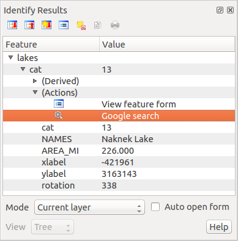

Cliccando sull’azione, verrà lanciato Firefox all’URL <http://www.google.com/search?q=Tustumena>. Puoi anche aggiungere altri campi all’azione, aggiungendo un `+` alla fine della stringa che definisce l’azione, selezionando quindi un altro campo e cliccando sul pulsante **[Inserisci campo]**. Nel nostro esempio non c’è alcun altro campo sul quale avrebbe senso fare una ricerca.

Puoi definire più di un’azione per ogni vettore, ognuna delle quali verrà mostrata nella finestra _Informazioni sui risultati_.

Puoi creare tantissimi tipi di azione. Per esempio se hai un vettore di punti che fa riferimento alle posizioni dove sono state scattate foto o immagini, insieme al nome stesso del file, puoi creare un’azione per avviare un programma che visualizzerà l’immagine. Puoi usare le azioni anche per lanciare report sul web per uno o più campi della tabella degli attributi, definendole allo stesso modo dell’esempio per la ricerca con Google.

Ci sono esempi anche molto più complicati, per esempio usando le azioni **Python**.

Normalmente quando usi un’azione per aprire un file con un’applicazione esterna, puoi usare un path assoluto o relativo. Nel secondo caso, il path è relativo alla posizione dell’eseguibile dell’applicazione esterna. Ma come si fa se devi usare un path relativo al vettore selezionato (se è un file, come uno shapefile o Spatialite)? Ecco il trucco:

```
command = "firefox";
imagerelpath = "images_test/test_image.jpg";
layer = qgis.utils.iface.activeLayer();
import os.path;
layerpath = layer.source() if layer.providerType() == 'ogr'
  else (qgis.core.QgsDataSourceURI(layer.source()).database()
  if layer.providerType() == 'spatialite' else None);
path = os.path.dirname(str(layerpath));
image = os.path.join(path,imagerelpath);
import subprocess;
subprocess.Popen( [command, image ] );
```

Ricordati che l’azione è del tipo _Python_, quindi devi cambiare le variabili _command_ e _imagerelpath_.

E se il percorso relativo deve essere relativo al file di progetto (salvato)? Il codice per l’azione Python diventa:

```
command="firefox";
imagerelpath="../../images/test_image.jpg";
projectpath=qgis.core.QgsProject.instance().fileName();
import os.path; path=os.path.dirname(str(projectpath)) if projectpath != '' else None;
image=os.path.join(path, imagerelpath);
import subprocess;
subprocess.Popen( [command, image ] );
```

Un altro esempio di azione python è quello che ti permette di aggiungere nuovi layer al progetto. In questo esempio aggiungeremo sia un vettore che un raster. Il nome dei file da aggiungere al progetto e il nome da assegnare ai layer è specificato dai dati (_filename_ e _layname_ sono nomi di colonne della tabella dagli attributi del vettore dove l’azione è stata creata):

```
qgis.utils.iface.addVectorLayer('/yourpath/[% "filename" %].shp','[% "layername" %]',
  'ogr')
```

Per aggiungere un raster (in questo caso un’immagine TIF), diventa:

```
qgis.utils.iface.addRasterLayer('/yourpath/[% "filename" %].tif','[% "layername" %]
')
```

## Menu Join

 Il _Join_ consente di join una tabella degli attributi caricata a un layer vettoriale caricato. Dopo aver cliccato  viene visualizzata la finestra _Aggiungi vettore da unire (join)_. Come colonne chiave, è necessario definire un: index:Vettore da unire (join) che connetterai con il vettore. Quindi, è necessario specificare il campo join che è comune sia al livello di unirsi e il livello di destinazione. Ora è anche possibile specificare un sottoinsieme di campi dallo strato aderito in base alla casella _Seleziona i campi per l’unione_. Come risultato del join, tutte le informazioni dallo strato aderire e il livello di destinazione vengono visualizzati nella tabella attributo del vettore di destinazione come informazione unita. Se è stato specificato un sottoinsieme di campi solo questi campi vengono visualizzati nella tabella degli attributi del livello di destinazione.

KADAS attualmente supporta anche join di tabella non spaziali supportate da OGR (come CSV, DBF e EXcel), file di testo delimitato e PostgreSQL.

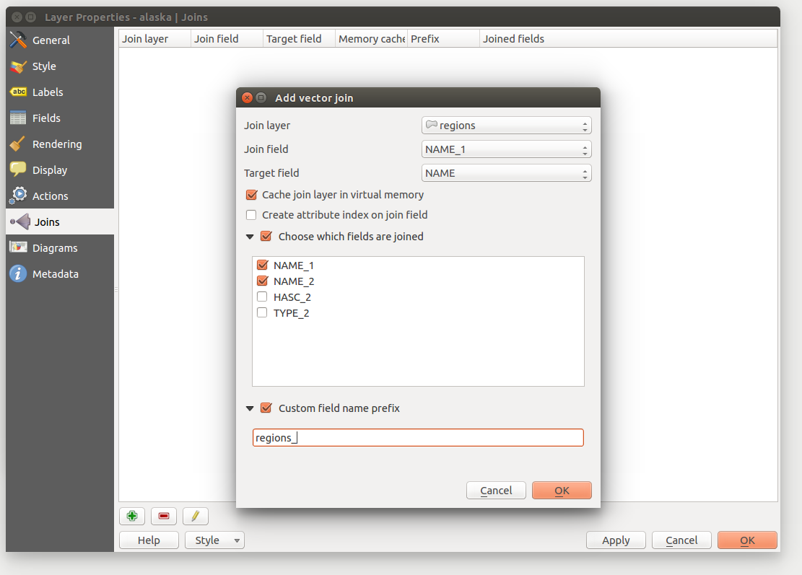

Inoltre, la finestra di dialogo aggiungi vettore da unire ti permette di:

-  _Layer unito in memoria virtuale_
-  _Crea un indice nel campo unito_
-  _Choose which fields are joined_
- Create a  _Custom field name prefix_

## Menu Diagrammi

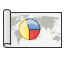 Il menu _Diagrammi_ permette di sovrapporre diagrammi a un vettore.

L’implementazione nativa per i diagrammi ti permette di creare grafici a torta, diagrammi di testo e istogrammi.

Il menu è suddiviso in quattro schede: _Aspetto_, _Dimensione_, _Posizione_ e _Opzioni_.

Nel caso dei grafici a torta e dei diagrammi di testo, gli attributi dei campi scelti per la classificazione verranno visualizzati in un cerchio o in un riquadro. La dimensione dei diagrammi è basata su una scala fissa oppure in base a un attributo. La posizione dei diagrammi interagisce con il nuovo sistema di etichettatura, quindi eventuali conflitti fra etichette e diagrammi sono ora risolti. Inoltre puoi anche posizionare manualmente i diagrammi.

**Figure Diagrams 1:**

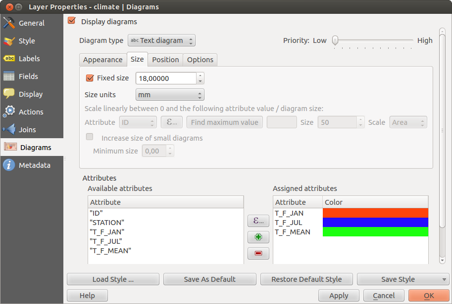
Finestra di dialogo dei diagrammi

Ecco un esempio di creazione di un diagramma di testo delle temperature sovrapposto al vettore alaska; entrambi i vettori sono disponibili fra i dati campione di KADAS (sezione _Dati campione_).

1. Per prima cosa, clicca su  _Aggiungi vettore_ e carica i due file `alaska.shp` e `climate.shp` dall’insieme di dati di KADAS.
2. Fai doppio click sul vettore `climate` nella legenda per aprire la finestra di dialogo _Proprietà layer_.
3. Clicca sulla scheda _Diagrammi_, spunta la casella di controllo  _Visualizza diagrammi_ e scegli ‘Diagramma testo’ dal menu a tendina _Tipo di diagramma_ .
4. Nella scheda _Aspetto_ scegli un blu chiaro come colore di sfondo e nella scheda _Dimensione_ imposta 18 mm come dimensione fissa.
5. Nella scheda _Posizione_ scegli ‘Intorno al punto’ come posizionamento.
6. Nel diagramma verranno visualizzati i valori di tre colonne: `T_F_JAN`, `T_F_JUL` e `T_F_MEAN`. Seleziona prima `T_F_JAN` come _Attributo_ e clicca sul pulsante  poi esegui la stessa procedura per `T_F_JUL` e `T_F_MEAN`.
7. Clicca su **[Applica]** per visualizzare il diagramma nella finestra principale di KADAS.
8. Puoi aggiustare la dimensione del grafico nella scheda _Dimensione_. Disattiva la casella di controllo  _Dimensione fissa_ e imposta la dimensione del diagramma in base all’attributo con il pulsante **[Trova valore massimo]**. Se il diagramma è troppo piccolo, spunta la casella di controllo  _Aumenta la dimensione dei diagrammi piccoli_ e specifica la dimensione minima dei diagrammi.
9. Cambia il colore degli attributi facendo doppio click su colore nel campo _Attributi assegnati_.
10. Clicca su **[OK]**.

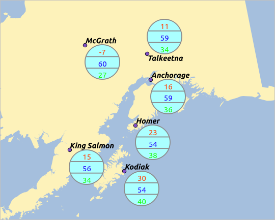

Ricordati che puoi usare anche l’opzione _Posizione definita da attributo_ per posizionare i diagrammi. Inoltre puoi anche impostare la visibilità dei diagrammi in funzione di determinate scale dalla scheda _Aspetto_.

Le dimensioni e gli attributi possono anche essere un’espressione. Usa il pulsante  per aggiungere un’espressione. Vedi il capitolo [_Expressions_](expression.md#vector-expressions) per ulteriori informazioni ed esempi.

## Menu Metadati

 Il menu _Metadati_ ha quattro sezioni: _Descrizione_, _Attribuzione_, _URL Metadati_ e _Proprietà_.

Nella sezione _Proprietà_ vengono elencate informazioni generali sul vettore, incluse le specifiche sul file, la sorgente del file, il numero di geometrie, il tipo di geometrie e le capabilities. La voce **Estensioni** fornisce l’estensione del vettore e le informazioni sul _Sistema di riferimento spaziale del layer_. Questo è un semplice e rapido metodo per ottenere informazioni sul vettore.

Inoltre puoi aggiungere un titolo e un breve riassunto del vettore nelle sezione _Descrizione_. Puoi anche impostare una _Lista delle parole chiave_. Questa lista può essere usata in un catalogo di metadati. Se vuoi usare un titolo di un file XML, devi aggiungere un collegamento in _URL dati_. Usa la sezione _Attribuzione_ per ottenere dati sugli attributi da un catalogo metadati in XML. Nella sezione _URL Metadati_ puoi specificare il path generico al catalogo dati XML. Le informazioni verranno salvate nel file di progetto di KADAS per sessioni future, ma lo puoi usare anche su KADAS server.

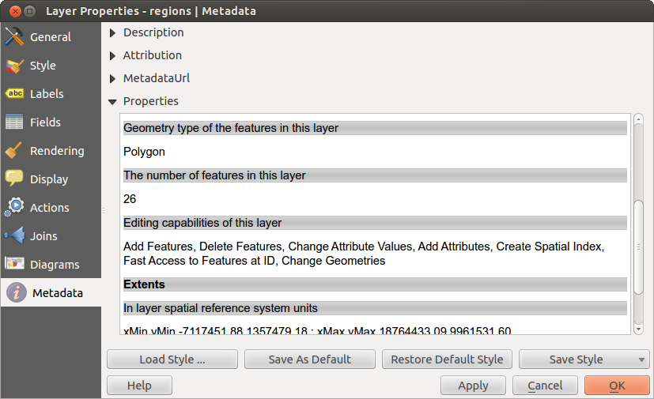
